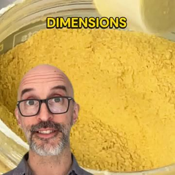

# Meta ad-library examples for F58 (GetHookd board 155932, gut health)

From [@FedotOff90](https://x.com/FedotOff90/status/2108212319113412929)'s public board preview. Days live are as of 2026-10-09. Full board breakdown is in the internal sources folder.

## Libby Babet: Women's-body myth-bust talking head (fitness coach) (305 days live)

- **What happens:** Libby Babet (coach/founder) talking head at home: hook text 'This is why fasted workouts backfire for women' → explains cortisol/muscle → 'for my pro babes' → shows the empty wrapper of the collagen bar she ate this morning → 'go train strong, my ladies'. Burned-in yellow-highlight captions; three versions (different crops/backgrounds) in one DCO ad.
- **Why it lasts:** 305 days live. 'Women's bodies react differently' is an identity hook; the product arrives as the personal fix after 60 s of genuine education; the empty-wrapper detail is proof of real use.
- **How to make one:** Founder/coach to camera, 85-95 s, one take, captions with keyword highlights (CapCut 'highlight' style), 3 framings of the same take as DCO variants.
- **LC remake:** 'This is why your gold necklace turns green (and it's not your skin)' myth-bust by a stylist/founder → science in plain words → 'this is the one I slept in last night' → shows it on.

Transcript

> I really want to clear up a myth that I hear all the time from women, which is that we should train faster for better fat burn. The reality is that women's bodies react really differently to men's when we fast and particularly when we fast and then work out. You see when you skip food before training your cortisol and adrenaline can spike higher and that can actually break down muscle and throw off your hormones completely. When you have a small snack before you train just a little protein and carbs, you actually protect your muscle tissue, you help to regulate your hormones and you perform better which means you get better results and that is so important for everything you're trying to achieve. This is particularly important if you're doing any kind of weight training, high intensity training or endurance training. So for my pro babes out there, you need to be eating before you train. People always used to tell me a piece of fruit or a smoothie would do the trick but those things always felt horrible in my tummy. So for me, I have one of our chief collagen bars. They really just sit so well in my stomach and I don't even feel them if I have them 30 minutes before I train. And the bonus is that collagen also gives your tenons a little bit of support going into a session. So before a workout is the best time to take that. This is the empty packet of the bar I had this morning, which is our mint chocolate covered bar, but there are also non chocolate covered ones if you're a bit more of a plain morning girlie. So give that a go if you want to train harder and better and get better results. So you are absolutely not ruining your burn if you eat before you work out. In fact, you are helping your body to burn smarter and that will help you get your results. So go train strong, my ladies.

## Pinch Magic Fiber: Presenter explainer with 'this is what 30 g of fiber looks like' (288 days live)

- **What happens:** Bearded presenter talks fiber science over b-roll (poop-shape hook, psyllium close-ups, comparison chart 'Premium Psyllium / 0 g sugar / Bromelain') and the key visual: a table of whole foods = 30 g fiber, 'if you can't eat this every day, here's this'. Ends on a 'The People Have Spoken' review page.
- **Why it lasts:** 288 days live. The 'what X looks like' visual turns an abstract number into a pile of food the viewer can't eat daily, so the product becomes the shortcut; comparison table handles 'all fiber is the same'.
- **How to make one:** 100 s explainer: presenter A-roll + 8-12 b-roll inserts + one big visual-equivalence shot + comparison table + review-page close.
- **LC remake:** 'This is what it costs to replace plated jewelry every year' visual: a pile of 8 cheap green-turned necklaces = $240 vs one LC stack.

Transcript

> The shape and consistency of your poop can tell you a lot about your health. When you don't get enough fiber, your digestive system struggles to move waste efficiently. Over time, this can lead to bloating, hardened stools, and discomfort whether you're in or out of the bathroom. Without fiber, toxins and waste linger in your system, affecting your gut microbiome, energy levels, and even your mood. To get the recommended daily fiber intake, you'd need to eat a lot of whole foods. This is what 30 grams of fiber looks like. If you can't eat this every day, here this. There's an easier way to get the fiber your body needs. Cillium husk. It's a powerful, all-natural fiber that gently works in your system. Think of cillium husk as a sponge. It absorbs water, softens stools, and sweeps waste through your digestive tract, making everything run more smoothly. It also feeds the good bacteria in your gut, supporting a healthy microbiome, which is key to overall digestive health and immunity. But not all fiber is created equal. Pinch intentionally uses a distinct source of the highest purity cillium. In combination with other gut-enhancing ingredients, optimize on over a dozen different dimensions. This ensures the best results in the game, while avoiding any fluff or detrimental ingredients like aspartame or enolent. These ingredients all work together to help your digestion stay on track, while also providing nutrients your body needs. Preparing pinch magic fiber is incredibly easy. Just mix it into water, and you've got a simple way to improve your digestive health each day, no matter how busy or schedule. While many fiber supplements rely on fillers or artificial ingredients, pinch stands out with its clean natural formula. It's gentle, effective, delicious, and designed for everyday use without any unwanted extras. Read the amazing customer feedback, and try pinch magic fiber today with peace of mind from its 100% money back guarantee.

## WebMD: Editorial flat-lay food static (WebMD 'Polyphenols') (253 days live)

- **What happens:** Overhead flat-lay of polyphenol foods (berries, olives, nuts, dark chocolate, cinnamon) with a handwritten 'POLYPHENOLS' label in a star bowl.
- **Why it lasts:** 253 days live. Looks like editorial content, not an ad; curiosity click to an article.
- **How to make one:** Overhead shot, natural light, slate or linen, one handwritten word; no product claims on the image.
- **LC remake:** Overhead flat-lay of an LC jewelry box on linen with handwritten label 'things I never take off' → blog/advertorial.
