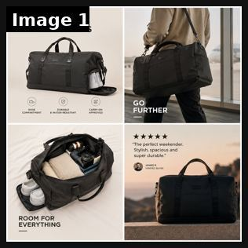

# 59 · Problem → agitation → solution → proof (4-part PAS ad, video or static): see it, then make it

[](https://x.com/ayomikunszn/status/2078116608069800131)

**The example:** [@ayomikunszn on X](https://x.com/ayomikunszn/status/2078116608069800131) · 1 image · 26 likes, 1K views

**Watch it:** [open the post on X](https://x.com/ayomikunszn/status/2078116608069800131)

> Created these Weekender Bag ad concepts after studying what's working for leading DTC travel brands on Meta. Each creative focuses on a different conversion angle: problem-solution, lifestyle, product benefits, and social proof. Good ads don't try to say everything. They https://t.co/DcQCatlz9c https://t.co/Su20O86nXa

## What you are seeing

A 4-image static concept for a weekender bag: the product on its own with feature icons, a man carrying it ("GO FURTHER"), the bag open ("ROOM FOR EVERYTHING") and a 5-star review card.

## Image by image

| Image | Text on it (OCR, rough) |
|---|---|
| 1 | BUILT FOR WEEKENDS pw GO ca FURTHER Kk kkk The perfect Stylish, spacious and super durable. ROOM FOR EVERYTHING |

## How to make one like it

**The format in one line:** The classic direct-response structure: name one specific pain so the right person thinks "that's me", agitate it (consequences, failed fixes), introduce the product as THE fix for that pain, close with specific proof and one CTA. One problem per ad — five benefits = five ads.

**Why it works:** - Meets the viewer where they already are emotionally. - Specific proof ("4.8★ from 12,000 reviews") beats generic. - Scales cleanly: one ad per pain point.

**Contents:** [1. Structure](#1-copy-the-structure) · [2. Shot by shot](#2-shot-by-shot-remake) · [3. Script and hooks](#3-write-the-script) · [4. Prompts](#4-prompts) · [5. Tools and settings](#5-tools-and-settings) · [6. Louise Carter remake](#6-louise-carter-remake) · [7. Variants and test](#7-variants-and-test-plan) · [8. Pitfalls](#8-pitfalls)

### 1. Copy the structure

The skeleton every version follows: **hook → problem or tension → turn (the product shows up) → proof → one clear ask.** The shot-by-shot below fills it in.

### 2. Shot-by-shot remake

**Target length / size:** Static 1080x1350 (4-panel) or 20-40s video

| # | Time / slot | What we see (visual + camera) | Dialogue / on-screen text |
|---|---|---|---|
| 1 | Problem | The pain, named precisely | "Your favourite necklace left a green line again." |
| 2 | Agitate | Consequences / failed fixes | "Clear nail polish. Taking it off. Buying more." |
| 3 | Solution | Product as the answer | "14K PVD bonded gold, waterproof." |
| 4 | Proof | Review / stars | Real review |
| 5 | CTA | - | Offer |

<details><summary>Playbook shot list (Louise Carter version from the README)</summary>

| Time / slot | Visual | Audio / copy |
|---|---|---|
| 0-5s | Close-up green ring mark on finger | "If your rings leave a green line, this is for you." |
| 5-20s | Taking jewelry off before every shower/pool; tangled tray | "I tried clear nail polish, 'hypoallergenic' plating… still green in a week." |
| 20-40s | LC piece in shower and pool | "This is what finally let me stop taking it off: 14K PVD, bonded not plated." |
| 40-60s | Real review count + any 7 for $85 | "[real rating/count]. Any 7 for $85." |

</details>

### 3. Write the script

Open with one of these hooks (first 1–3 seconds, or the headline on a static):

- "If your rings leave a green line, this is for you"
- "Tired of taking your necklace off every night?"
- "Still buying gifts she never wears?"

Then fill the beats from the table above. Pull the wording from real customer reviews, not from ad copy: a review line beats a copywriter line almost every time. Read every line out loud and cut anything you would not say to a friend. Ready-made Louise Carter scripts are in section 6; hand [BOT.md](BOT.md) to any AI agent to write versions for another brand.

### 4. Prompts

**Claude**

```text
Write 10 PAS ads for [product]: one sentence each for problem, agitation, solution, proof (from these reviews [paste]) and CTA.
```

**Full creative-agent prompt (from the playbook):**

```
For each LC pain point in {{PAINS}}, write a 45-60s PAS script with the 4 timed phases; proof only from {{REAL_PROOF}}. Also a static version: headline (pain) / body (agitation) / product visual / CTA.
```

### 5. Tools and settings

1. List LC pain points from reviews; one ad per pain.
2. Cover-the-product test: first 15s must stand alone as a portrait of the problem.
3. Proof must be real and specific (review count/rating from the actual platform).

| Setting | Value |
|---|---|
| Canvas | 1080×1350 (4:5) for feed; 1080×1920 (9:16) story/reel version with the same elements stacked |
| Type | Headline 80–110 px, max 8 words; body 36–44 px; at most 2 typefaces |
| Layout | Headline readable at thumbnail size; product at least 40% of the canvas; logo small, bottom corner |
| Safe zone | Keep text out of the bottom 20% on 9:16 (UI overlays) |
| Tools | Figma or Canva for layout; Photoshop or Photoroom to cut out product; Midjourney or Flux only for backgrounds, never for the product itself |
| Export | PNG or JPG at quality 90, sRGB, under 1 MB |

### 6. Louise Carter remake

- A · Green ring line.
- B · Taking jewelry off every night.
- C · Gift she never wears.

Brand rules, claims you can and cannot make, and more scripts: [brands/louise-carter.md](brands/louise-carter.md). Step-by-step from idea to scale: [STAGES.md](STAGES.md).

### 7. Variants and test plan

- Pain point
- Video vs static
- Creator vs founder

**Test plan:** - **Budget/structure:** 3 pains × 2 formats, $30/day each, 5 days - **Primary KPIs:** Hold rate to 20s, CPA; Omni (F59-*) - **Kill rule:** CPA >2× - **Scale rule:** Winning pain → F54/F34 variants - **Naming:** `utm_content=F59-<concept>-<variant>`; weekly Omni roll-up of new-customer revenue by format.

**Naming:** `F59-<variant>-<hook##>-<date>` so results map back to this folder. Change one thing per test (hook, narrator, length or offer), never two.

### 8. Pitfalls

- Agitate the problem, not the person.
- Proof must be real.
- Too much text: if it cannot be read in 1 second at thumbnail size, cut it.
- AI-generated product images: show the real product; AI is fine for backgrounds only.

**Compliance:** Baseline: [_COMPLIANCE.md](../_COMPLIANCE.md) (no fake testimonials, AI disclosure, no bulk/spoofed accounts, copy structure not assets, PDP-only claims). - Proof numbers must be real and current; no overclaiming.

## More examples

Every post we found for this format, with transcripts: [examples/](examples/README.md). Playbook: [README.md](README.md). Agent brief: [BOT.md](BOT.md).
