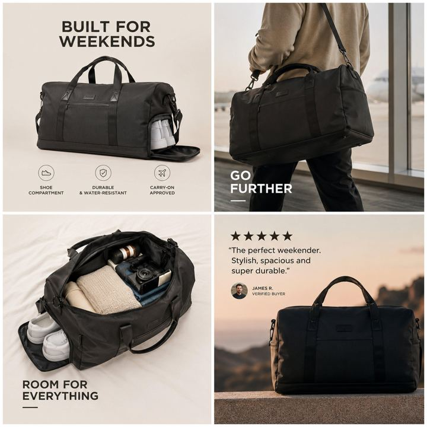

# 59 · Problem → agitation → solution → proof (4-part PAS ad, video or static)

<!-- HERO:START -->
[](EXAMPLE.md)

**[See the example and how to make it →](EXAMPLE.md)** · [watch on X](https://x.com/ayomikunszn/status/2078116608069800131)
<!-- HERO:END -->


> **LC priority P1** · evidence: Medium (framework, multi-source) · hype risk: Low · cost $0-150 · 1 h

## What it is
The classic direct-response structure: name one specific pain so the right person thinks "that's me", agitate it (consequences, failed fixes), introduce the product as THE fix for that pain, close with specific proof and one CTA. One problem per ad — five benefits = five ads.

## Why it works
- Meets the viewer where they already are emotionally.
- Specific proof ("4.8★ from 12,000 reviews") beats generic.
- Scales cleanly: one ad per pain point.

## Shot-by-shot (LC version)

| Time / slot | Visual | Audio / copy |
|---|---|---|
| 0-5s | Close-up green ring mark on finger | "If your rings leave a green line, this is for you." |
| 5-20s | Taking jewelry off before every shower/pool; tangled tray | "I tried clear nail polish, 'hypoallergenic' plating… still green in a week." |
| 20-40s | LC piece in shower and pool | "This is what finally let me stop taking it off: 14K PVD, bonded not plated." |
| 40-60s | Real review count + any 7 for $85 | "[real rating/count]. Any 7 for $85." |

## Hooks (swap-in openers)
- "If your rings leave a green line, this is for you"
- "Tired of taking your necklace off every night?"
- "Still buying gifts she never wears?"

## Real examples from X (studied)
- GetHookd — "Problem-Solution Ads": 4-part structure with timings, specificity rules, mistakes (product before pain, overpromising, one ad for five problems) ([article](https://www.gethookd.ai/learn/problem-solution-ads-format-examples-tips/)).
- GetHookd — "7 Best UGC Video Ads": problem-solution story among 7 UGC types ([article](https://www.gethookd.ai/learn/7-best-ugc-video-ads-examples-to-try-in-2026/)).
- @alexpagepilot — UGC problem/solution in top 5 dropship formats ([post](https://x.com/alexpagepilot/status/2099438014456045990)).

## Production recipe
1. List LC pain points from reviews; one ad per pain.
2. Cover-the-product test: first 15s must stand alone as a portrait of the problem.
3. Proof must be real and specific (review count/rating from the actual platform).

## Bot prompt (copy into the creative agent)
```
For each LC pain point in {{PAINS}}, write a 45-60s PAS script with the 4 timed phases; proof only from {{REAL_PROOF}}. Also a static version: headline (pain) / body (agitation) / product visual / CTA.
```

## 3 LC scripts
- A · Green ring line.
- B · Taking jewelry off every night.
- C · Gift she never wears.

## Variants to test
- Pain point
- Video vs static
- Creator vs founder

## Omni test plan
- **Budget/structure:** 3 pains × 2 formats, $30/day each, 5 days
- **Primary KPIs:** Hold rate to 20s, CPA; Omni (F59-*)
- **Kill rule:** CPA >2×
- **Scale rule:** Winning pain → F54/F34 variants
- **Naming:** `utm_content=F59-<concept>-<variant>`; weekly Omni roll-up of new-customer revenue by format.

## Compliance
Baseline: [_COMPLIANCE.md](../_COMPLIANCE.md) (no fake testimonials, AI disclosure, no bulk/spoofed accounts, copy structure not assets, PDP-only claims).
- Proof numbers must be real and current; no overclaiming.

## Related
- Strategies: 10-skit-and-problem-first-ugc-hooks, 41-von-restorff-static-copy-prompt
- Formats: [34-callout-statics-signs-myths-warnings](../34-callout-statics-signs-myths-warnings/README.md), [14-in-car-yapper-confession](../14-in-car-yapper-confession/README.md), [11-before-after-transformation](../11-before-after-transformation/README.md)

<!-- EVIDENCE:START -->
## Wave 4 update: Fedotoff October 2026 swipe boards
- Deborah Hayes: "Spa treatments for belly fat don't work" two-layer explainer, 286 days live (AI & CGI Ads That Actually Convert board). A "what you tried doesn't work, here's the layer it misses" reframe, the same skeleton as F108's "3 layers".
- BioRoot Labs: "Relief like ibuprofen without the stomach pain" ingredient static, 179 days live (AI Storytelling Ads: 13 Brands x 50 Longest-Running board). "Like X without the side effect": the known drug as an anchor, the side effect as the enemy.
- Stills, how-to and LC remakes: [adlibrary/](adlibrary/README.md).

## Wave 5 update: hook = product (Oct 2026)
- Matt Gittleson: "The hook and the product have to be the same idea." Construction: **problem → promised relief → your product is the mechanism**. Examples: "STOP deleting your horizontal pics" and "here's how I FINALLY made my IG pics look aesthetic": the answer is the app, so the product is the payoff, not an interruption. **Removal test:** if the video still makes sense with the product removed, it will convert at zero. A storytelling video that slips the app in at second 67 works as content and fails as marketing ([article](https://x.com/mattgittleson/status/2107530746923823444)).
- LC: "STOP taking your necklace off before the shower" → the relief is a necklace you never take off → LC waterproof gold is the mechanism.

## Evidence from X discovery (auto-generated)

| Date | Author | Post | Engagement | Grade | Gist |
|---|---|---|---|---|---|
<!-- EVIDENCE:END -->
