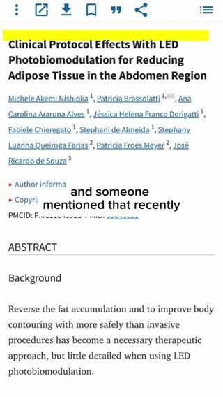
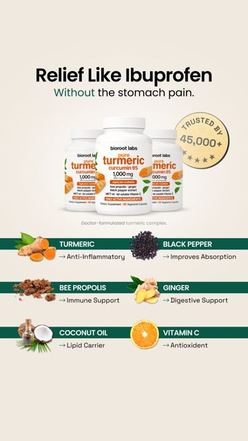

# Meta ad-library examples for F59

<!-- WAVE4 -->
## Wave 4: Alex Fedotoff's October 2026 swipe boards (GetHookd public previews)

Each ad below is from the free 10-ad preview of a public GetHookd board that [@FedotOff90](https://x.com/FedotOff90) shared on X. Days live are as of 2026-10-09; brand claims are the advertisers', not verified.

### Deborah Hayes: "Spa treatments for belly fat don't work" two-layer explainer (286 days live)

- **Board:** [AI & CGI Ads That Actually Convert](https://x.com/FedotOff90/status/2107892934050037807) · video 126 s
- **What happens:** "Spa treatments for belly fat don't work. And there's a scientific reason why… I did six spa sessions… $1,200… Your belly fat has two types of fat… these only work on surface fat." UGC plus a medical-paper insert plus CGI. 126 s.
- **Why it lasts:** 286 days. A "what you tried doesn't work, here's the layer it misses" reframe, the same skeleton as F108's "3 layers".
- **How to make one:** List what they tried with money spent, then a 2-layer mechanism, then the product reaches layer 2.
- **LC remake:** "I spent $600 on plated jewelry that turned green. Here's the layer they skip."

### BioRoot Labs: "Relief like ibuprofen without the stomach pain" ingredient static (179 days live)

- **Board:** [AI Storytelling Ads: 13 Brands x 50 Longest-Running (Oct 2026)](https://x.com/FedotOff90/status/2107177846070202853) · image
- **What happens:** A static: "Relief Like Ibuprofen, Without the stomach pain", 3 bottles, a "45,000+ trusted" badge, and an ingredient grid (turmeric anti-inflammatory, black pepper absorption, bee propolis immune, ginger digestive, coconut oil lipid carrier, vitamin C antioxidant).
- **Why it lasts:** 179 days. "Like X without the side effect": the known drug as an anchor, the side effect as the enemy.
- **How to make one:** Headline "[benefit] like [familiar drug], without [its side effect]", product, ingredient grid with one benefit each.
- **LC remake:** "The look of solid gold, without the green neck."

