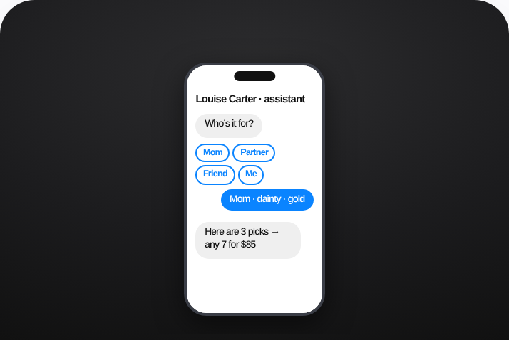

# 60 · Click-to-message ads (Messenger / IG DM / TikTok Instant Messaging) — 'stylist in your DMs': see it, then make it



> **No clean public example yet.** This is an illustrative mock of the format, not a real ad. The closest real posts are in [examples/](examples/README.md); swap a real one in here when you find it.

## How to make one like it

**The format in one line:** Ads whose CTA opens a chat instead of a landing page. The creative promises a concrete service ("send us who it's for + budget → we'll build her stack in 2 minutes"); an automated welcome flow qualifies (recipient, style, budget) and a human or bot replies with 3 picks + checkout link.

**Why it works:** - Optimises for conversations, routing ads to people willing to talk. - Gift buyers are unsure — a stylist chat removes the decision barrier. - Captures zero-party data (recipient, occasion) for Omnisend/OneText.

**Contents:** [1. Structure](#1-copy-the-structure) · [2. Shot by shot](#2-shot-by-shot-remake) · [3. Script and hooks](#3-write-the-script) · [4. Prompts](#4-prompts) · [5. Tools and settings](#5-tools-and-settings) · [6. Louise Carter remake](#6-louise-carter-remake) · [7. Variants and test](#7-variants-and-test-plan) · [8. Pitfalls](#8-pitfalls)

### 1. Copy the structure

The skeleton every version follows: **hook → problem or tension → turn (the product shows up) → proof → one clear ask.** The shot-by-shot below fills it in.

### 2. Shot-by-shot remake

**Target length / size:** Ad 1080x1350/1080x1920 + DM flow

| # | Time / slot | What we see (visual + camera) | Dialogue / on-screen text |
|---|---|---|---|
| 1 | Creative | Product + concrete promise | "Send us who it's for + budget, we'll build her stack in 2 minutes" |
| 2 | CTA | Send message button | - |
| 3 | DM flow | Auto-greeting with 3 quick replies (gift / for me / help me choose) | Then a human or a bot recommends 3 pieces |
| 4 | Close | Checkout link in the chat | - |

<details><summary>Playbook shot list (Louise Carter version from the README)</summary>

| Time / slot | Visual | Audio / copy |
|---|---|---|
| Ad 0-3s | Creator: "Don't know what to get her? DM us 'STACK'" | — |
| Ad 3-10s | Screen-record of a real chat: 3 picks appear | — |
| Chat 1 | Welcome: "Who's it for? Mom / Partner / Friend / Me" | Buttons |
| Chat 2 | "Gold or mixed? Dainty or bold?" | Buttons |
| Chat 3 | 3 picks + "any 7 for $85" link + human handoff | — |

</details>

### 3. Write the script

Open with one of these hooks (first 1–3 seconds, or the headline on a static):

- "Tell us who it's for. We'll build the stack."
- "DM 'STACK' and a real stylist picks 7 for you"
- "Gift panic? Message us."

Then fill the beats from the table above. Pull the wording from real customer reviews, not from ad copy: a review line beats a copywriter line almost every time. Read every line out loud and cut anything you would not say to a friend. Ready-made Louise Carter scripts are in section 6; hand [BOT.md](BOT.md) to any AI agent to write versions for another brand.

### 4. Prompts

**Meta setup**

```text
Objective: Engagement or Sales with "Message destination" (Messenger + IG + WhatsApp). Greeting template with quick replies; route to a person within 5 minutes during business hours.
```

**Full creative-agent prompt (from the playbook):**

```
Write a click-to-message ad (15s script + primary text) and a 4-step welcome flow for LC gifting: recipient, style, budget, occasion date; output 3 SKU picks logic from {{CATALOG}} and the handoff message.
```

### 5. Tools and settings

1. Build welcome flow (Meta inbox automations / ManyChat) with 3 qualifying questions.
2. Staff replies within minutes during peak gifting weeks; after-hours auto-reply with picks.
3. Send picks with UTM links (utm_content=F60-*) so Omni attributes revenue.
4. Ask opt-in for SMS/email (OneText/Omnisend) inside the chat.

| Setting | Value |
|---|---|
| What you are building | A repeatable system (account, page, offer or pipeline), not one ad |
| Cadence | Decide the posting or launch rhythm up front (e.g. daily, or 3 new ads a week) and keep it for 30 days |
| Template | Lock one caption, layout and naming template so output is consistent |
| Tracking | One UTM pattern per system (`utm_campaign=F<NN>`) and a weekly sheet: spend, CTR, hook rate, CPA |
| Tools | Meta Ads Manager / TikTok Ads Manager, a shared Drive folder per format, the agent brief in BOT.md |

### 6. Louise Carter remake

- A · "Gift panic? DM us" (holiday).
- B · "Build my bridesmaid stacks" (weddings).
- C · Retargeting: "Still deciding? Ask us anything."

Brand rules, claims you can and cannot make, and more scripts: [brands/louise-carter.md](brands/louise-carter.md). Step-by-step from idea to scale: [STAGES.md](STAGES.md).

### 7. Variants and test plan

- Bot-only vs human handoff
- Platform (IG DM vs Messenger vs TikTok IMA)

**Test plan:** - **Budget/structure:** $40/day, 14 days in gifting season - **Primary KPIs:** Cost per conversation, conversation→purchase %, CPA; Omni (F60-*) - **Kill rule:** Conv→purchase <5% after 100 chats - **Scale rule:** Q4 + Mother's Day - **Naming:** `utm_content=F60-<concept>-<variant>`; weekly Omni roll-up of new-customer revenue by format.

**Naming:** `F60-<variant>-<hook##>-<date>` so results map back to this folder. Change one thing per test (hook, narrator, length or offer), never two.

### 8. Pitfalls

- A slow reply kills it; staff it or use a bot with a handoff.
- No clean public example; visual is a mock.
- Changing the template every week: the system only learns if it stays consistent for at least 30 days.
- No tracking: without one naming and UTM pattern you cannot tell which piece of the system works.

**Compliance:** Baseline: [_COMPLIANCE.md](../_COMPLIANCE.md) (no fake testimonials, AI disclosure, no bulk/spoofed accounts, copy structure not assets, PDP-only claims). - Disclose automation ("I'm LC's assistant"); follow platform messaging policies (24h window); explicit opt-in before SMS/email marketing (TCPA/GDPR).

## More examples

Every post we found for this format, with transcripts: [examples/](examples/README.md). Playbook: [README.md](README.md). Agent brief: [BOT.md](BOT.md).
