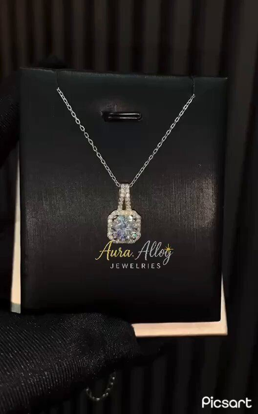

# 60 · Click-to-message ads (Messenger / IG DM / TikTok Instant Messaging) — "stylist in your DMs"

<!-- HERO:START -->
[](EXAMPLE.md)

**[See the example and how to make it →](EXAMPLE.md)** · [watch on X](https://x.com/aura_alloy/status/1982632501110812979)
<!-- HERO:END -->


> **LC priority P2** · evidence: Medium (platform case studies via vendor) · hype risk: Med · cost $0 creative + chat ops · setup 1-2 days

## What it is
Ads whose CTA opens a chat instead of a landing page. The creative promises a concrete service ("send us who it's for + budget → we'll build her stack in 2 minutes"); an automated welcome flow qualifies (recipient, style, budget) and a human or bot replies with 3 picks + checkout link.

## Why it works
- Optimises for conversations, routing ads to people willing to talk.
- Gift buyers are unsure — a stylist chat removes the decision barrier.
- Captures zero-party data (recipient, occasion) for Omnisend/OneText.

## Shot-by-shot (LC version)

| Time / slot | Visual | Audio / copy |
|---|---|---|
| Ad 0-3s | Creator: "Don't know what to get her? DM us 'STACK'" | — |
| Ad 3-10s | Screen-record of a real chat: 3 picks appear | — |
| Chat 1 | Welcome: "Who's it for? Mom / Partner / Friend / Me" | Buttons |
| Chat 2 | "Gold or mixed? Dainty or bold?" | Buttons |
| Chat 3 | 3 picks + "any 7 for $85" link + human handoff | — |

## Hooks (swap-in openers)
- "Tell us who it's for. We'll build the stack."
- "DM 'STACK' and a real stylist picks 7 for you"
- "Gift panic? Message us."

## Real examples from X (studied)
- GetHookd — "3 Best TikTok Instant Messaging Ads": CPA down up to 74% (Kathy Cosmetics, HydroClean), CPL −20% (Tugo); fast replies, after-hours automation, welcome message matched to the ad's offer ([article](https://www.gethookd.ai/learn/3-best-tiktok-instant-messaging-ads-examples-tips/)).
- GetHookd — "7 Effective Facebook Messenger Ad Examples": 7 objectives + menu chatbot; the flow behind the click decides outcomes ([article](https://www.gethookd.ai/learn/7-effective-facebook-messenger-ad-examples-to-copy-in-2026/)).
- GetHookd — Instagram direct-message ads examples & strategy ([article](https://www.gethookd.ai/learn/instagram-direct-message-ads-examples-strategy/)).

## Production recipe
1. Build welcome flow (Meta inbox automations / ManyChat) with 3 qualifying questions.
2. Staff replies within minutes during peak gifting weeks; after-hours auto-reply with picks.
3. Send picks with UTM links (utm_content=F60-*) so Omni attributes revenue.
4. Ask opt-in for SMS/email (OneText/Omnisend) inside the chat.

## Bot prompt (copy into the creative agent)
```
Write a click-to-message ad (15s script + primary text) and a 4-step welcome flow for LC gifting: recipient, style, budget, occasion date; output 3 SKU picks logic from {{CATALOG}} and the handoff message.
```

## 3 LC scripts
- A · "Gift panic? DM us" (holiday).
- B · "Build my bridesmaid stacks" (weddings).
- C · Retargeting: "Still deciding? Ask us anything."

## Variants to test
- Bot-only vs human handoff
- Platform (IG DM vs Messenger vs TikTok IMA)

## Omni test plan
- **Budget/structure:** $40/day, 14 days in gifting season
- **Primary KPIs:** Cost per conversation, conversation→purchase %, CPA; Omni (F60-*)
- **Kill rule:** Conv→purchase <5% after 100 chats
- **Scale rule:** Q4 + Mother's Day
- **Naming:** `utm_content=F60-<concept>-<variant>`; weekly Omni roll-up of new-customer revenue by format.

## Compliance
Baseline: [_COMPLIANCE.md](../_COMPLIANCE.md) (no fake testimonials, AI disclosure, no bulk/spoofed accounts, copy structure not assets, PDP-only claims).
- Disclose automation ("I'm LC's assistant"); follow platform messaging policies (24h window); explicit opt-in before SMS/email marketing (TCPA/GDPR).

## Related
- Strategies: 14-email-list-as-asset, 15-community-led-discovery
- Formats: [48-the-dm-i-get-every-day](../48-the-dm-i-get-every-day/README.md), [26-founder-surprise-customer-call](../26-founder-surprise-customer-call/README.md)

<!-- EVIDENCE:START -->
## Evidence from X discovery (auto-generated)

| Date | Author | Post | Engagement | Grade | Gist |
|---|---|---|---|---|---|
<!-- EVIDENCE:END -->
