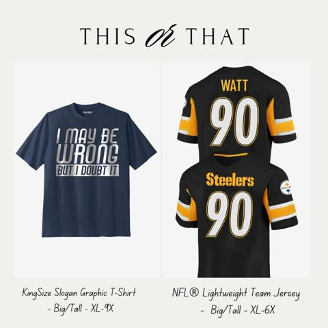
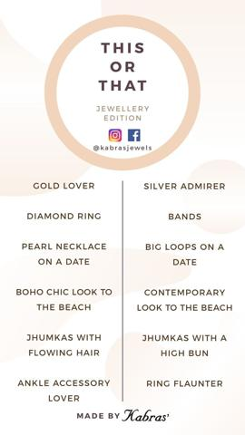
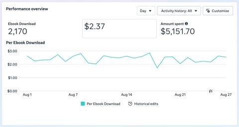
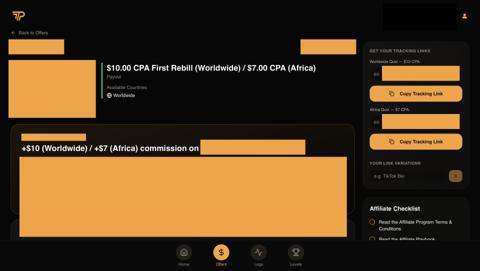

# 61 · Poll-sticker & product-match quiz ads (interactive A/B polls → retarget by answer): see it, then make it

[](https://x.com/f3dericobartoli/status/2039638255537201662)

**The example:** [@f3dericobartoli on X](https://x.com/f3dericobartoli/status/2039638255537201662) · 4 images · 19 likes, 2K views

**Watch it:** [open the post on X](https://x.com/f3dericobartoli/status/2039638255537201662)

> **How close is this example?** Close: quiz-funnel statics; no poll-sticker ad found. The gallery below has more examples.

> Some statics we recently made for a quiz funnel >>> we figure out the untapped angles that we can test >>> we make the landing page first (in this case a personalized quiz) >>> then we create 20+ different concepts >>> each concept gets 3 to 5 different visual styles >>> each visual style gets paired with short, medium and long form Primary Ad Text >>> so that we easily create 200+ variations in 2/3 hours >>> when we…

## What you are seeing

Four statics a creative team made for a quiz funnel. One is an iMessage thread: "I finally looked into the hair thing. Took some quiz. Turns out it's not even about growth..." Another is an editorial 'New research' card. Each ad's job is to get people to start a quiz, which then matches them to a product.

## Image by image

| Image | Text on it (OCR, rough) |
|---|---|
| 1 | New Research Hair Loss Isn’t Genetic. It’s Structural. Clinical framework reveals the protein collapse behind male pattern … Read the findings |
| 2 | Sarah finally looked into the hair thing. Took some quiz. Turns out it's not even about growth the anchor holding the hair is what breaks down. Everything tried before was only doing half the job. actually feel like understand it now. |
| 3 | Day How much could you recover in 90 days? Take the quiz |
| 4 | (mostly visual) |

## More real examples (6)

Other posts that show this format, or a close cousin of it. Click a thumbnail to open it on X.

| | | |
|---|---|---|
| [](https://x.com/frugalfreebies/status/1801654197462479132)<br>**@frugalfreebies** · image · 5 views<br>This or that? Which one would you pick for Father's Day? OneStopPlus Clearance Sale! - As low as $4.98! PLUS: Save 50% with code: KSESITEWIDE https:// | [](https://x.com/ZeeNunewTikTok/status/1927734140985541103)<br>**@ZeeNunewTikTok** · image · 624 views<br>Tag Booster ‼️ Lats play This or that Jewelry edition. Tell us your choices in the comments. Please remember to use the hashtag and keyword. KazzMag19 | [](https://x.com/codyschneider/status/2093098436069568758)<br>**@codyschneider** · image · 7K views<br>an AI agent is running facebook ads for a local business it just got the 2170 ebook downloads in august 16% of people who download the ebook turn into |
| [](https://x.com/zakburgers/status/2082826379863707993)<br>**@zakburgers** · image · 1K views<br>working with the biggest peptide players gave me huge experience in the segmentation game for emails creating 10 different angle flows for these brand | [](https://x.com/codyschneider/status/2093096255786234158)<br>**@codyschneider** · image · 959 views<br>an AI agent is running this local business facebook ads it got the 2170 ebook downloads 16% of people who download the ebook turn into a future patien | [](https://x.com/JamesEbringer/status/2081462841052151919)<br>**@JamesEbringer** · images · 2K views<br>Facebook CPCs in Africa are $0.05 right now Five cents a click Go inside TAP and look for the Africa Ads Method Set up a Facebook ad account Point a s |

## How to make one like it

**The format in one line:** Interactive creatives: a two-option poll sticker on a Story/Reel ad ("Herringbone or paperclip?") and/or a short product-match quiz ("Find your stack in 30s") as the destination. Answers create segments you retarget with matching creative.

**Why it works:** - Low-friction participation lifts engagement and gives first-party preference data. - Retargeting by answer = personalised follow-up creative. - Quiz → personalised result page reduces choice paralysis for a 7-piece bundle.

**Contents:** [1. Structure](#1-copy-the-structure) · [2. Shot by shot](#2-shot-by-shot-remake) · [3. Script and hooks](#3-write-the-script) · [4. Prompts](#4-prompts) · [5. Tools and settings](#5-tools-and-settings) · [6. Louise Carter remake](#6-louise-carter-remake) · [7. Variants and test](#7-variants-and-test-plan) · [8. Pitfalls](#8-pitfalls)

### 1. Copy the structure

The skeleton every version follows: **hook → problem or tension → turn (the product shows up) → proof → one clear ask.** The shot-by-shot below fills it in.

### 2. Shot-by-shot remake

**Target length / size:** Story ad with a poll sticker, or a quiz-funnel static

| # | Time / slot | What we see (visual + camera) | Dialogue / on-screen text |
|---|---|---|---|
| 1 | Story frame 1 | Two necklaces side by side | Poll sticker: "Paperclip or snake chain?" |
| 2 | Story frame 2 | Result reveal next day | "62% said paperclip. Here's how to style it." |
| 3 | Quiz static | iMessage-style screenshot | "Took a 30-second quiz and it picked my stack." |
| 4 | Retarget | Ads by answer: paperclip voters see paperclip stacks | - |

<details><summary>Playbook shot list (Louise Carter version from the README)</summary>

| Time / slot | Visual | Audio / copy |
|---|---|---|
| Story ad | Two pieces side by side; poll sticker "Which would you wear daily?" | — |
| Retarget A | Ad featuring the chosen piece + "you picked herringbone" | — |
| Quiz | 5 questions (style, metal, occasion, budget, recipient) → "Your 7-piece stack" | Optional email for results |

</details>

### 3. Write the script

Open with one of these hooks (first 1–3 seconds, or the headline on a static):

- "Herringbone or paperclip? Vote."
- "Gold every day or only weekends?"
- "Find your 7-piece stack in 30 seconds"

Then fill the beats from the table above. Pull the wording from real customer reviews, not from ad copy: a review line beats a copywriter line almost every time. Read every line out loud and cut anything you would not say to a friend. Ready-made Louise Carter scripts are in section 6; hand [BOT.md](BOT.md) to any AI agent to write versions for another brand.

### 4. Prompts

**Meta**

```text
Instagram Stories ad with the poll sticker (available in Ads Manager for Stories placements); build engaged audiences by answer.
```

**Quiz (Octane AI / Typeform)**

```text
5 questions (style, metal tone, budget, occasion, sea or city), result = a 7-piece stack with an add-all button.
```

**Full creative-agent prompt (from the playbook):**

```
Write 10 two-option poll prompts for LC (style/metal/occasion debates) and a 6-question product-match quiz mapping answers to {{SKUS}} → a 7-piece result + copy.
```

### 5. Tools and settings

1. Polls: Stories ads with poll sticker (Meta supports polls on Reels/Stories ads).
2. Engagement custom audiences by answer where available; else retarget engagers with both variants.
3. Quiz: 5-7 questions on LC site (strategy 04), result = curated 7-piece cart.

| Setting | Value |
|---|---|
| What you are building | A repeatable system (account, page, offer or pipeline), not one ad |
| Cadence | Decide the posting or launch rhythm up front (e.g. daily, or 3 new ads a week) and keep it for 30 days |
| Template | Lock one caption, layout and naming template so output is consistent |
| Tracking | One UTM pattern per system (`utm_campaign=F<NN>`) and a weekly sheet: spend, CTR, hook rate, CPA |
| Tools | Meta Ads Manager / TikTok Ads Manager, a shared Drive folder per format, the agent brief in BOT.md |

### 6. Louise Carter remake

- A · Poll "Dainty or bold?" → retarget each.
- B · Quiz "Find your stack".
- C · Launch teaser poll "Which should we restock first?" (only if both are real options).

Brand rules, claims you can and cannot make, and more scripts: [brands/louise-carter.md](brands/louise-carter.md). Step-by-step from idea to scale: [STAGES.md](STAGES.md).

### 7. Variants and test plan

- Poll vs quiz
- Story vs Reel placement

**Test plan:** - **Budget/structure:** $30/day per poll ad, 7 days; quiz traffic $50/day - **Primary KPIs:** Poll tap rate, quiz completion, result-page CVR; Omni (F61-*) - **Kill rule:** Quiz completion <40% - **Scale rule:** Answer-based retargeting - **Naming:** `utm_content=F61-<concept>-<variant>`; weekly Omni roll-up of new-customer revenue by format.

**Naming:** `F61-<variant>-<hook##>-<date>` so results map back to this folder. Change one thing per test (hook, narrator, length or offer), never two.

### 8. Pitfalls

- Polls only work in Stories placements.
- The quiz result must be a real, buyable stack.
- Keep quizzes under 6 questions.
- Changing the template every week: the system only learns if it stays consistent for at least 30 days.
- No tracking: without one naming and UTM pattern you cannot tell which piece of the system works.

**Compliance:** Baseline: [_COMPLIANCE.md](../_COMPLIANCE.md) (no fake testimonials, AI disclosure, no bulk/spoofed accounts, copy structure not assets, PDP-only claims). - Poll options must be real; quiz data use disclosed; email optional and consented.

## More examples

Every post we found for this format, with transcripts: [examples/](examples/README.md). Playbook: [README.md](README.md). Agent brief: [BOT.md](BOT.md).
