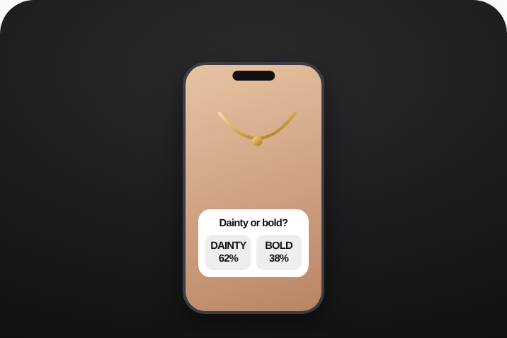

# 61 · Poll-sticker & product-match quiz ads (interactive A/B polls → retarget by answer): see it, then make it



> **No clean public example yet.** This is an illustrative mock of the format, not a real ad. The closest real posts are in [examples/](examples/README.md); swap a real one in here when you find it.

## How to make one like it

**The format in one line:** Interactive creatives: a two-option poll sticker on a Story/Reel ad ("Herringbone or paperclip?") and/or a short product-match quiz ("Find your stack in 30s") as the destination. Answers create segments you retarget with matching creative.

**Why it works:** - Low-friction participation lifts engagement and gives first-party preference data. - Retargeting by answer = personalised follow-up creative. - Quiz → personalised result page reduces choice paralysis for a 7-piece bundle.

**Contents:** [1. Structure](#1-copy-the-structure) · [2. Shot by shot](#2-shot-by-shot-remake) · [3. Script and hooks](#3-write-the-script) · [4. Prompts](#4-prompts) · [5. Tools and settings](#5-tools-and-settings) · [6. Louise Carter remake](#6-louise-carter-remake) · [7. Variants and test](#7-variants-and-test-plan) · [8. Pitfalls](#8-pitfalls)

### 1. Copy the structure

The skeleton every version follows: **hook → problem or tension → turn (the product shows up) → proof → one clear ask.** The shot-by-shot below fills it in.

### 2. Shot-by-shot remake

**Target length / size:** Story/Reel ad with poll + optional quiz

| # | Time / slot | What we see (visual + camera) | Dialogue / on-screen text |
|---|---|---|---|
| 1 | Story ad | Two products side by side | Poll sticker: "Herringbone or paperclip?" |
| 2 | Retarget | Show the chosen one to each voter | "You picked herringbone" |
| 3 | Quiz variant | "Find your stack in 30s" landing quiz | 3-5 questions → recommendation |

<details><summary>Playbook shot list (Louise Carter version from the README)</summary>

| Time / slot | Visual | Audio / copy |
|---|---|---|
| Story ad | Two pieces side by side; poll sticker "Which would you wear daily?" | — |
| Retarget A | Ad featuring the chosen piece + "you picked herringbone" | — |
| Quiz | 5 questions (style, metal, occasion, budget, recipient) → "Your 7-piece stack" | Optional email for results |

</details>

### 3. Write the script

Open with one of these hooks (first 1–3 seconds, or the headline on a static):

- "Herringbone or paperclip? Vote."
- "Gold every day or only weekends?"
- "Find your 7-piece stack in 30 seconds"

Then fill the beats from the table above. Pull the wording from real customer reviews, not from ad copy: a review line beats a copywriter line almost every time. Read every line out loud and cut anything you would not say to a friend. Ready-made Louise Carter scripts are in section 6; hand [BOT.md](BOT.md) to any AI agent to write versions for another brand.

### 4. Prompts

**Meta**

```text
Add the poll sticker in Ads Manager (Stories/Reels placements), build custom audiences from poll answers, retarget each with the chosen product.
```

**Full creative-agent prompt (from the playbook):**

```
Write 10 two-option poll prompts for LC (style/metal/occasion debates) and a 6-question product-match quiz mapping answers to {{SKUS}} → a 7-piece result + copy.
```

### 5. Tools and settings

1. Polls: Stories ads with poll sticker (Meta supports polls on Reels/Stories ads).
2. Engagement custom audiences by answer where available; else retarget engagers with both variants.
3. Quiz: 5-7 questions on LC site (strategy 04), result = curated 7-piece cart.

| Setting | Value |
|---|---|
| What you are building | A repeatable system (account, page, offer or pipeline), not one ad |
| Cadence | Decide the posting or launch rhythm up front (e.g. daily, or 3 new ads a week) and keep it for 30 days |
| Template | Lock one caption, layout and naming template so output is consistent |
| Tracking | One UTM pattern per system (`utm_campaign=F<NN>`) and a weekly sheet: spend, CTR, hook rate, CPA |
| Tools | Meta Ads Manager / TikTok Ads Manager, a shared Drive folder per format, the agent brief in BOT.md |

### 6. Louise Carter remake

- A · Poll "Dainty or bold?" → retarget each.
- B · Quiz "Find your stack".
- C · Launch teaser poll "Which should we restock first?" (only if both are real options).

Brand rules, claims you can and cannot make, and more scripts: [brands/louise-carter.md](brands/louise-carter.md). Step-by-step from idea to scale: [STAGES.md](STAGES.md).

### 7. Variants and test plan

- Poll vs quiz
- Story vs Reel placement

**Test plan:** - **Budget/structure:** $30/day per poll ad, 7 days; quiz traffic $50/day - **Primary KPIs:** Poll tap rate, quiz completion, result-page CVR; Omni (F61-*) - **Kill rule:** Quiz completion <40% - **Scale rule:** Answer-based retargeting - **Naming:** `utm_content=F61-<concept>-<variant>`; weekly Omni roll-up of new-customer revenue by format.

**Naming:** `F61-<variant>-<hook##>-<date>` so results map back to this folder. Change one thing per test (hook, narrator, length or offer), never two.

### 8. Pitfalls

- Polls work only on Stories/Reels placements.
- Keep the quiz under 5 questions.
- No clean public example; visual is a mock.
- Changing the template every week: the system only learns if it stays consistent for at least 30 days.
- No tracking: without one naming and UTM pattern you cannot tell which piece of the system works.

**Compliance:** Baseline: [_COMPLIANCE.md](../_COMPLIANCE.md) (no fake testimonials, AI disclosure, no bulk/spoofed accounts, copy structure not assets, PDP-only claims). - Poll options must be real; quiz data use disclosed; email optional and consented.

## More examples

Every post we found for this format, with transcripts: [examples/](examples/README.md). Playbook: [README.md](README.md). Agent brief: [BOT.md](BOT.md).
