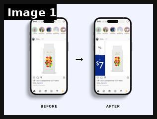
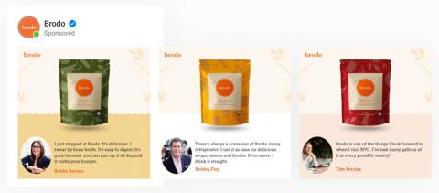
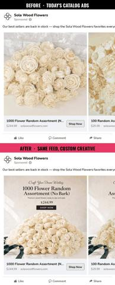

# 62 · Catalog / collection / dynamic product ads (Advantage+ catalog, catalog video, collection + Instant Experience lookbook): see it, then make it

[](https://x.com/danpantelo/status/1640330448818544640)

**The example:** [@danpantelo on X](https://x.com/danpantelo/status/1640330448818544640) · 1 image · 4 likes, 3K views

**Watch it:** [open the post on X](https://x.com/danpantelo/status/1640330448818544640)

> **How close is this example?** Close: a catalog-ad mock-up by a practitioner, not a live ad. The gallery below has more examples.

> @moizali Here on the left is a mockup of what Native's DPA would look like if they were running DPA. On the right is what it could look like if they enhanced their feed with a custom template.

## What you are seeing

Two phone mock-ups of a catalog (dynamic product) ad for Native deodorant: on the left, the plain product-on-white tile a default catalog feed produces; on the right, the same catalog item wrapped in a custom branded template. It shows how much a designed catalog template changes the ad without making a new creative per product.

## Image by image

| Image | Text on it (OCR, rough) |
|---|---|
| 1 | 47 BEFORE AFTER |

## More real examples (2)

Other posts that show this format, or a close cousin of it. Click a thumbnail to open it on X.

| | | |
|---|---|---|
| [](https://x.com/goodAdsAI/status/1762455167591649792)<br>**@goodAdsAI** · image · 102 views<br>#BrandedCatalog Spotlight Brand: @brodoNYC Category: Food & Beverage Template type: Product image with rotating celebrity reviews WHY IT WORKS: 🖼️The | [](https://x.com/VisualLiftai/status/2078583438018220351)<br>**@VisualLiftai** · video · 28 views<br>@MehtabKarta For Solawood, what do you use to run your DPA ads? Made you this with our new DPA template builder :) |   |

## How to make one like it

**The format in one line:** Let Meta pick the product per person: Advantage+ catalog ads (dynamic product ads) with catalog video and branded frames; collection ads with a lifestyle hero video over 3-4 product tiles opening an Instant Storefront/Lookbook; creator Partnership ads paired with the catalog.

**Why it works:** - Shows the exact piece someone viewed (abandoned cart / browse retargeting). - Catalog video/lifestyle frames beat plain packshots. - Lookbook keeps browsing inside the app (fast load).

**Contents:** [1. Structure](#1-copy-the-structure) · [2. Shot by shot](#2-shot-by-shot-remake) · [3. Script and hooks](#3-write-the-script) · [4. Prompts](#4-prompts) · [5. Tools and settings](#5-tools-and-settings) · [6. Louise Carter remake](#6-louise-carter-remake) · [7. Variants and test](#7-variants-and-test-plan) · [8. Pitfalls](#8-pitfalls)

### 1. Copy the structure

The skeleton every version follows: **hook → problem or tension → turn (the product shows up) → proof → one clear ask.** The shot-by-shot below fills it in.

### 2. Shot-by-shot remake

**Target length / size:** Catalog setup + branded frames

| # | Time / slot | What we see (visual + camera) | Dialogue / on-screen text |
|---|---|---|---|
| 1 | Catalog | All products with clean images, titles, prices | - |
| 2 | Frames | Branded overlay templates (price tag, "waterproof" badge) | - |
| 3 | Collection ad | Lifestyle hero video above 4 product tiles | - |
| 4 | Catalog video | Product images turned into short video by template | - |

<details><summary>Playbook shot list (Louise Carter version from the README)</summary>

| Time / slot | Visual | Audio / copy |
|---|---|---|
| Hero | 15s lifestyle video: stack on wet skin | — |
| Tiles | 4 bestsellers from catalog with price | — |
| Instant Experience | Lookbook: "Beach stack", "Office stack", "Bridesmaid stack" → PDPs | — |
| DPA frame | Catalog image + branded frame "14K PVD · waterproof · any 7 for $85" | — |

</details>

### 3. Write the script

Open with one of these hooks (first 1–3 seconds, or the headline on a static):

- Hero line: "Shower-proof gold. Pick your 7."
- DPA frame: "Still thinking about it? It's waterproof."
- Lookbook: "Shop the stack"

Then fill the beats from the table above. Pull the wording from real customer reviews, not from ad copy: a review line beats a copywriter line almost every time. Read every line out loud and cut anything you would not say to a friend. Ready-made Louise Carter scripts are in section 6; hand [BOT.md](BOT.md) to any AI agent to write versions for another brand.

### 4. Prompts

**Meta Commerce Manager**

```text
Upload a catalog feed (Shopify integration), create a product set per category, apply a dynamic template with a gold frame and price badge.
```

**Full creative-agent prompt (from the playbook):**

```
Audit this catalog feed sample {{FEED}}: rewrite titles/descriptions for search + clarity (≤65 chars titles), propose 5 product sets, 3 catalog frame overlays, and a collection-ad hero script.
```

### 5. Tools and settings

1. Clean Shopify→Meta catalog feed (titles with "14K PVD waterproof", lifestyle images, video where possible).
2. Product sets: bestsellers, necklaces, huggies, gift sets, bundle-eligible.
3. Branded catalog frames (price/offer must match).
4. Pair top creator Partnership ads with catalog (F43).

| Setting | Value |
|---|---|
| Canvas | 1080×1350 (4:5) per slide; 1080×1920 for TikTok photo mode |
| Slides | 5–10; slide 1 is the hook only, last slide is the ask (save / follow / shop) |
| Type | 64–96 px headline per slide, one idea per slide, consistent position across slides |
| Continuity | Same template, colour and font on every slide so it reads as one piece |
| Audio (TikTok) | Add a trending sound at low volume; photo mode auto-advances |
| Tools | Canva or Figma template; Postnitro or ChatGPT for drafts; export PNG, sRGB |

### 6. Louise Carter remake

- A · Advantage+ catalog retargeting with "Still thinking about it?" frame.
- B · Collection ad: beach stack hero + 4 tiles.
- C · Instant Lookbook: 3 occasion stacks.

Brand rules, claims you can and cannot make, and more scripts: [brands/louise-carter.md](brands/louise-carter.md). Step-by-step from idea to scale: [STAGES.md](STAGES.md).

### 7. Variants and test plan

- Packshot vs lifestyle catalog image
- Frame vs no frame
- Collection vs carousel

**Test plan:** - **Budget/structure:** Always-on retargeting $50-100/day; prospecting catalog test $50/day - **Primary KPIs:** ROAS, CPA by product set; Omni new-customer revenue (F62-*) - **Kill rule:** Set ROAS < account avg ×0.7 after 14 days - **Scale rule:** Holiday product sets - **Naming:** `utm_content=F62-<concept>-<variant>`; weekly Omni roll-up of new-customer revenue by format.

**Naming:** `F62-<variant>-<hook##>-<date>` so results map back to this folder. Change one thing per test (hook, narrator, length or offer), never two.

### 8. Pitfalls

- Bad product photos kill catalog ads; reshoot on a consistent background.
- Keep prices in the feed accurate.
- A weak first slide: nobody swipes past a boring cover.
- No reason to save: give a list, a checklist or a reference people come back to.

**Compliance:** Baseline: [_COMPLIANCE.md](../_COMPLIANCE.md) (no fake testimonials, AI disclosure, no bulk/spoofed accounts, copy structure not assets, PDP-only claims). - Prices/offers in frames must match checkout; AI backgrounds must not alter the product.

## Field notes

Newer observations live in the playbook: [Wave 3 update: Meta ad-library long-runners (Fedotoff gut-health board)](README.md) · [Wave 4 update: Fedotoff October 2026 swipe boards](README.md)

## More examples

Every post we found for this format, with transcripts: [examples/](examples/README.md). Playbook: [README.md](README.md). Agent brief: [BOT.md](BOT.md).
