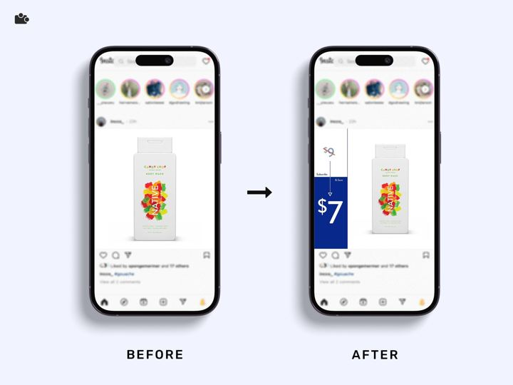

# 62 · Catalog / collection / dynamic product ads (Advantage+ catalog, catalog video, collection + Instant Experience lookbook)

<!-- HERO:START -->
[](EXAMPLE.md)

**[See the example and how to make it →](EXAMPLE.md)** · [watch on X](https://x.com/danpantelo/status/1640330448818544640)
<!-- HERO:END -->


> **LC priority P1** · evidence: Med-High (platform case studies) · hype risk: Low · cost $0 creative (catalog), setup time · setup 1-2 days

## What it is
Let Meta pick the product per person: Advantage+ catalog ads (dynamic product ads) with catalog video and branded frames; collection ads with a lifestyle hero video over 3-4 product tiles opening an Instant Storefront/Lookbook; creator Partnership ads paired with the catalog.

## Why it works
- Shows the exact piece someone viewed (abandoned cart / browse retargeting).
- Catalog video/lifestyle frames beat plain packshots.
- Lookbook keeps browsing inside the app (fast load).

## Shot-by-shot (LC version)

| Time / slot | Visual | Audio / copy |
|---|---|---|
| Hero | 15s lifestyle video: stack on wet skin | — |
| Tiles | 4 bestsellers from catalog with price | — |
| Instant Experience | Lookbook: "Beach stack", "Office stack", "Bridesmaid stack" → PDPs | — |
| DPA frame | Catalog image + branded frame "14K PVD · waterproof · any 7 for $85" | — |

## Hooks (swap-in openers)
- Hero line: "Shower-proof gold. Pick your 7."
- DPA frame: "Still thinking about it? It's waterproof."
- Lookbook: "Shop the stack"

## Real examples from X (studied)
- GetHookd — "4 Best Facebook Dynamic Product Ads Examples": ONE BOY catalog video (+34% purchases, −11% CPA), Sephora Partnership + catalog (1.56× iROAS), Ben & Jerry's AI backgrounds, Boden curated set ([article](https://www.gethookd.ai/learn/4-best-facebook-dynamic-product-ads-examples-to-try-in-2026/)).
- GetHookd — "Facebook Collection Ads": hero + product tiles + Instant Experience; 4 templates (Storefront, Lookbook, Customer Acquisition, Storytelling) ([article](https://www.gethookd.ai/learn/facebook-collection-ads-examples-cost-how-to-create-them/)).
- GetHookd — "4 Best Facebook Instant Experience Ads": lead with the strongest visual, sound-off, A/B vs standard mobile ads ([article](https://www.gethookd.ai/learn/4-best-facebook-instant-experience-ads-examples-tips-for-2026/)).
- GetHookd — "5 Best Jewelry Facebook Ads": collection ads as shoppable lookbook for larger catalogs ([article](https://www.gethookd.ai/learn/5-best-jewelry-facebook-ads-examples-to-copy-in-2026/)).

## Production recipe
1. Clean Shopify→Meta catalog feed (titles with "14K PVD waterproof", lifestyle images, video where possible).
2. Product sets: bestsellers, necklaces, huggies, gift sets, bundle-eligible.
3. Branded catalog frames (price/offer must match).
4. Pair top creator Partnership ads with catalog (F43).

## Bot prompt (copy into the creative agent)
```
Audit this catalog feed sample {{FEED}}: rewrite titles/descriptions for search + clarity (≤65 chars titles), propose 5 product sets, 3 catalog frame overlays, and a collection-ad hero script.
```

## 3 LC scripts
- A · Advantage+ catalog retargeting with "Still thinking about it?" frame.
- B · Collection ad: beach stack hero + 4 tiles.
- C · Instant Lookbook: 3 occasion stacks.

## Variants to test
- Packshot vs lifestyle catalog image
- Frame vs no frame
- Collection vs carousel

## Omni test plan
- **Budget/structure:** Always-on retargeting $50-100/day; prospecting catalog test $50/day
- **Primary KPIs:** ROAS, CPA by product set; Omni new-customer revenue (F62-*)
- **Kill rule:** Set ROAS < account avg ×0.7 after 14 days
- **Scale rule:** Holiday product sets
- **Naming:** `utm_content=F62-<concept>-<variant>`; weekly Omni roll-up of new-customer revenue by format.

## Compliance
Baseline: [_COMPLIANCE.md](../_COMPLIANCE.md) (no fake testimonials, AI disclosure, no bulk/spoofed accounts, copy structure not assets, PDP-only claims).
- Prices/offers in frames must match checkout; AI backgrounds must not alter the product.

## Related
- Strategies: 05-offer-page-engineering, 18-upsell-ecosystem
- Formats: [37-urgency-offer-statics](../37-urgency-offer-statics/README.md), [43-hudson-method-creator-swarm](../43-hudson-method-creator-swarm/README.md), [64-reminder-retargeting-sequence](../64-reminder-retargeting-sequence/README.md)

<!-- EVIDENCE:START -->
## Evidence from X discovery (auto-generated)

| Date | Author | Post | Engagement | Grade | Gist |
|---|---|---|---|---|---|
<!-- EVIDENCE:END -->
