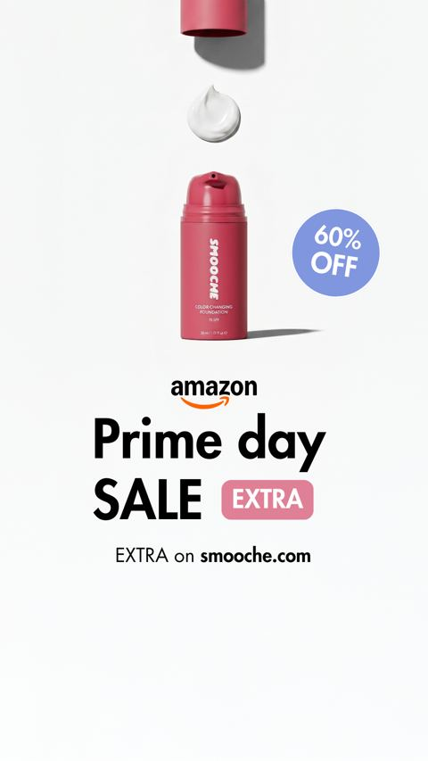
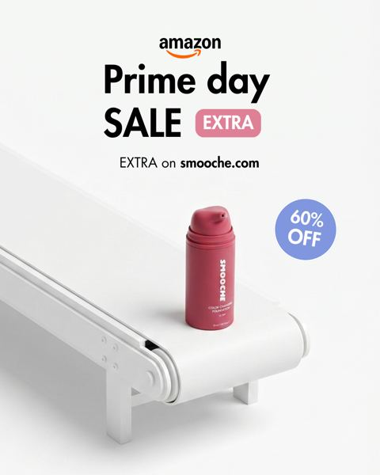
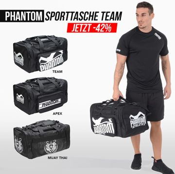
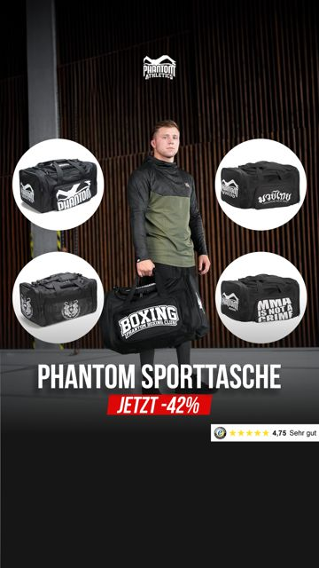
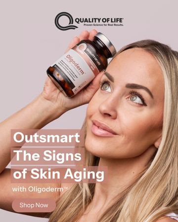

# Meta ad-library examples for F62 (GetHookd board 155932, gut health)

<!-- WAVE6 -->
## Wave 6: Resilia & Smooche live Meta ads (Oct 2026)

Pulled from the public Meta Ad Library on 2026-10-09 (Resilia: aged garlic, Ceylon cinnamon, oil of oregano; Smooche: color-changing foundation, Reverse Time peptide serum). Days live are counted to 2026-10-09; most video ads were new tests that week, while the long runners are statics and catalog templates. Transcripts are automatic. Brand claims are the advertisers', not verified, and many are health claims we would never make. The **Do not copy** line flags deceptive tactics (persona "publication" pages, undisclosed AI actors and "experts", fake stock counts).

### Smooche · Smooche: A catalog-template ad (111 days live)

- **Ad:** [Meta Ad Library #2068494240743500](https://www.facebook.com/ads/library/?id=2068494240743500) · static image · page “Smooche” · started 2026-06-19 · 1 copies · lands on `smooche.com/collections/the-hits/products/color-changing-fou`
- **What happens:** A catalog-template ad (headline {{product.name}}) whose image is a designed "Amazon Prime Day SALE, 60% off" frame.
- **Why it works:** Catalog-template ads ({{product.name}} / {{product.brand}} as the headline) with designed overlay frames are among the longest-running Smooche creatives (100-111 days). The catalog slot carries a branded promo frame rather than a plain packshot.
- **How to make one:** In the Commerce Manager catalog, add a designed overlay frame (the sale badge, a "Prime Day" banner, or a full "We f*cked up" note) so the dynamic ad looks like a static creative and still auto-rotates SKUs.
- **LC remake:** The LC catalog with an "Any 7 · $85" corner badge and a "survives the shower" ribbon on every product image.

### Smooche · Smooche: The same catalog template (111 days live)

- **Ad:** [Meta Ad Library #1774500803516201](https://www.facebook.com/ads/library/?id=1774500803516201) · static image · page “Smooche” · started 2026-06-19 · 1 copies · lands on `smooche.com/collections/the-hits/products/color-changing-fou`
- **What happens:** The same catalog template, with the bottle on a white conveyor and a "Prime day SALE EXTRA" badge.
- **Why it works:** Catalog-template ads ({{product.name}} / {{product.brand}} as the headline) with designed overlay frames are among the longest-running Smooche creatives (100-111 days). The catalog slot carries a branded promo frame rather than a plain packshot.
- **How to make one:** In the Commerce Manager catalog, add a designed overlay frame (the sale badge, a "Prime Day" banner, or a full "We f*cked up" note) so the dynamic ad looks like a static creative and still auto-rotates SKUs.
- **LC remake:** The LC catalog with an "Any 7 · $85" corner badge and a "survives the shower" ribbon on every product image.
<!-- /WAVE6 -->

From [@FedotOff90](https://x.com/FedotOff90/status/2108212319113412929)'s public board preview. Days live are as of 2026-10-09. Full board breakdown is in the internal sources folder.

## Phantom Athletics: Catalog DCO grid with big % badge (German) (445 days live)

- **What happens:** Dynamic-creative carousel: hero model holding the bag, three product variants stacked left, red 'JETZT -42%' badge, Trustpilot-style 4.75 rating strip.
- **Why it lasts:** 445 days live. Meta's DCO tests the image/headline combos; the % badge + rating does all the selling for an impulse category.
- **How to make one:** 1080x1080 and 1080x1350 templates in Canva; 3-6 cards; feed the catalog; one offer badge, max 3 colours.
- **LC remake:** LC catalog DCO: model wearing the stack, 3 variant tiles (necklace / huggies / bracelet), '7 for $85' badge, rating strip. Let Advantage+ creative rotate.

## Phantom Athletics: Catalog DCO grid, alternate layout (374 days live)

- **What happens:** Second Phantom layout: model in centre, four circle product cut-outs, 'PHANTOM SPORTTASCHE / JETZT -42%' bar.
- **Why it lasts:** 374 days live; two layouts of the same offer let DCO find the better frame per placement.
- **How to make one:** Duplicate the grid template into a circle layout; same offer text.
- **LC remake:** Same as above, circle layout variant.

<!-- WAVE4 -->
## Wave 4: Alex Fedotoff's October 2026 swipe boards (GetHookd public previews)

Each ad below is from the free 10-ad preview of a public GetHookd board that [@FedotOff90](https://x.com/FedotOff90) shared on X. Days live are as of 2026-10-09; brand claims are the advertisers', not verified.

### Quality of Life Labs: Model-holding-bottle DCO (Quality of Life Labs, 5 headlines) (583 days live)

- **Board:** [Skincare & Anti-Aging Winners — Active Now (Oct 2026, US/EN)](https://x.com/FedotOff90/status/2107495487570137409) · dco
- **What happens:** The same blonde model holding the bottle across 5 headline variants: "Outsmart the signs of skin aging", "Clinically-tested. Skin approved.", "Transform your skin diet". 35 media each.
- **Why it lasts:** 583 days. DCO keeps a winning visual alive by rotating headlines (Entity-ID caveat: Andromeda counts these as one idea).
- **How to make one:** One hero photo with 5 headlines, uploaded as DCO.
- **LC remake:** LC: one model photo with 5 headlines.

