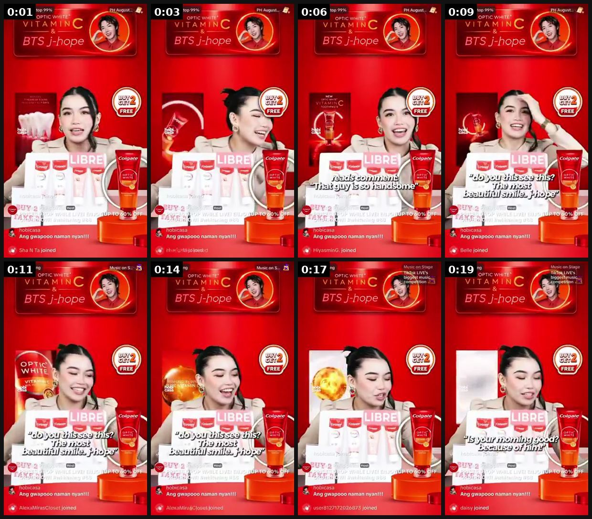

# 63 · Live shopping ads (TikTok LIVE / IG Live sessions amplified with paid): see it, then make it

[](https://x.com/HobiCasa/status/2084825639866277902)

**The example:** [@HobiCasa on X](https://x.com/HobiCasa/status/2084825639866277902) · 0:20 video · 293 likes, 7K views

**Watch it:** [open the post on X](https://x.com/HobiCasa/status/2084825639866277902) · [play the video file](https://video.twimg.com/amplify_video/2084825561998970880/vid/avc1/320x568/tPRPHaTyOgiIANPr.mp4?tag=29)

> Colgate PH TikTok live is now showing j-hope’s face for Optic White in their live selling. 😍 🧡 The campaign started this August announcing him as the newest Brand Ambassador for Colgate Optic White. Hopefully, the full rollout will come out soon in Asia Pacific, excited to see his brand films 🪥 ! Colgate Hong Kong has already started its campaign with merchandise displays in many retail shops! #jhopexColgate

## What you are seeing

A TikTok LIVE selling stream: a host holding up Colgate Optic White tubes in front of a red branded backdrop, with on-screen live comments and a product pin.

## Beat by beat

The storyboard above samples the video every 0:02. Lines are the transcript for that stretch; on-screen text comes from OCR, so treat it as rough.

| Frame | Time | On screen | Said / sung |
|---|---|---|---|
| 1 | 0:00–0:02 | League D2 top 99% PH August OPTIC WI VITA ae BTS ant care ji EE oO ge a a 50 no ng: ee Le Sha Ta joined | · |
| 2 | 0:02–0:05 | League D2 top 99% PH August... OPT Cc WHITE ar, BTS j-hope FREE al Ww Ang ii Foes | · |
| 3 | 0:05–0:07 | · | · |
| 4 | 0:07–0:10 | · | · |
| 5 | 0:10–0:13 | · | · |
| 6 | 0:13–0:15 | · | · |
| 7 | 0:15–0:18 | Daily Ranking OPTIC KL IVE tm VITA BTS Jj Ka Asa gate 5c ko az a! An ooo Le joined | · |
| 8 | 0:18–0:20 | Daily Ranking Music or age OPTIC LIV est VITA NJ competition val a oh FREE OS Es writ AN ee, ee Ang 9000 daisy joined | · |

## How to make one like it

**The format in one line:** Scheduled live sessions (founder/host trying on stacks, water tests, Q&A, live-only bundle) promoted with Live Shopping Ads that drop viewers straight into the stream with a product bag.

**Why it works:** - Real-time Q&A answers objections instantly. - Live-only offers create genuine urgency. - Amplify only sessions that already convert organically (MySmile pattern).

**Contents:** [1. Structure](#1-copy-the-structure) · [2. Shot by shot](#2-shot-by-shot-remake) · [3. Script and hooks](#3-write-the-script) · [4. Prompts](#4-prompts) · [5. Tools and settings](#5-tools-and-settings) · [6. Louise Carter remake](#6-louise-carter-remake) · [7. Variants and test](#7-variants-and-test-plan) · [8. Pitfalls](#8-pitfalls)

### 1. Copy the structure

Use the example's timing as your beat sheet. Keep the beat, change the words and the product.

| Beat | Time | In the example | Your version |
|---|---|---|---|
| 1 | 0:01 | on screen: League D2 top 99% PH August OPTIC WI VITA ae BTS ant care ji EE oO ge a a 50 no ng: ee Le Sha Ta joined | … |
| 2 | 0:03 | on screen: League D2 top 99% PH August... OPT Cc WHITE ar, BTS j-hope FREE al Ww Ang ii Foes | … |
| 3 | 0:06 | (visual beat, see frame 3) | … |
| 4 | 0:09 | (visual beat, see frame 4) | … |
| 5 | 0:11 | (visual beat, see frame 5) | … |
| 6 | 0:14 | (visual beat, see frame 6) | … |
| 7 | 0:17 | on screen: Daily Ranking OPTIC KL IVE tm VITA BTS Jj Ka Asa gate 5c ko az a! An ooo Le joined | … |
| 8 | 0:19 | on screen: Daily Ranking Music or age OPTIC LIV est VITA NJ competition val a oh FREE OS Es writ AN ee, ee Ang 9000 daisy joined | … |

### 2. Shot-by-shot remake

**Target length / size:** Live sessions 30-90 min + live shopping ads

| # | Time / slot | What we see (visual + camera) | Dialogue / on-screen text |
|---|---|---|---|
| 1 | Before | Teaser posts with the live time | "live at 7pm: water test + live-only bundle" |
| 2 | Live | Host tries on stacks, water test, Q&A | Pinned product links |
| 3 | Ads | Live shopping ads send people straight into the stream | - |
| 4 | After | Clip the best moments | - |

<details><summary>Playbook shot list (Louise Carter version from the README)</summary>

| Time / slot | Visual | Audio / copy |
|---|---|---|
| 0-5 min | Host intro + today's live-only bundle | — |
| 5-30 min | Try-ons, water test in a bowl, viewer requests | — |
| 30-45 min | Gift guide by recipient | — |
| 45-60 min | Last call; pin product | — |

</details>

### 3. Write the script

Open with one of these hooks (first 1–3 seconds, or the headline on a static):

- "LIVE: we're dunking jewelry in water for an hour"
- "Build-your-stack live — you pick, I style"

Then fill the beats from the table above. Pull the wording from real customer reviews, not from ad copy: a review line beats a copywriter line almost every time. Read every line out loud and cut anything you would not say to a friend. Ready-made Louise Carter scripts are in section 6; hand [BOT.md](BOT.md) to any AI agent to write versions for another brand.

### 4. Prompts

**Run of show**

```text
0-5 min welcome + offer · 5-20 try-ons · 20-30 water test · 30-45 Q&A · every 10 min repeat the offer.
```

**Full creative-agent prompt (from the playbook):**

```
Write a 60-minute live run-of-show for LC with segments, live-only bundle (real), objection answers from {{FAQ}}, and 5 hook lines for the Live Shopping Ad.
```

### 5. Tools and settings

1. Only after TikTok Shop is live (F19).
2. Weekly slot; organic first; boost sessions with above-average GMV/viewer.

| Setting | Value |
|---|---|
| What you are building | A repeatable system (account, page, offer or pipeline), not one ad |
| Cadence | Decide the posting or launch rhythm up front (e.g. daily, or 3 new ads a week) and keep it for 30 days |
| Template | Lock one caption, layout and naming template so output is consistent |
| Tracking | One UTM pattern per system (`utm_campaign=F<NN>`) and a weekly sheet: spend, CTR, hook rate, CPA |
| Tools | Meta Ads Manager / TikTok Ads Manager, a shared Drive folder per format, the agent brief in BOT.md |

### 6. Louise Carter remake

- A · Water-test live.
- B · Gift-guide live (Q4).
- C · Creator co-host live.

Brand rules, claims you can and cannot make, and more scripts: [brands/louise-carter.md](brands/louise-carter.md). Step-by-step from idea to scale: [STAGES.md](STAGES.md).

### 7. Variants and test plan

- Founder vs creator host
- Day/time

**Test plan:** - **Budget/structure:** $30-100 per boosted session - **Primary KPIs:** GMV per viewer, CPA; Omni + TikTok Shop (F63-*) - **Kill rule:** GMV/viewer below organic sessions - **Scale rule:** Q4 weekly - **Naming:** `utm_content=F63-<concept>-<variant>`; weekly Omni roll-up of new-customer revenue by format.

**Naming:** `F63-<variant>-<hook##>-<date>` so results map back to this folder. Change one thing per test (hook, narrator, length or offer), never two.

### 8. Pitfalls

- Consistency (same time weekly) builds the audience.
- Live-only offers must be real and honoured.
- Changing the template every week: the system only learns if it stays consistent for at least 30 days.
- No tracking: without one naming and UTM pattern you cannot tell which piece of the system works.

**Compliance:** Baseline: [_COMPLIANCE.md](../_COMPLIANCE.md) (no fake testimonials, AI disclosure, no bulk/spoofed accounts, copy structure not assets, PDP-only claims). - Live-only prices must be real; disclose paid co-hosts.

## More examples

Every post we found for this format, with transcripts: [examples/](examples/README.md). Playbook: [README.md](README.md). Agent brief: [BOT.md](BOT.md).
