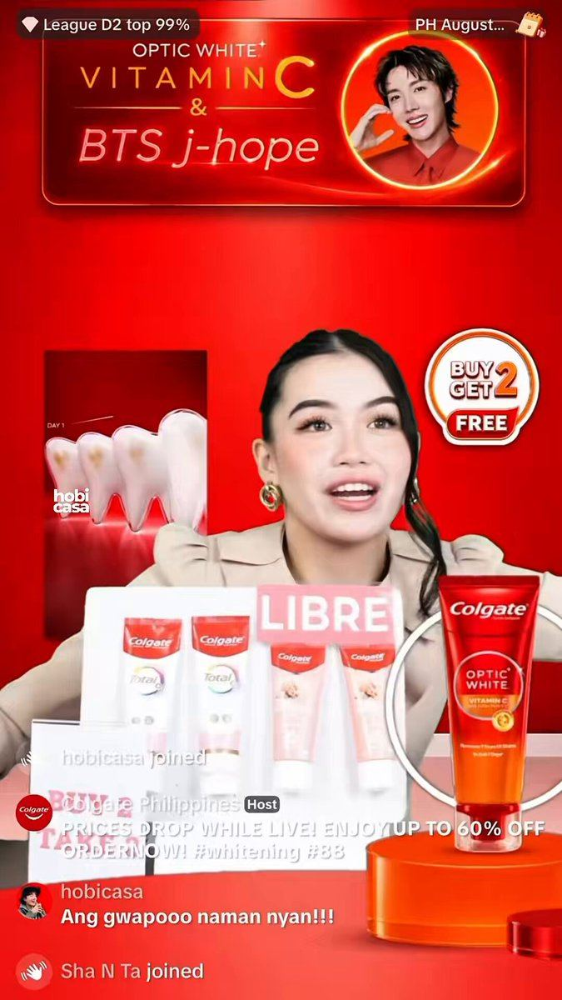

# 63 · Live shopping ads (TikTok LIVE / IG Live sessions amplified with paid)

<!-- HERO:START -->
[](EXAMPLE.md)

**[See the example and how to make it →](EXAMPLE.md)** · [watch on X](https://x.com/HobiCasa/status/2084825639866277902)
<!-- HERO:END -->


> **LC priority P3** · evidence: Medium (platform case studies) · hype risk: Med · cost $0 + host time · 2-3 h per session

## What it is
Scheduled live sessions (founder/host trying on stacks, water tests, Q&A, live-only bundle) promoted with Live Shopping Ads that drop viewers straight into the stream with a product bag.

## Why it works
- Real-time Q&A answers objections instantly.
- Live-only offers create genuine urgency.
- Amplify only sessions that already convert organically (MySmile pattern).

## Shot-by-shot (LC version)

| Time / slot | Visual | Audio / copy |
|---|---|---|
| 0-5 min | Host intro + today's live-only bundle | — |
| 5-30 min | Try-ons, water test in a bowl, viewer requests | — |
| 30-45 min | Gift guide by recipient | — |
| 45-60 min | Last call; pin product | — |

## Hooks (swap-in openers)
- "LIVE: we're dunking jewelry in water for an hour"
- "Build-your-stack live — you pick, I style"

## Real examples from X (studied)
- GetHookd — "5 Effective TikTok Live Shopping Ads": Maybelline, MizuMi, The Beauty Story, MySmile, Snax Lab ([article](https://www.gethookd.ai/learn/5-effective-tiktok-live-shopping-ads-examples-for-2026/)).
- GetHookd — "3 Best Instagram Live Ads Examples" ([article](https://www.gethookd.ai/learn/3-best-instagram-live-ads-examples-in-2026/)).

## Production recipe
1. Only after TikTok Shop is live (F19).
2. Weekly slot; organic first; boost sessions with above-average GMV/viewer.

## Bot prompt (copy into the creative agent)
```
Write a 60-minute live run-of-show for LC with segments, live-only bundle (real), objection answers from {{FAQ}}, and 5 hook lines for the Live Shopping Ad.
```

## 3 LC scripts
- A · Water-test live.
- B · Gift-guide live (Q4).
- C · Creator co-host live.

## Variants to test
- Founder vs creator host
- Day/time

## Omni test plan
- **Budget/structure:** $30-100 per boosted session
- **Primary KPIs:** GMV per viewer, CPA; Omni + TikTok Shop (F63-*)
- **Kill rule:** GMV/viewer below organic sessions
- **Scale rule:** Q4 weekly
- **Naming:** `utm_content=F63-<concept>-<variant>`; weekly Omni roll-up of new-customer revenue by format.

## Compliance
Baseline: [_COMPLIANCE.md](../_COMPLIANCE.md) (no fake testimonials, AI disclosure, no bulk/spoofed accounts, copy structure not assets, PDP-only claims).
- Live-only prices must be real; disclose paid co-hosts.

## Related
- Strategies: 39-creator-campaign-marketplaces, 28-ugc-creator-network-per-video-pay
- Formats: [19-tiktok-shop-affiliate-shoppable-demo](../19-tiktok-shop-affiliate-shoppable-demo/README.md), [43-hudson-method-creator-swarm](../43-hudson-method-creator-swarm/README.md)

<!-- EVIDENCE:START -->
## Evidence from X discovery (auto-generated)

| Date | Author | Post | Engagement | Grade | Gist |
|---|---|---|---|---|---|
<!-- EVIDENCE:END -->
