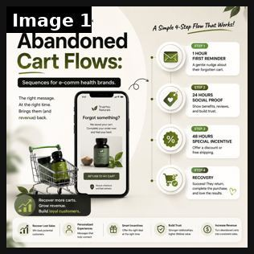

# 64 · Reminder / retargeting sequence ads (abandoned cart, countdown, back-in-stock, wishlist, cross-sell): see it, then make it

[](https://x.com/aakashkapil01/status/2080679066693492819)

**The example:** [@aakashkapil01 on X](https://x.com/aakashkapil01/status/2080679066693492819) · 1 image · 2 likes, 2K views

**Watch it:** [open the post on X](https://x.com/aakashkapil01/status/2080679066693492819)

> You're not losing money because your ads suck. You're losing money because people who were ready to buy... leave. Most 6-figure health brands never get them back. Here's the abandoned cart sequence I'd use to recover more sales without spending another $1 on ads. 🧵👇

## What you are seeing

An infographic of an abandoned-cart flow: "Abandoned Cart Flows" with a phone showing a "Forgot something?" message and 4 timed steps (1 hour reminder, 24 hours social proof, 48 hours incentive, recovery).

## Image by image

| Image | Text on it (OCR, rough) |
|---|---|
| 1 | E-COMMERCE AUTOMATION Simple 4-Step Flow That Works! Abandoned HOUR FIRST REMINDER gentle nudge about Cart Flows: their forgotten cart. nets on. oy 24 HOURS The right message. SOCIAL PROOF At the right time. Show benefits, reviews, Brings them and and build trust. revenue back. Forgot something? We  |

## How to make one like it

**The format in one line:** A planned sequence of short reminder creatives for people who already showed intent, each matched to their moment: cart abandoners (the exact piece), bundle-incomplete ("you've picked 4 — 3 more for the same $85"), event countdowns (shipping cutoff), back-in-stock, post-purchase cross-sell (matching huggies).

**Why it works:** - Highest-intent audiences; message matches the exact moment. - Bundle-completion reminder is LC-specific AOV lever. - Mirrors email/SMS so the story is consistent across channels.

**Contents:** [1. Structure](#1-copy-the-structure) · [2. Shot by shot](#2-shot-by-shot-remake) · [3. Script and hooks](#3-write-the-script) · [4. Prompts](#4-prompts) · [5. Tools and settings](#5-tools-and-settings) · [6. Louise Carter remake](#6-louise-carter-remake) · [7. Variants and test](#7-variants-and-test-plan) · [8. Pitfalls](#8-pitfalls)

### 1. Copy the structure

The skeleton every version follows: **hook → problem or tension → turn (the product shows up) → proof → one clear ask.** The shot-by-shot below fills it in.

### 2. Shot-by-shot remake

**Target length / size:** 4-6 short creatives mapped to moments

| # | Time / slot | What we see (visual + camera) | Dialogue / on-screen text |
|---|---|---|---|
| 1 | 1 hour | The exact item left in cart | "Forgot something?" |
| 2 | 24 hours | Social proof | Review |
| 3 | 48 hours | Incentive (only if margin allows) | Free gift / shipping |
| 4 | 7 days | New angle | Different hook |
| 5 | Back in stock | Waitlist audience | "It's back" |

<details><summary>Playbook shot list (Louise Carter version from the README)</summary>

| Time / slot | Visual | Audio / copy |
|---|---|---|
| Day 0-1 | Cart: DPA of the exact piece + "it's waterproof" | — |
| Day 2-3 | Social proof: real review about that piece | — |
| Day 4-7 | Bundle: "3 more pieces, same $85" | — |
| Gift window | "Order by Dec 15 for delivery" | Real cutoff |
| Post-purchase D10 | Cross-sell matching piece | — |

</details>

### 3. Write the script

Open with one of these hooks (first 1–3 seconds, or the headline on a static):

- "Still in your bag: Chelsea Herringbone"
- "You picked 4. 3 more, same $85."
- "Last day for gift delivery"
- "Back: the huggies you saved"

Then fill the beats from the table above. Pull the wording from real customer reviews, not from ad copy: a review line beats a copywriter line almost every time. Read every line out loud and cut anything you would not say to a friend. Ready-made Louise Carter scripts are in section 6; hand [BOT.md](BOT.md) to any AI agent to write versions for another brand.

### 4. Prompts

**Meta**

```text
Advantage+ catalog for cart abandoners (dynamic), plus 3 static audiences by recency (1-3, 4-7, 8-30 days) with frequency caps.
```

**Full creative-agent prompt (from the playbook):**

```
Design a 5-step LC reminder sequence (audience, timing, creative type, copy ≤12 words, matching email/SMS line) for: cart, bundle-incomplete, gift cutoff, back-in-stock, cross-sell. Only real deadlines/stock.
```

### 5. Tools and settings

1. Audiences: ATC 7d, IC 7d, viewed 14d, purchasers 10-60d (cross-sell), engagers 30d.
2. Frequency caps; exclude recent purchasers from acquisition reminders.
3. Mirror each step in Omnisend/OneText with the same concept ID.

| Setting | Value |
|---|---|
| What you are building | A repeatable system (account, page, offer or pipeline), not one ad |
| Cadence | Decide the posting or launch rhythm up front (e.g. daily, or 3 new ads a week) and keep it for 30 days |
| Template | Lock one caption, layout and naming template so output is consistent |
| Tracking | One UTM pattern per system (`utm_campaign=F<NN>`) and a weekly sheet: spend, CTR, hook rate, CPA |
| Tools | Meta Ads Manager / TikTok Ads Manager, a shared Drive folder per format, the agent brief in BOT.md |

### 6. Louise Carter remake

- A · Bundle-completion reminder.
- B · Gift-cutoff countdown.
- C · Post-purchase cross-sell.

Brand rules, claims you can and cannot make, and more scripts: [brands/louise-carter.md](brands/louise-carter.md). Step-by-step from idea to scale: [STAGES.md](STAGES.md).

### 7. Variants and test plan

- Message per step
- Static vs DPA

**Test plan:** - **Budget/structure:** Retargeting $30-80/day always-on - **Primary KPIs:** Incremental ROAS (holdout), CPA; Omni incl. email/SMS (F64-*) - **Kill rule:** Frequency >5 with declining CTR - **Scale rule:** Seasonal sequences - **Naming:** `utm_content=F64-<concept>-<variant>`; weekly Omni roll-up of new-customer revenue by format.

**Naming:** `F64-<variant>-<hook##>-<date>` so results map back to this folder. Change one thing per test (hook, narrator, length or offer), never two.

### 8. Pitfalls

- Too many discounts train people to abandon carts.
- Cap frequency.
- Changing the template every week: the system only learns if it stays consistent for at least 30 days.
- No tracking: without one naming and UTM pattern you cannot tell which piece of the system works.

**Compliance:** Baseline: [_COMPLIANCE.md](../_COMPLIANCE.md) (no fake testimonials, AI disclosure, no bulk/spoofed accounts, copy structure not assets, PDP-only claims). - Real stock/deadlines only; respect frequency; consent for SMS/email.

## Field notes

Newer observations live in the playbook: [Wave 2c update: BOFU message matrix (Fedotoff Retargeting & BOFU Playbook)](README.md)

## More examples

Every post we found for this format, with transcripts: [examples/](examples/README.md). Playbook: [README.md](README.md). Agent brief: [BOT.md](BOT.md).
