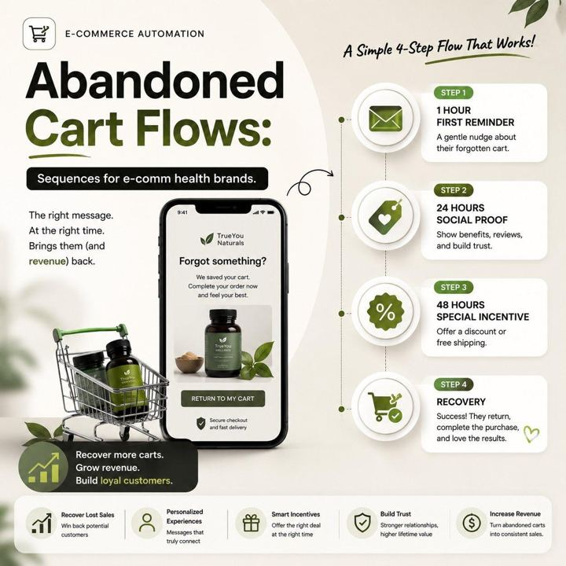

# 64 · Reminder / retargeting sequence ads (abandoned cart, countdown, back-in-stock, wishlist, cross-sell)

<!-- HERO:START -->
[](EXAMPLE.md)

**[See the example and how to make it →](EXAMPLE.md)** · [watch on X](https://x.com/aakashkapil01/status/2080679066693492819)
<!-- HERO:END -->


> **LC priority P1** · evidence: Medium (vendor library) · hype risk: Low · cost $0 · 1 day setup

## What it is
A planned sequence of short reminder creatives for people who already showed intent, each matched to their moment: cart abandoners (the exact piece), bundle-incomplete ("you've picked 4 — 3 more for the same $85"), event countdowns (shipping cutoff), back-in-stock, post-purchase cross-sell (matching huggies).

## Why it works
- Highest-intent audiences; message matches the exact moment.
- Bundle-completion reminder is LC-specific AOV lever.
- Mirrors email/SMS so the story is consistent across channels.

## Shot-by-shot (LC version)

| Time / slot | Visual | Audio / copy |
|---|---|---|
| Day 0-1 | Cart: DPA of the exact piece + "it's waterproof" | — |
| Day 2-3 | Social proof: real review about that piece | — |
| Day 4-7 | Bundle: "3 more pieces, same $85" | — |
| Gift window | "Order by Dec 15 for delivery" | Real cutoff |
| Post-purchase D10 | Cross-sell matching piece | — |

## Hooks (swap-in openers)
- "Still in your bag: Chelsea Herringbone"
- "You picked 4. 3 more, same $85."
- "Last day for gift delivery"
- "Back: the huggies you saved"

## Real examples from X (studied)
- GetHookd — "9 Instagram Reminder Ads Examples": 9 reminder types with timing ([article](https://www.gethookd.ai/learn/9-instagram-reminder-ads-examples-to-try-in-2026/)).
- GetHookd — "5 Effective Facebook Retargeting Ad Examples" ([article](https://www.gethookd.ai/learn/5-effective-facebook-retargeting-ad-examples-strategies/)).

## Production recipe
1. Audiences: ATC 7d, IC 7d, viewed 14d, purchasers 10-60d (cross-sell), engagers 30d.
2. Frequency caps; exclude recent purchasers from acquisition reminders.
3. Mirror each step in Omnisend/OneText with the same concept ID.

## Bot prompt (copy into the creative agent)
```
Design a 5-step LC reminder sequence (audience, timing, creative type, copy ≤12 words, matching email/SMS line) for: cart, bundle-incomplete, gift cutoff, back-in-stock, cross-sell. Only real deadlines/stock.
```

## 3 LC scripts
- A · Bundle-completion reminder.
- B · Gift-cutoff countdown.
- C · Post-purchase cross-sell.

## Variants to test
- Message per step
- Static vs DPA

## Omni test plan
- **Budget/structure:** Retargeting $30-80/day always-on
- **Primary KPIs:** Incremental ROAS (holdout), CPA; Omni incl. email/SMS (F64-*)
- **Kill rule:** Frequency >5 with declining CTR
- **Scale rule:** Seasonal sequences
- **Naming:** `utm_content=F64-<concept>-<variant>`; weekly Omni roll-up of new-customer revenue by format.

## Compliance
Baseline: [_COMPLIANCE.md](../_COMPLIANCE.md) (no fake testimonials, AI disclosure, no bulk/spoofed accounts, copy structure not assets, PDP-only claims).
- Real stock/deadlines only; respect frequency; consent for SMS/email.

## Related
- Strategies: 05-offer-page-engineering, 14-email-list-as-asset, 17-review-prompt-timing
- Formats: [37-urgency-offer-statics](../37-urgency-offer-statics/README.md), [62-catalog-collection-dpa-ads](../62-catalog-collection-dpa-ads/README.md)

## Wave 2c update: BOFU message matrix (Fedotoff Retargeting & BOFU Playbook)
- **4 angles that close warm traffic:** Objection Killer (risk reversal), Offer Nudge (the reason to come back today), Evergreen Comeback ("it's here, it's proven, it's 20% off"), AOV Maximizer (bundles, sets, upsells). Master BOFU vault 300 ads, classified; BOFU offers board 333 ads. 2026 setup: one retargeting campaign at 5-10% of spend. Doc: [Retargeting & BOFU](https://rural-lifeboat-196.notion.site/3b8db9d7074d8119b0a7ce45c24a4ee3). See **F75** (we're sorry, sold out) and **F86** (offer architecture).

<!-- EVIDENCE:START -->
## Evidence from X discovery (auto-generated)

| Date | Author | Post | Engagement | Grade | Gist |
|---|---|---|---|---|---|
<!-- EVIDENCE:END -->
