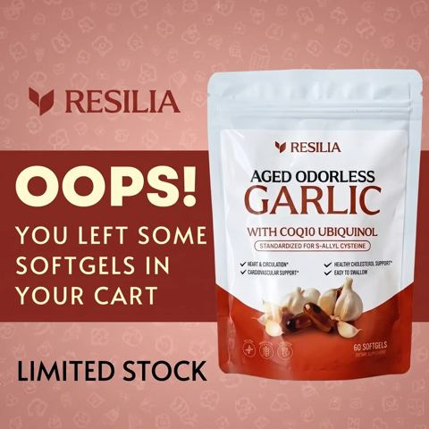

# Meta ad-library examples for F64

<!-- WAVE6 -->
## Wave 6: Resilia & Smooche live Meta ads (Oct 2026)

Pulled from the public Meta Ad Library on 2026-10-09 (Resilia: aged garlic, Ceylon cinnamon, oil of oregano; Smooche: color-changing foundation, Reverse Time peptide serum). Days live are counted to 2026-10-09; most video ads were new tests that week, while the long runners are statics and catalog templates. Transcripts are automatic. Brand claims are the advertisers', not verified, and many are health claims we would never make. The **Do not copy** line flags deceptive tactics (persona "publication" pages, undisclosed AI actors and "experts", fake stock counts).

### Resilia · Arterial Health Review: “OOPS! You left some softgels in your cart. LIMITED STOCK” (1 day live)

- **Ad:** [Meta Ad Library #1105798451932226](https://www.facebook.com/ads/library/?id=1105798451932226) · static image · page “Arterial Health Review” · started 2026-10-07 · lands on `resilia.shop/products/resilia-aged-odorless-garlic`
- **What happens:** "OOPS! You left some softgels in your cart. LIMITED STOCK" with the pouch on a maroon panel.
- **Why it works:** "OOPS! You left some softgels in your cart. Limited stock." A cart-abandon static in the brand colours.
- **How to make one:** Use an "OOPS" headline, the exact product, a "limited stock" chip, and show it only to cart abandoners within 7 days.
- **LC remake:** "OOPS. Your 7 pieces are still in the cart."

Primary text

> Looking to Take Control of Your Heart Health Naturally?❤️ Experience the Power of Resilia Aged Garlic Extract! ✅: Supports cardiovascular health naturally ✅: Completely odorless formula ✅: Supports arterial health ✅: 20-month aging process ✅: 900+ clinical studies ✅: SAC-standardized aged garlic extract ✅: Plus CoQ10 Ubiquinol & Vitamin K2 MK-7 Transform your cardiovascular health with three clinically studied ingredients backed by modern science — 30-Day Risk-Free Guarantee.

<!-- /WAVE6 -->

