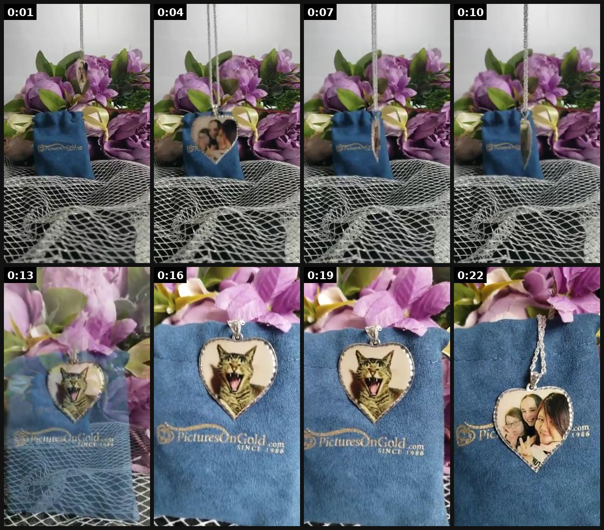
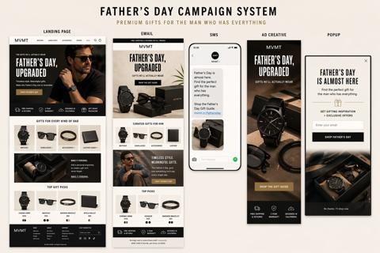
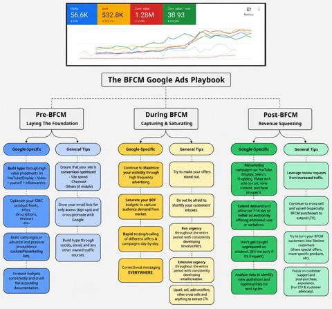

# 65 · Seasonal gifting campaign — launch 3-4 weeks early, urgency only in the final week: see it, then make it

[](https://x.com/PowerbyMomBlog/status/1733284392045543691)

**The example:** [@PowerbyMomBlog on X](https://x.com/PowerbyMomBlog/status/1733284392045543691) · 0:24 video · 0 likes, 309 views

**Watch it:** [open the post on X](https://x.com/PowerbyMomBlog/status/1733284392045543691) · [play the video file](https://video.twimg.com/ext_tw_video/1733283825269252096/pu/vid/avc1/320x568/vHxBV9HhHe7FDUsT.mp4?tag=12)

> My daughter selected these photos for the sterling silver, diamond cut edge heart necklace from @PicturesOnGold1. The kitty was our 12-year-old Ollie whom we lost in July. It's a beautiful keepsake & it's on our Holiday Gift Guide! https://powered-by-mom.com/personalized-pendant-necklaces-engraved/ AD

## What you are seeing

A sponsored mom-blogger video (marked AD) for a personalised sterling silver heart locket: her daughter chose the photos, including their cat Ollie who died in July. Slow close-ups open the locket on a denim pouch next to purple flowers, and the post says it is on her Holiday Gift Guide. Emotional, gift-led and seasonal.

## Beat by beat

The storyboard above samples the video every 0:03. Lines are the transcript for that stretch; on-screen text comes from OCR, so treat it as rough.

| Frame | Time | On screen | Said / sung |
|---|---|---|---|
| 1 | 0:00–0:03 | 2. a Cal … a as: a. SEs | · |
| 2 | 0:03–0:06 | · | · |
| 3 | 0:06–0:09 | · | · |
| 4 | 0:09–0:12 | BABA ras a | · |
| 5 | 0:12–0:15 | · | · |
| 6 | 0:15–0:18 | · | · |
| 7 | 0:18–0:21 | a a 4m … A, by ANY 7: | · |
| 8 | 0:21–0:24 | · | · |

## More real examples (3)

Other posts that show this format, or a close cousin of it. Click a thumbnail to open it on X.

| | | |
|---|---|---|
| [](https://x.com/sayuri_quietjp/status/1997519250903482686)<br>**@sayuri_quietjp** · 0:30 video · 6K views<br>クリスマスの贈り物に、 アクセサリーを選んでもらいました🎁✨ たくさん並ぶ宝石の中から、 「これが似合うよ」って言われた瞬間が いちばん輝いていた気がします…💎 大切な人と、大切な時間を そっと胸にしまって。 A special Christmas gift — a beautiful piece | [](https://x.com/ecomchasedimond/status/2047313886848925761)<br>**@ecomchasedimond** · image · 20K views<br>ChatGPT Images 2.0 made this full Father’s Day campaign system with one prompt. One prompt gave me the landing page, email, SMS, ad creative, and popu | [](https://x.com/lifemaximised/status/2107617132104036607)<br>**@lifemaximised** · image · 2K views<br>STOP waiting for November to begin your Black Friday prep or you’ll get lapped by everyone starting NOW… BFCM is in 7 weeks already. It’s time to set |

## How to make one like it

**The format in one line:** A season-long creative arc: weeks -4 to -2 = problem-framed gift ideas ("for the mom who never takes jewelry off"), week -1 = urgency and shipping cutoffs; creatives framed around the recipient's gifting problem, not seasonal clichés (hearts, red bows).

**Why it works:** - Captures early researchers before competitors start. - Gifting-problem framing beats generic seasonal visuals. - Urgency saved for the final week stays credible.

**Contents:** [1. Structure](#1-copy-the-structure) · [2. Shot by shot](#2-shot-by-shot-remake) · [3. Script and hooks](#3-write-the-script) · [4. Prompts](#4-prompts) · [5. Tools and settings](#5-tools-and-settings) · [6. Louise Carter remake](#6-louise-carter-remake) · [7. Variants and test](#7-variants-and-test-plan) · [8. Pitfalls](#8-pitfalls)

### 1. Copy the structure

Use the example's timing as your beat sheet. Keep the beat, change the words and the product.

| Beat | Time | In the example | Your version |
|---|---|---|---|
| 1 | 0:01 | on screen: 2. a Cal … a as: a. SEs | … |
| 2 | 0:04 | (visual beat, see frame 2) | … |
| 3 | 0:07 | (visual beat, see frame 3) | … |
| 4 | 0:10 | on screen: BABA ras a | … |
| 5 | 0:13 | (visual beat, see frame 5) | … |
| 6 | 0:16 | (visual beat, see frame 6) | … |
| 7 | 0:19 | on screen: a a 4m … A, by ANY 7: | … |
| 8 | 0:22 | (visual beat, see frame 8) | … |

### 2. Shot-by-shot remake

**Target length / size:** Campaign: 3-4 week gifting runway (statics, videos, gift guide)

| # | Time / slot | What we see (visual + camera) | Dialogue / on-screen text |
|---|---|---|---|
| 1 | Week -4 to -3 | Gift-problem creative: "What do you get the friend who has everything?" | Gift guide carousel |
| 2 | Week -3 to -2 | Emotional gift moments (real customers) | "My mum hasn't taken it off since Christmas." |
| 3 | Week -2 to -1 | Bundle + gift box | "7 pieces, wrapped, $85." |
| 4 | Final week | Shipping-deadline urgency | "Order by Dec 18 for Christmas delivery." |
| 5 | Post-holiday | Gift-card and self-gifting | "You got cash? Treat yourself." |

<details><summary>Playbook shot list (Louise Carter version from the README)</summary>

| Time / slot | Visual | Audio / copy |
|---|---|---|
| Week -4 | "Gifts for the mom who has everything (but takes her jewelry off)" | — |
| Week -3 | Recipient carousels (F57) | — |
| Week -2 | Testimonials from last season's gift buyers (F40) | — |
| Week -1 | Cutoff countdown + any 7 for $85 (F37/F64) | — |

</details>

### 3. Write the script

Open with one of these hooks (first 1–3 seconds, or the headline on a static):

- "The gift she'll actually wear in the shower"
- "Gifts for the friend who loses every necklace"
- "Order by [real date] for delivery"

Then fill the beats from the table above. Pull the wording from real customer reviews, not from ad copy: a review line beats a copywriter line almost every time. Read every line out loud and cut anything you would not say to a friend. Ready-made Louise Carter scripts are in section 6; hand [BOT.md](BOT.md) to any AI agent to write versions for another brand.

### 4. Prompts

**Calendar**

```text
Map the 4 weeks, assign creatives to each, set real shipping cut-offs by region.
```

**Claude**

```text
Write a gift guide carousel: 6 recipients, one stack each, with price and a one-line reason.
```

**Full creative-agent prompt (from the playbook):**

```
Build a 4-week seasonal plan for {{SEASON}} with weekly creative types, 3 hooks per recipient persona, and the real shipping cutoff messaging.
```

### 5. Tools and settings

1. Calendar per season with week-by-week creative mix; one concept ID across ads/email/SMS.
2. Recipient personas: mom, partner, best friend, bridesmaids, self-gift.

| Setting | Value |
|---|---|
| What you are building | A repeatable system (account, page, offer or pipeline), not one ad |
| Cadence | Decide the posting or launch rhythm up front (e.g. daily, or 3 new ads a week) and keep it for 30 days |
| Template | Lock one caption, layout and naming template so output is consistent |
| Tracking | One UTM pattern per system (`utm_campaign=F<NN>`) and a weekly sheet: spend, CTR, hook rate, CPA |
| Tools | Meta Ads Manager / TikTok Ads Manager, a shared Drive folder per format, the agent brief in BOT.md |

### 6. Louise Carter remake

- A · Mother's Day arc.
- B · Holiday/BFCM arc.
- C · Wedding-season bridesmaid arc.

Brand rules, claims you can and cannot make, and more scripts: [brands/louise-carter.md](brands/louise-carter.md). Step-by-step from idea to scale: [STAGES.md](STAGES.md).

### 7. Variants and test plan

- Recipient persona
- Launch week

**Test plan:** - **Budget/structure:** Season budget split 60% weeks -4..-2 / 40% week -1 - **Primary KPIs:** Season revenue, new-customer %; Omni (F65-*) - **Kill rule:** Weekly creative refresh if CPA rises >30% - **Scale rule:** Repeat yearly - **Naming:** `utm_content=F65-<concept>-<variant>`; weekly Omni roll-up of new-customer revenue by format.

**Naming:** `F65-<variant>-<hook##>-<date>` so results map back to this folder. Change one thing per test (hook, narrator, length or offer), never two.

### 8. Pitfalls

- Shipping deadlines must be real per region.
- Urgency only in the final week.
- Plan stock for the bundle you push.
- Changing the template every week: the system only learns if it stays consistent for at least 30 days.
- No tracking: without one naming and UTM pattern you cannot tell which piece of the system works.

**Compliance:** Baseline: [_COMPLIANCE.md](../_COMPLIANCE.md) (no fake testimonials, AI disclosure, no bulk/spoofed accounts, copy structure not assets, PDP-only claims). - Real deadlines; no fake scarcity.

## Field notes

Newer observations live in the playbook: [Wave 2c update: Q4 2026 timeline (Fedotoff Q4 Playbook)](README.md)

## More examples

Every post we found for this format, with transcripts: [examples/](examples/README.md). Playbook: [README.md](README.md). Agent brief: [BOT.md](BOT.md).
