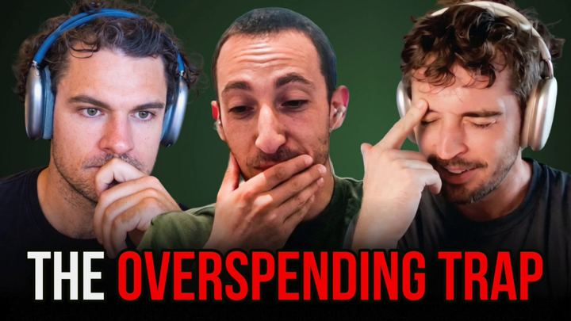

# 65 · Seasonal gifting campaign — launch 3-4 weeks early, urgency only in the final week

<!-- HERO:START -->
[](EXAMPLE.md)

**[See the example and how to make it →](EXAMPLE.md)** · [watch on X](https://x.com/PowerbyMomBlog/status/1733284392045543691)
<!-- HERO:END -->


> **LC priority P1** · evidence: Medium (vendor jewelry study) · hype risk: Low · cost $0-500 · 1-2 days per season

## What it is
A season-long creative arc: weeks -4 to -2 = problem-framed gift ideas ("for the mom who never takes jewelry off"), week -1 = urgency and shipping cutoffs; creatives framed around the recipient's gifting problem, not seasonal clichés (hearts, red bows).

## Why it works
- Captures early researchers before competitors start.
- Gifting-problem framing beats generic seasonal visuals.
- Urgency saved for the final week stays credible.

## Shot-by-shot (LC version)

| Time / slot | Visual | Audio / copy |
|---|---|---|
| Week -4 | "Gifts for the mom who has everything (but takes her jewelry off)" | — |
| Week -3 | Recipient carousels (F57) | — |
| Week -2 | Testimonials from last season's gift buyers (F40) | — |
| Week -1 | Cutoff countdown + any 7 for $85 (F37/F64) | — |

## Hooks (swap-in openers)
- "The gift she'll actually wear in the shower"
- "Gifts for the friend who loses every necklace"
- "Order by [real date] for delivery"

## Real examples from X (studied)
- GetHookd — "7 Best Instagram Jewelry Ads": seasonal campaigns 3-4 weeks early, urgency in the final week, solve a specific gifting problem (Catbird) ([article](https://www.gethookd.ai/learn/7-best-instagram-jewelry-ads-examples-for-2026/)).
- GetHookd — "5 Best Jewelry Facebook Ads": life-event targeting (anniversaries, engagements) ([article](https://www.gethookd.ai/learn/5-best-jewelry-facebook-ads-examples-to-copy-in-2026/)).
- GetHookd — "7 Effective Static Ads": seasonal campaign static ([article](https://www.gethookd.ai/learn/7-effective-static-ads-examples-worth-copying-in-2026/)).

## Production recipe
1. Calendar per season with week-by-week creative mix; one concept ID across ads/email/SMS.
2. Recipient personas: mom, partner, best friend, bridesmaids, self-gift.

## Bot prompt (copy into the creative agent)
```
Build a 4-week seasonal plan for {{SEASON}} with weekly creative types, 3 hooks per recipient persona, and the real shipping cutoff messaging.
```

## 3 LC scripts
- A · Mother's Day arc.
- B · Holiday/BFCM arc.
- C · Wedding-season bridesmaid arc.

## Variants to test
- Recipient persona
- Launch week

## Omni test plan
- **Budget/structure:** Season budget split 60% weeks -4..-2 / 40% week -1
- **Primary KPIs:** Season revenue, new-customer %; Omni (F65-*)
- **Kill rule:** Weekly creative refresh if CPA rises >30%
- **Scale rule:** Repeat yearly
- **Naming:** `utm_content=F65-<concept>-<variant>`; weekly Omni roll-up of new-customer revenue by format.

## Compliance
Baseline: [_COMPLIANCE.md](../_COMPLIANCE.md) (no fake testimonials, AI disclosure, no bulk/spoofed accounts, copy structure not assets, PDP-only claims).
- Real deadlines; no fake scarcity.

## Related
- Strategies: 05-offer-page-engineering, 12-built-in-sharing-gift-referral, 14-email-list-as-asset
- Formats: [37-urgency-offer-statics](../37-urgency-offer-statics/README.md), [25-sweepstakes-celebrity-giveaway](../25-sweepstakes-celebrity-giveaway/README.md), [64-reminder-retargeting-sequence](../64-reminder-retargeting-sequence/README.md)

## Wave 2c update: Q4 2026 timeline (Fedotoff Q4 Playbook)
- Late September: lock the plan and grow the list. October: test, build, open the waiting list. Early to mid November: early access. BFCM week Nov 26 to Dec 2. December: gifting and shipping-cutoff ads. January: protect the new cohort. Operations (stock, shipping, support) kill more Q4s than bad ads. Doc: [Q4 2026 Playbook](https://rural-lifeboat-196.notion.site/3e3db9d7074d8146a2a7e5ac96e42df8).

<!-- EVIDENCE:START -->
## Evidence from X discovery (auto-generated)

| Date | Author | Post | Engagement | Grade | Gist |
|---|---|---|---|---|---|
<!-- EVIDENCE:END -->
