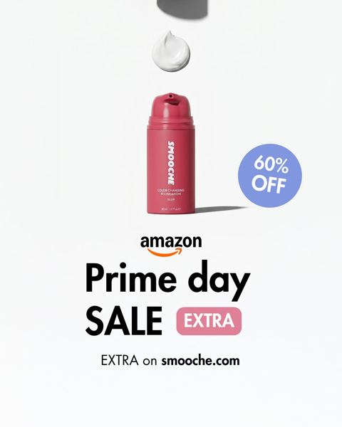
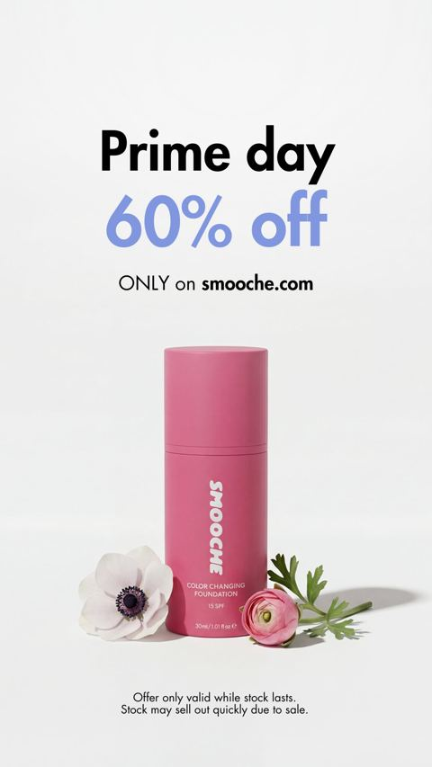

# Meta ad-library examples for F65

<!-- WAVE6 -->
## Wave 6: Resilia & Smooche live Meta ads (Oct 2026)

Pulled from the public Meta Ad Library on 2026-10-09 (Resilia: aged garlic, Ceylon cinnamon, oil of oregano; Smooche: color-changing foundation, Reverse Time peptide serum). Days live are counted to 2026-10-09; most video ads were new tests that week, while the long runners are statics and catalog templates. Transcripts are automatic. Brand claims are the advertisers', not verified, and many are health claims we would never make. The **Do not copy** line flags deceptive tactics (persona "publication" pages, undisclosed AI actors and "experts", fake stock counts).

### Smooche · Smooche: “Prime day SALE EXTRA on smooche.com” (10 days live)

- **Ad:** [Meta Ad Library #1056610557243299](https://www.facebook.com/ads/library/?id=1056610557243299) · static image · page “Smooche” · started 2026-09-28 · 2 copies · lands on `smooche.com/collections/the-hits/products/color-changing-fou`
- **What happens:** "Prime day SALE EXTRA on smooche.com", 60% off, with a dropper shot.
- **Why it works:** "Up to 60% off, and last Prime Day this exact deal sold out in 48 hours" ties a scarcity story to a tentpole event and points the ad at Amazon.
- **How to make one:** Make a white-space static with the product, the event logo and a single % badge. Put the sold-out-last-time story in the primary text.
- **LC remake:** "Last Black Friday the 7-piece set sold out in 31 hours." The flat lay plus a countdown badge.

Primary text

> Up to 60% off — and last Prime Day this exact deal sold out in 48 hours. This time there's less stock at the same price. 2 million bottles sold, zero shade complaints, because it matches ANY skin tone — your shade is already inside the bottle. The fastest-moving shades are already running low. We can't restock at this price and we won't drop it again until next year. If it's in your cart, check out before it's gone.

### Smooche · Smooche: “Prime day 60% off ONLY on smooche.com” (10 days live)

- **Ad:** [Meta Ad Library #1455485669823347](https://www.facebook.com/ads/library/?id=1455485669823347) · static image · page “Smooche” · started 2026-09-28 · 2 copies · lands on `smooche.com/collections/the-hits/products/color-changing-fou`
- **What happens:** "Prime day 60% off ONLY on smooche.com" on a minimal grey background.
- **Why it works:** "Up to 60% off, and last Prime Day this exact deal sold out in 48 hours" ties a scarcity story to a tentpole event and points the ad at Amazon.
- **How to make one:** Make a white-space static with the product, the event logo and a single % badge. Put the sold-out-last-time story in the primary text.
- **LC remake:** "Last Black Friday the 7-piece set sold out in 31 hours." The flat lay plus a countdown badge.

Primary text

> Up to 60% off — and last Prime Day this exact deal sold out in 48 hours. This time there's less stock at the same price. 2 million bottles sold, zero shade complaints, because it matches ANY skin tone — your shade is already inside the bottle. The fastest-moving shades are already running low. We can't restock at this price and we won't drop it again until next year. If it's in your cart, check out before it's gone.

<!-- /WAVE6 -->

