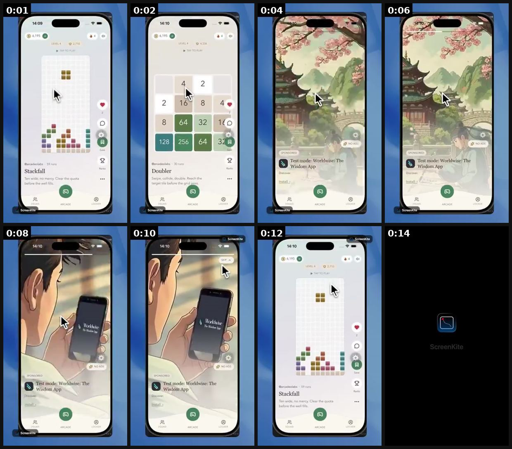
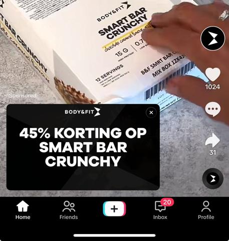
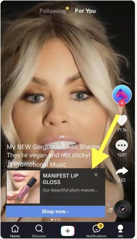
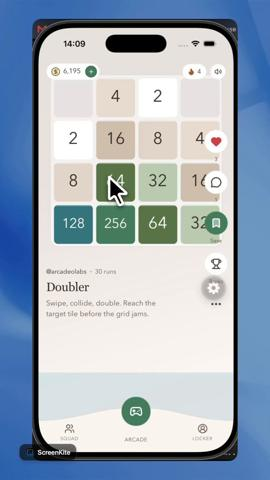
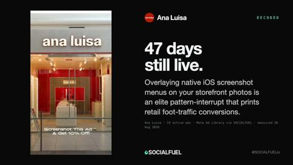

# 66 · Interactive gesture add-on ads (TikTok tap-to-reveal, shake-to-reveal, Super Like): see it, then make it

[](https://x.com/ChrisHarihar/status/1703108334218297531)

**The example:** [@ChrisHarihar on X](https://x.com/ChrisHarihar/status/1703108334218297531) · 0:08 video · 7 likes, 1K views

**Watch it:** [open the post on X](https://x.com/ChrisHarihar/status/1703108334218297531) · [play the video file](https://video.twimg.com/amplify_video/1703108275909111808/vid/avc1/320x604/DOAr0frOlfwpmcxv.mp4?tag=14)

> **How close is this example?** Close: a real shake-to-reveal ad from a film campaign, not a product brand. The gallery below has more examples.

> This "shake to learn more" ad format on TikTok, which offers simple interactivity, is effective. So far, I've only seen it used for movies (TMNT and Barbie). Anyone seen other examples/use cases?

## What you are seeing

A TikTok in-feed ad using the 'shake to learn more' interactive add-on (from the Barbie movie campaign): a creator talks to camera, a prompt asks viewers to shake their phone, the screen bursts into a full-screen pink Barbie pattern, then a 'watch it' card with ticket links. The poster says the format works well and has mostly been used for films.

## Beat by beat

The storyboard above samples the video every 0:01. Lines are the transcript for that stretch; on-screen text comes from OCR, so treat it as rough.

| Frame | Time | On screen | Said / sung |
|---|---|---|---|
| 1 | 0:00–0:01 | Shake to learn more 4730 … Bring home the biggest movie of the year! Own Barbie Now on Digital! Sponsored a | On the ground. |
| 2 | 0:01–0:02 | Sha more 4730 170 … Bring home the biggest movie of the year! 190 Own Barbie Now on Digital! Sponsored. | · |
| 3 | 0:02–0:04 | · | · |
| 4 | 0:04–0:05 | · | · |
| 5 | 0:05–0:07 | Barbie Movies a … App! prime video AN | · |
| 6 | 0:07–0:08 | Theaters at Fulton Market Regal Battery Park 12:45 … WATCH IT Buy Rent Digital | · |

<details><summary>Full transcript (timestamped)</summary>

- `0:00` On the ground.

</details>

## More real examples (4)

Other posts that show this format, or a close cousin of it. Click a thumbnail to open it on X.

| | | |
|---|---|---|
| [](https://x.com/crowizard_stef/status/1735569746349670808)<br>**@crowizard_stef** · image · 2K views<br>Stores are using TikTok’s new interactive cards already! Don’t fall behind: ​1. Create a new campaign where you select Reach & Frequency as the Ad Buy | [](https://x.com/coltonjetlee/status/1790930807764435387)<br>**@coltonjetlee** · image · 164 views<br>For those running TikTok Shop ads... Do you guys turn on a "Interactive Add-on" like a Product Card? We've been using them as TikTok claims it boosts | [](https://x.com/_deepakss_/status/2087895969157246985)<br>**@_deepakss_** · 0:15 video · 201 views<br>Building "Tiktok for games" Arcadeo for this year's Shipaton. My main aim is to have a non frustrating experience when viewing an ad. This means user |
| [](https://x.com/SOCIALFUELio/status/2092930152133243178)<br>**@SOCIALFUELio** · 0:07 video · 12 views<br>ana luisa are running 22 ads. this one has held for 47 days. Using an iOS crop-menu overlay visually programs the exact user behavior needed to claim |   |   |

## How to make one like it

**The format in one line:** TikTok interactive add-ons layered on an existing video ad: a Display Card that reveals an offer on tap, a shake-to-reveal surprise, or branded Super Like icons on double-tap.

**Why it works:** - Turns a gesture viewers already make into the ad interaction. - Good for offers/drops.

**Contents:** [1. Structure](#1-copy-the-structure) · [2. Shot by shot](#2-shot-by-shot-remake) · [3. Script and hooks](#3-write-the-script) · [4. Prompts](#4-prompts) · [5. Tools and settings](#5-tools-and-settings) · [6. Louise Carter remake](#6-louise-carter-remake) · [7. Variants and test](#7-variants-and-test-plan) · [8. Pitfalls](#8-pitfalls)

### 1. Copy the structure

Use the example's timing as your beat sheet. Keep the beat, change the words and the product.

| Beat | Time | In the example | Your version |
|---|---|---|---|
| 1 | 0:00 | On the ground. | … |
| 2 | 0:02 | On the ground. | … |
| 3 | 0:03 | (visual beat, see frame 3) | … |
| 4 | 0:05 | (visual beat, see frame 4) | … |
| 5 | 0:06 | on screen: Barbie Movies a … App! prime video AN | … |
| 6 | 0:07 | on screen: Theaters at Fulton Market Regal Battery Park 12:45 … WATCH IT Buy Rent Digital | … |

### 2. Shot-by-shot remake

**Target length / size:** 15-30s TikTok in-feed ad with an interactive add-on

| # | Time / slot | What we see (visual + camera) | Dialogue / on-screen text |
|---|---|---|---|
| 1 | 0-3s | Creator holds up a closed gift box | "Shake your phone to open it." |
| 2 | Shake moment | Gesture add-on triggers a gold burst animation | - |
| 3 | 3-10s | Box opens: 7-piece stack | "Any 7 for $85." |
| 4 | 10-20s | Demo in the shower | "Waterproof." |
| 5 | Card | Product card add-on with price | - |

<details><summary>Playbook shot list (Louise Carter version from the README)</summary>

| Time / slot | Visual | Audio / copy |
|---|---|---|
| 0-5s | Gift box unboxing video | — |
| 5s | Display Card: "Tap to reveal today's stack" | — |
| Reveal | Card with any 7 for $85 | — |

</details>

### 3. Write the script

Open with one of these hooks (first 1–3 seconds, or the headline on a static):

- "Tap to open the box"
- "Shake to reveal your stack"

Then fill the beats from the table above. Pull the wording from real customer reviews, not from ad copy: a review line beats a copywriter line almost every time. Read every line out loud and cut anything you would not say to a friend. Ready-made Louise Carter scripts are in section 6; hand [BOT.md](BOT.md) to any AI agent to write versions for another brand.

### 4. Prompts

**TikTok Ads Manager**

```text
Add the Gesture / Super Like / Countdown sticker interactive add-on when building the ad (check current availability in your region).
```

**Animation**

```text
After Effects or CapCut: 1s gold particle burst, brand colours.
```

**Full creative-agent prompt (from the playbook):**

```
Write 5 Display Card / gesture concepts for LC TikTok ads with on-card copy ≤8 words.
```

### 5. Tools and settings

1. Add Display Card to winning TikTok video ads; test vs no card.

| Setting | Value |
|---|---|
| What you are building | A repeatable system (account, page, offer or pipeline), not one ad |
| Cadence | Decide the posting or launch rhythm up front (e.g. daily, or 3 new ads a week) and keep it for 30 days |
| Template | Lock one caption, layout and naming template so output is consistent |
| Tracking | One UTM pattern per system (`utm_campaign=F<NN>`) and a weekly sheet: spend, CTR, hook rate, CPA |
| Tools | Meta Ads Manager / TikTok Ads Manager, a shared Drive folder per format, the agent brief in BOT.md |

### 6. Louise Carter remake

- A · Tap-to-reveal offer.
- B · Shake-to-reveal gift.
- C · Super Like gold sparkles.

Brand rules, claims you can and cannot make, and more scripts: [brands/louise-carter.md](brands/louise-carter.md). Step-by-step from idea to scale: [STAGES.md](STAGES.md).

### 7. Variants and test plan

- Card vs no card

**Test plan:** - **Budget/structure:** A/B on an existing winner, $30/day - **Primary KPIs:** CTR, CPC; Omni (F66-*) - **Kill rule:** No CTR lift - **Scale rule:** Holiday drops - **Naming:** `utm_content=F66-<concept>-<variant>`; weekly Omni roll-up of new-customer revenue by format.

**Naming:** `F66-<variant>-<hook##>-<date>` so results map back to this folder. Change one thing per test (hook, narrator, length or offer), never two.

### 8. Pitfalls

- Add-on availability varies by region and objective; check before you produce.
- The video must work without the interaction too.
- Don't make the gesture the only content.
- Changing the template every week: the system only learns if it stays consistent for at least 30 days.
- No tracking: without one naming and UTM pattern you cannot tell which piece of the system works.

**Compliance:** Baseline: [_COMPLIANCE.md](../_COMPLIANCE.md) (no fake testimonials, AI disclosure, no bulk/spoofed accounts, copy structure not assets, PDP-only claims). - Offer must be real.

## Field notes

Newer observations live in the playbook: [Wave 3 update: brands & apps crushing it (Oct 2026)](README.md)

## More examples

Every post we found for this format, with transcripts: [examples/](examples/README.md). Playbook: [README.md](README.md). Agent brief: [BOT.md](BOT.md).
