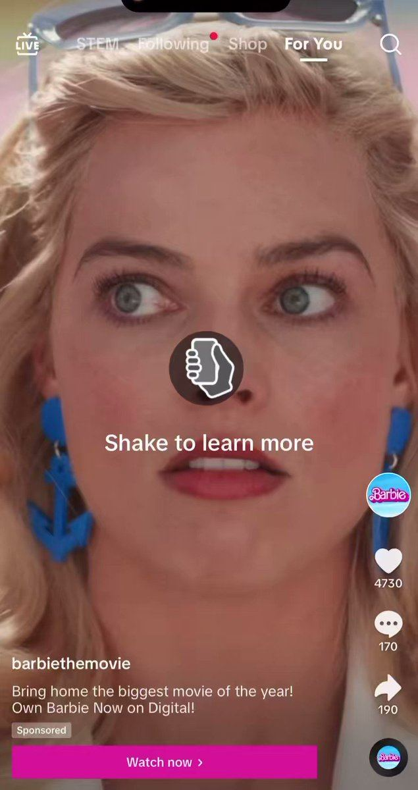

# 66 · Interactive gesture add-on ads (TikTok tap-to-reveal, shake-to-reveal, Super Like)

<!-- HERO:START -->
[](EXAMPLE.md)

**[See the example and how to make it →](EXAMPLE.md)** · [watch on X](https://x.com/ChrisHarihar/status/1703108334218297531)
<!-- HERO:END -->


> **LC priority P3** · evidence: Low-Med (platform case studies) · hype risk: Low · cost $0 add-on to existing video · 15 min

## What it is
TikTok interactive add-ons layered on an existing video ad: a Display Card that reveals an offer on tap, a shake-to-reveal surprise, or branded Super Like icons on double-tap.

## Why it works
- Turns a gesture viewers already make into the ad interaction.
- Good for offers/drops.

## Shot-by-shot (LC version)

| Time / slot | Visual | Audio / copy |
|---|---|---|
| 0-5s | Gift box unboxing video | — |
| 5s | Display Card: "Tap to reveal today's stack" | — |
| Reveal | Card with any 7 for $85 | — |

## Hooks (swap-in openers)
- "Tap to open the box"
- "Shake to reveal your stack"

## Real examples from X (studied)
- GetHookd — "3 Effective TikTok Gesture Ads": Fendi, Basic-Fit, Sour Patch Kids with reported results ([article](https://www.gethookd.ai/learn/3-effective-tiktok-gesture-ads-examples-to-inspire-you-in-2026/)).

## Production recipe
1. Add Display Card to winning TikTok video ads; test vs no card.

## Bot prompt (copy into the creative agent)
```
Write 5 Display Card / gesture concepts for LC TikTok ads with on-card copy ≤8 words.
```

## 3 LC scripts
- A · Tap-to-reveal offer.
- B · Shake-to-reveal gift.
- C · Super Like gold sparkles.

## Variants to test
- Card vs no card

## Omni test plan
- **Budget/structure:** A/B on an existing winner, $30/day
- **Primary KPIs:** CTR, CPC; Omni (F66-*)
- **Kill rule:** No CTR lift
- **Scale rule:** Holiday drops
- **Naming:** `utm_content=F66-<concept>-<variant>`; weekly Omni roll-up of new-customer revenue by format.

## Compliance
Baseline: [_COMPLIANCE.md](../_COMPLIANCE.md) (no fake testimonials, AI disclosure, no bulk/spoofed accounts, copy structure not assets, PDP-only claims).
- Offer must be real.

## Related
- Strategies: 05-offer-page-engineering
- Formats: [37-urgency-offer-statics](../37-urgency-offer-statics/README.md), [46-unboxing-packing-orders](../46-unboxing-packing-orders/README.md)

<!-- EVIDENCE:START -->
## Wave 3 update: brands & apps crushing it (Oct 2026)
- Ana Luisa (jewelry) runs an ad with an iOS crop-menu overlay that visually programs the exact gesture needed to claim the in-store discount; held 47 days of 22 live ads ([@SOCIALFUELio](https://x.com/SOCIALFUELio/status/2092930152133243178)). Closest direct jewelry competitor signal in the set.

## Evidence from X discovery (auto-generated)

| Date | Author | Post | Engagement | Grade | Gist |
|---|---|---|---|---|---|
<!-- EVIDENCE:END -->
