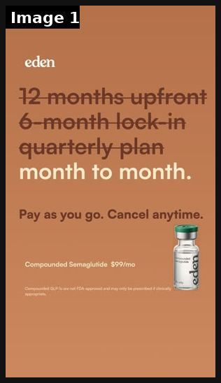

# 67 · The Cross-Out static (strike through the failed fixes and leave the one that works): see it, then make it

[](https://x.com/aashishilla170/status/2105999366104444944)

**The example:** [@aashishilla170 on X](https://x.com/aashishilla170/status/2105999366104444944) · 1 image · 1 likes, 35 views

**Watch it:** [open the post on X](https://x.com/aashishilla170/status/2105999366104444944)

> Breaking down an ad a day. Day 1 3 things that work, 3 that don't, how I'd fix it. What's working: >Strikethrough sells freedom, not price, which is the real GLP-1 objection. >Format carries the message, so four crossed-out lines do the work no copy could. >"$99/mo" plays quiet at the bottom, landing after you've already bought in. What's not working: >Vial is tiny and tucked in a corner, invisible for a product peop…

## What you are seeing

A cross-out static for Eden: "12 months upfront", "6-month lock-in" and "quarterly plan" all struck through, then "month to month." and "Pay as you go. Cancel anytime." next to the product vial.

## Image by image

| Image | Text on it (OCR, rough) |
|---|---|
| 1 | 72 month to month. Pay as you go. Cancel anytime. Compounded $99 |

## How to make one like it

**The format in one line:** A plain static listing the fixes the viewer has already tried, each one struck through, with the product as the last line, not crossed out. The primary text repeats the list ("Olive oil. Apple cider vinegar. Honey masks…") before naming the mechanism.

**Why it works:** - The viewer recognises their own failed attempts, which reads as "this brand gets it". - The strikethrough is a visual pattern-break and makes the argument without copy. - Works as a pure static, so it is cheap to test 10 versions.

**Contents:** [1. Structure](#1-copy-the-structure) · [2. Shot by shot](#2-shot-by-shot-remake) · [3. Script and hooks](#3-write-the-script) · [4. Prompts](#4-prompts) · [5. Tools and settings](#5-tools-and-settings) · [6. Louise Carter remake](#6-louise-carter-remake) · [7. Variants and test](#7-variants-and-test-plan) · [8. Pitfalls](#8-pitfalls)

### 1. Copy the structure

The skeleton every version follows: **hook → problem or tension → turn (the product shows up) → proof → one clear ask.** The shot-by-shot below fills it in.

### 2. Shot-by-shot remake

**Target length / size:** 1 static, 1080x1350

| # | Time / slot | What we see (visual + camera) | Dialogue / on-screen text |
|---|---|---|---|
| 1 | List | The fixes they've tried, struck through | ~~clear nail polish~~ ~~taking it off~~ ~~buying cheaper~~ |
| 2 | Last line | Product, not crossed out | "14K PVD. Done." |
| 3 | Product | Photo | - |

<details><summary>Playbook shot list (Louise Carter version from the README)</summary>

| Time / slot | Visual | Audio / copy |
|---|---|---|
| Static | Kraft/white background: "~~clear nail polish~~ / ~~taking it off to shower~~ / ~~gold-tone~~ / 14K PVD ✓" next to a necklace on wet skin | Headline: "Done taking it off every night?" |
| Primary text | List of failed fixes → why plating fails → bonded PVD | "Any 7 for $85" |

</details>

### 3. Write the script

Open with one of these hooks (first 1–3 seconds, or the headline on a static):

- "Done trying everything else?"
- "~~Take it off before the shower~~"
- "Things I tried before I found waterproof gold"

Then fill the beats from the table above. Pull the wording from real customer reviews, not from ad copy: a review line beats a copywriter line almost every time. Read every line out loud and cut anything you would not say to a friend. Ready-made Louise Carter scripts are in section 6; hand [BOT.md](BOT.md) to any AI agent to write versions for another brand.

### 4. Prompts

**Figma**

```text
Text 64px, strikethrough 4px in brand red at 70% opacity, last line in bold gold.
```

**Full creative-agent prompt (from the playbook):**

```
From {{REVIEWS}}, list the fixes customers tried before LC (polish, removing jewelry, cheap plated pieces). Write 5 cross-out statics (≤5 struck lines + 1 winner line) and a 150-word primary text for each.
```

### 5. Tools and settings

1. Collect 5 failed fixes from LC reviews and support tickets.
2. Make 4 designs: handwritten marker, typed list, Notes-app screenshot (F32), sticky note.
3. Primary text 120-250 words: failed fixes → mechanism → offer.

| Setting | Value |
|---|---|
| Canvas | 1080×1350 (4:5) for feed; 1080×1920 (9:16) story/reel version with the same elements stacked |
| Type | Headline 80–110 px, max 8 words; body 36–44 px; at most 2 typefaces |
| Layout | Headline readable at thumbnail size; product at least 40% of the canvas; logo small, bottom corner |
| Safe zone | Keep text out of the bottom 20% on 9:16 (UI overlays) |
| Tools | Figma or Canva for layout; Photoshop or Photoroom to cut out product; Midjourney or Flux only for backgrounds, never for the product itself |
| Export | PNG or JPG at quality 90, sRGB, under 1 MB |

### 6. Louise Carter remake

- A · "~~nail polish~~ ~~taking it off~~ ~~gold-tone~~ 14K PVD".
- B · Gifts: "~~candle~~ ~~gift card~~ ~~another scarf~~ a 7-piece stack".
- C · Price: "~~$400 solid gold~~ ~~$9 plated~~ $85 for 7, waterproof".

Brand rules, claims you can and cannot make, and more scripts: [brands/louise-carter.md](brands/louise-carter.md). Step-by-step from idea to scale: [STAGES.md](STAGES.md).

### 7. Variants and test plan

- Problem list vs gift list vs price list
- Handwritten vs typed

**Test plan:** - **Budget/structure:** 5 statics, $20/day each, 7 days - **Primary KPIs:** CPA, CTR; Omni (F67-*) - **Kill rule:** CPA >1.8× after $60 - **Scale rule:** Keep the winner evergreen; spin off new lists - **Naming:** `utm_content=F67-<concept>-<variant>`; weekly Omni roll-up of new-customer revenue by format.

**Naming:** `F67-<variant>-<hook##>-<date>` so results map back to this folder. Change one thing per test (hook, narrator, length or offer), never two.

### 8. Pitfalls

- The crossed-out items must be things people really try.
- Too much text: if it cannot be read in 1 second at thumbnail size, cut it.
- AI-generated product images: show the real product; AI is fine for backgrounds only.

**Compliance:** Baseline: [_COMPLIANCE.md](../_COMPLIANCE.md) (no fake testimonials, AI disclosure, no bulk/spoofed accounts, copy structure not assets, PDP-only claims). - Do not name competitor brands; struck items are categories.

## More examples

Every post we found for this format, with transcripts: [examples/](examples/README.md). Playbook: [README.md](README.md). Agent brief: [BOT.md](BOT.md).
