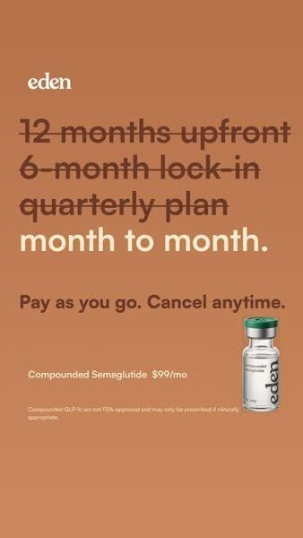

# 67 · The Cross-Out static (strike through the failed fixes and leave the one that works)

<!-- HERO:START -->
[](EXAMPLE.md)

**[See the example and how to make it →](EXAMPLE.md)** · [watch on X](https://x.com/aashishilla170/status/2105999366104444944)
<!-- HERO:END -->


> **LC priority P1** · evidence: Medium (live ad + days-active) · hype risk: Low · cost $0 · 15 min

## What it is
A plain static listing the fixes the viewer has already tried, each one struck through, with the product as the last line, not crossed out. The primary text repeats the list ("Olive oil. Apple cider vinegar. Honey masks…") before naming the mechanism.

## Why it works
- The viewer recognises their own failed attempts, which reads as "this brand gets it".
- The strikethrough is a visual pattern-break and makes the argument without copy.
- Works as a pure static, so it is cheap to test 10 versions.

## Shot-by-shot (LC version)

| Time / slot | Visual | Audio / copy |
|---|---|---|
| Static | Kraft/white background: "~~clear nail polish~~ / ~~taking it off to shower~~ / ~~gold-tone~~ / 14K PVD ✓" next to a necklace on wet skin | Headline: "Done taking it off every night?" |
| Primary text | List of failed fixes → why plating fails → bonded PVD | "Any 7 for $85" |

## Hooks (swap-in openers)
- "Done trying everything else?"
- "~~Take it off before the shower~~"
- "Things I tried before I found waterproof gold"

## Real examples from X (studied)
- @FedotOff90 "37 Ad Formats That Print" verified swipe: Seb Skincare, 77 days live ("Done Trying Everything Else?" with the body listing home remedies). [ad](https://app.gethookd.ai/share/ad/106353129?signature=c302f3338226a5fcc2a32923e1def9b3c99d746652482a47d6b5d1b0177d7f42) · [doc](https://rural-lifeboat-196.notion.site/3c8db9d7074d81548084c2b25d1be1ef) · [post](https://x.com/FedotOff90/status/2104949773539442831)
- @FedotOff90 lists "the cross-out" among the 10 headline formats ([post](https://x.com/FedotOff90/status/2104949773539442831)).

## Production recipe
1. Collect 5 failed fixes from LC reviews and support tickets.
2. Make 4 designs: handwritten marker, typed list, Notes-app screenshot (F32), sticky note.
3. Primary text 120-250 words: failed fixes → mechanism → offer.

## Bot prompt (copy into the creative agent)
```
From {{REVIEWS}}, list the fixes customers tried before LC (polish, removing jewelry, cheap plated pieces). Write 5 cross-out statics (≤5 struck lines + 1 winner line) and a 150-word primary text for each.
```

## 3 LC scripts
- A · "~~nail polish~~ ~~taking it off~~ ~~gold-tone~~ 14K PVD".
- B · Gifts: "~~candle~~ ~~gift card~~ ~~another scarf~~ a 7-piece stack".
- C · Price: "~~$400 solid gold~~ ~~$9 plated~~ $85 for 7, waterproof".

## Variants to test
- Problem list vs gift list vs price list
- Handwritten vs typed

## Omni test plan
- **Budget/structure:** 5 statics, $20/day each, 7 days
- **Primary KPIs:** CPA, CTR; Omni (F67-*)
- **Kill rule:** CPA >1.8× after $60
- **Scale rule:** Keep the winner evergreen; spin off new lists
- **Naming:** `utm_content=F67-<concept>-<variant>`; weekly Omni roll-up of new-customer revenue by format.

## Compliance
Baseline: [_COMPLIANCE.md](../_COMPLIANCE.md) (no fake testimonials, AI disclosure, no bulk/spoofed accounts, copy structure not assets, PDP-only claims).
- Do not name competitor brands; struck items are categories.

## Related
- Strategies: 41-von-restorff-static-copy-prompt, 02-oldest-ad-hook-repurposing
- Formats: [34-callout-statics-signs-myths-warnings](../34-callout-statics-signs-myths-warnings/README.md), [35-diagram-statics-venn-report-card](../35-diagram-statics-venn-report-card/README.md), [32-screenshot-native-static-pack](../32-screenshot-native-static-pack/README.md)

<!-- EVIDENCE:START -->
## Wave 4 update: Fedotoff October 2026 swipe boards
- Frøya Organics: "What will be gone by 2025" checklist static (Frøya Organics), 609 days live (Skincare & Anti-Aging Winners board). A year-goal checklist; each line is one symptom the reader ticks off.
- Stills, how-to and LC remakes: [adlibrary/](adlibrary/README.md).

## Evidence from X discovery (auto-generated)

| Date | Author | Post | Engagement | Grade | Gist |
|---|---|---|---|---|---|
| 2026-09-29 | [@FedotOff90](https://x.com/FedotOff90) | [link](https://x.com/FedotOff90/status/2104949773539442831) | 110L/208BM/9kV | VALUE | "37 ad formats printing right now" — verified Notion swipe (live ad, days active, brand ad count per format) + 132-ad FORMATS board. |
| 2026-09-18 | [@FedotOff90](https://x.com/FedotOff90) | [link](https://x.com/FedotOff90/status/2100948331136782532) | 17L/18BM/3kV | VALUE | Rebuilt the formats list with proof: 30-day survival column = "this works" bar; copy the structure, not the words. |
<!-- EVIDENCE:END -->
