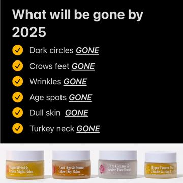

# Meta ad-library examples for F67

<!-- WAVE4 -->
## Wave 4: Alex Fedotoff's October 2026 swipe boards (GetHookd public previews)

Each ad below is from the free 10-ad preview of a public GetHookd board that [@FedotOff90](https://x.com/FedotOff90) shared on X. Days live are as of 2026-10-09; brand claims are the advertisers', not verified.

### Frøya Organics: "What will be gone by 2025" checklist static (Frøya Organics) (609 days live)

- **Board:** [Skincare & Anti-Aging Winners — Active Now (Oct 2026, US/EN)](https://x.com/FedotOff90/status/2107495487570137409) · dco
- **What happens:** A black static: "What will be gone by 2025" with yellow check-boxes: Dark circles GONE, Crows feet GONE, Wrinkles GONE, Age spots GONE, Dull skin GONE, Turkey neck GONE; 4 jars on the strip below.
- **Why it lasts:** 609 days, with 5,530 brand ads. A year-goal checklist; each line is one symptom the reader ticks off.
- **How to make one:** A dark background, "What will be gone by [year]", 6 checked symptom lines with "GONE" underlined, a product strip.
- **LC remake:** "What will be gone in 2027: green neck GONE, tarnish GONE, taking it off to shower GONE."

