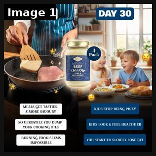

# 68 · Streak calendar static (a habit grid filled with ✓ days): see it, then make it

[](https://x.com/iwo_cybulski/status/1833960761489813736)

**The example:** [@iwo_cybulski on X](https://x.com/iwo_cybulski/status/1833960761489813736) · 1 image · 3 likes, 239 views

**Watch it:** [open the post on X](https://x.com/iwo_cybulski/status/1833960761489813736)

> **How close is this example?** Proxy: a Day 1 / Day 30 static; no checkmark-calendar ad found. The gallery below has more examples.

> #16 adaday for @fondbonebroth ⁕ Touching on the mother's desire to make healthy and tasty food for their kids so they grow big and strong ⁕ Day 1 vs Day 30 to show how using the product changes your everyday life ⁕ Used AI images to help visualize the process Want a FREE ad creative for your brand? DM me "ads" ⚡

## What you are seeing

A static ad for a beef-tallow cooking fat: a split image labelled DAY 1 and DAY 30 — a frying pan on the left, a happy family at a dinner table on the right — with benefit pills under each side. It is the closest real example we found to a streak / progress-over-time static; there is no checkmark calendar grid.

## Image by image

| Image | Text on it (OCR, rough) |
|---|---|
| 1 | aaa DAY DAY 30 be ft I is TAL! Gan a MEALS GE TIER MORE KIDS STOP BEING PICKY KIDS LOOK FEEL HEALTHIER BURNING FOOD SEEMS IMPOSSIBLE YOU START TO SLOWLY LOSE FAT |

## How to make one like it

**The format in one line:** A month-grid or habit-tracker static, filled in day by day (✓, X, or small photos), that shows a streak: "90 days, 0 times taken off". Proof of consistency becomes the visual.

**Why it works:** - Calendars are a familiar personal artefact and don't read as an ad. - A long streak says "it lasts" without making a claim. - Easy to localise: summer, swim season, wedding month.

**Contents:** [1. Structure](#1-copy-the-structure) · [2. Shot by shot](#2-shot-by-shot-remake) · [3. Script and hooks](#3-write-the-script) · [4. Prompts](#4-prompts) · [5. Tools and settings](#5-tools-and-settings) · [6. Louise Carter remake](#6-louise-carter-remake) · [7. Variants and test](#7-variants-and-test-plan) · [8. Pitfalls](#8-pitfalls)

### 1. Copy the structure

The skeleton every version follows: **hook → problem or tension → turn (the product shows up) → proof → one clear ask.** The shot-by-shot below fills it in.

### 2. Shot-by-shot remake

**Target length / size:** 1 static 1080x1350

| # | Time / slot | What we see (visual + camera) | Dialogue / on-screen text |
|---|---|---|---|
| 1 | Main | A 30- or 90-day calendar grid, each day ticked in gold marker | "90 days. Never taken off." |
| 2 | Detail | A few day boxes with tiny notes | "sea" "gym" "wedding" "shower" |
| 3 | Product | The necklace laid across the bottom of the calendar | - |
| 4 | Corner | Offer | "Any 7 for $85" |

<details><summary>Playbook shot list (Louise Carter version from the README)</summary>

| Time / slot | Visual | Audio / copy |
|---|---|---|
| Static | Paper calendar or Notes-style grid, every day ticked with gold marker; the necklace lies across the grid | Headline: "Day 90. Haven't taken it off once." |
| Variant | Grid of 30 small daily wrist/neck photos | "30 days, 30 showers, same chain" |

</details>

### 3. Write the script

Open with one of these hooks (first 1–3 seconds, or the headline on a static):

- "Day 90. Haven't taken it off once."
- "My 30-day shower test"
- "Streak: 214 days, 0 green marks"

Then fill the beats from the table above. Pull the wording from real customer reviews, not from ad copy: a review line beats a copywriter line almost every time. Read every line out loud and cut anything you would not say to a friend. Ready-made Louise Carter scripts are in section 6; hand [BOT.md](BOT.md) to any AI agent to write versions for another brand.

### 4. Prompts

**Real version**

```text
Print a calendar, tick days for real as a team member wears it, photograph it at the end.
```

**Figma**

```text
Calendar grid 7x13, gold ticks, handwritten notes in 4-5 cells.
```

**Full creative-agent prompt (from the playbook):**

```
Design 4 streak-calendar statics for LC from a real wear test {{TEST_LOG}}: headline ≤8 words, grid description, 120-word primary text. Only real days and results.
```

### 5. Tools and settings

1. Run a real 30/60/90-day wear test with a staff member or customer (with consent).
2. Photograph a real calendar and keep the dates true.
3. Pair it with the F12 timeline video.

| Setting | Value |
|---|---|
| Canvas | 1080×1350 (4:5) for feed; 1080×1920 (9:16) story/reel version with the same elements stacked |
| Type | Headline 80–110 px, max 8 words; body 36–44 px; at most 2 typefaces |
| Layout | Headline readable at thumbnail size; product at least 40% of the canvas; logo small, bottom corner |
| Safe zone | Keep text out of the bottom 20% on 9:16 (UI overlays) |
| Tools | Figma or Canva for layout; Photoshop or Photoroom to cut out product; Midjourney or Flux only for backgrounds, never for the product itself |
| Export | PNG or JPG at quality 90, sRGB, under 1 MB |

### 6. Louise Carter remake

- A · 90-day ticked calendar.
- B · 30 daily selfies grid.
- C · Summer: "every beach day in June" calendar.

Brand rules, claims you can and cannot make, and more scripts: [brands/louise-carter.md](brands/louise-carter.md). Step-by-step from idea to scale: [STAGES.md](STAGES.md).

### 7. Variants and test plan

- Ticks vs photos
- 30 vs 90 days

**Test plan:** - **Budget/structure:** 3 statics, $20/day, 7 days - **Primary KPIs:** CTR, CPA; Omni (F68-*) - **Kill rule:** CTR <0.8% - **Scale rule:** Recut as Reel for organic - **Naming:** `utm_content=F68-<concept>-<variant>`; weekly Omni roll-up of new-customer revenue by format.

**Naming:** `F68-<variant>-<hook##>-<date>` so results map back to this folder. Change one thing per test (hook, narrator, length or offer), never two.

### 8. Pitfalls

- If you claim 90 days, someone should really have worn it 90 days.
- Keep notes tiny; the grid is the visual.
- No clean public example of this exact format was found; test it before scaling.
- Too much text: if it cannot be read in 1 second at thumbnail size, cut it.
- AI-generated product images: show the real product; AI is fine for backgrounds only.

**Compliance:** Baseline: [_COMPLIANCE.md](../_COMPLIANCE.md) (no fake testimonials, AI disclosure, no bulk/spoofed accounts, copy structure not assets, PDP-only claims). - Results must come from a real test; disclose if it is a staff member.

## More examples

Every post we found for this format, with transcripts: [examples/](examples/README.md). Playbook: [README.md](README.md). Agent brief: [BOT.md](BOT.md).
