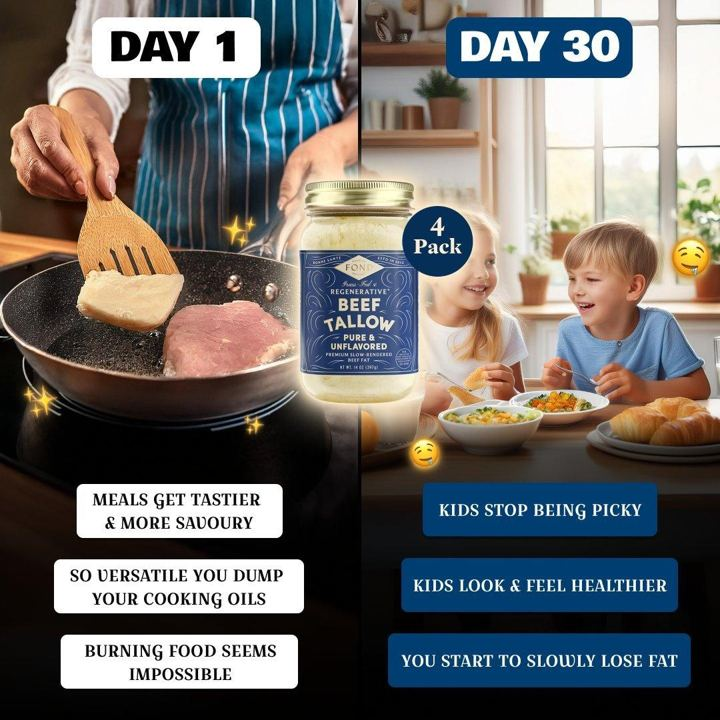

# 68 · Streak calendar static (a habit grid filled with ✓ days)

<!-- HERO:START -->
[](EXAMPLE.md)

**[See the example and how to make it →](EXAMPLE.md)** · [watch on X](https://x.com/iwo_cybulski/status/1833960761489813736)
<!-- HERO:END -->


> **LC priority P2** · evidence: Medium (live ad) · hype risk: Low · cost $0 · 20 min

## What it is
A month-grid or habit-tracker static, filled in day by day (✓, X, or small photos), that shows a streak: "90 days, 0 times taken off". Proof of consistency becomes the visual.

## Why it works
- Calendars are a familiar personal artefact and don't read as an ad.
- A long streak says "it lasts" without making a claim.
- Easy to localise: summer, swim season, wedding month.

## Shot-by-shot (LC version)

| Time / slot | Visual | Audio / copy |
|---|---|---|
| Static | Paper calendar or Notes-style grid, every day ticked with gold marker; the necklace lies across the grid | Headline: "Day 90. Haven't taken it off once." |
| Variant | Grid of 30 small daily wrist/neck photos | "30 days, 30 showers, same chain" |

## Hooks (swap-in openers)
- "Day 90. Haven't taken it off once."
- "My 30-day shower test"
- "Streak: 214 days, 0 green marks"

## Real examples from X (studied)
- @FedotOff90 "37 Ad Formats That Print" verified swipe: Flip My Life Now, 112 (90 at the Aug pull) days live (streak-calendar visual; body "why people can't stop talking about it"). [ad](https://app.gethookd.ai/share/ad/102769512?signature=379fc2a61125b8e4765ee750d12222c912d0ebcd0da8e918ddd5a9a891539487) · [doc](https://rural-lifeboat-196.notion.site/3c8db9d7074d81548084c2b25d1be1ef) · [post](https://x.com/FedotOff90/status/2104949773539442831)

## Production recipe
1. Run a real 30/60/90-day wear test with a staff member or customer (with consent).
2. Photograph a real calendar and keep the dates true.
3. Pair it with the F12 timeline video.

## Bot prompt (copy into the creative agent)
```
Design 4 streak-calendar statics for LC from a real wear test {{TEST_LOG}}: headline ≤8 words, grid description, 120-word primary text. Only real days and results.
```

## 3 LC scripts
- A · 90-day ticked calendar.
- B · 30 daily selfies grid.
- C · Summer: "every beach day in June" calendar.

## Variants to test
- Ticks vs photos
- 30 vs 90 days

## Omni test plan
- **Budget/structure:** 3 statics, $20/day, 7 days
- **Primary KPIs:** CTR, CPA; Omni (F68-*)
- **Kill rule:** CTR <0.8%
- **Scale rule:** Recut as Reel for organic
- **Naming:** `utm_content=F68-<concept>-<variant>`; weekly Omni roll-up of new-customer revenue by format.

## Compliance
Baseline: [_COMPLIANCE.md](../_COMPLIANCE.md) (no fake testimonials, AI disclosure, no bulk/spoofed accounts, copy structure not assets, PDP-only claims).
- Results must come from a real test; disclose if it is a staff member.

## Related
- Strategies: 16-rewards-streaks-earned-discounts, 41-von-restorff-static-copy-prompt
- Formats: [12-week-by-week-results-timeline](../12-week-by-week-results-timeline/README.md), [33-text-on-skin-static](../33-text-on-skin-static/README.md)

<!-- EVIDENCE:START -->
## Evidence from X discovery (auto-generated)

| Date | Author | Post | Engagement | Grade | Gist |
|---|---|---|---|---|---|
<!-- EVIDENCE:END -->
