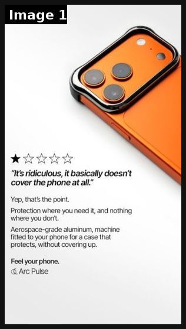
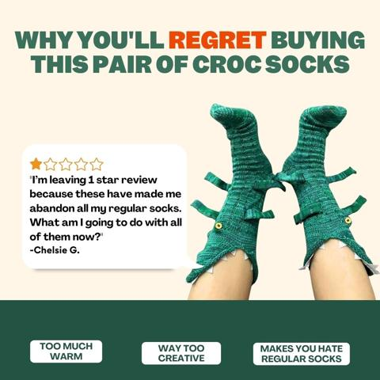
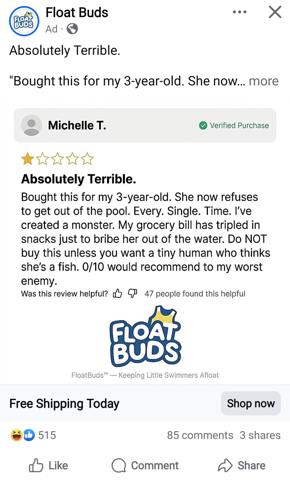
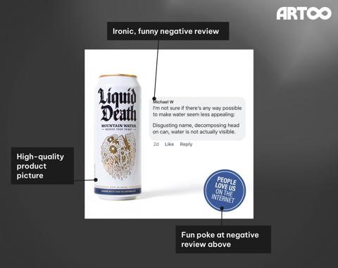

# 69 · Zero Stars rating flip ('5 stars from you / zero stars from them'): see it, then make it

[](https://x.com/cortex_adbrain/status/2103883993603031429)

**The example:** [@cortex_adbrain on X](https://x.com/cortex_adbrain/status/2103883993603031429) · 1 image · 0 likes, 31 views

**Watch it:** [open the post on X](https://x.com/cortex_adbrain/status/2103883993603031429)

> if you're a creative strategist, a 1-star review just outworked your entire creative brief the brand quoted their own worst complaint, bolded it, gave it a star rating, and made it the headline that's not bravery — that's physics a reader who sees "it basically doesn't cover the phone at all" and keeps scrolling has already done half the sales job themselves the 1-star framing disarms every objection before you raise…

## What you are seeing

A 1-star rating flip static for an aluminium phone case (Arc Pulse): one star, the quoted complaint "It's ridiculous, it basically doesn't cover the phone at all.", then "Yep, that's the point." and the benefit.

## Image by image

| Image | Text on it (OCR, rough) |
|---|---|
| 1 | It's ridiculous, it basically doesn't cover the phone at all. Yep, thats the point. Protection where you need it, and nothing where you don't. Aerospace-grade aluminum, machine fitted to your phone for a case that protects, without covering up. Feel your phone, Arc Pulse |

## More real examples (3)

Other posts that show this format, or a close cousin of it. Click a thumbnail to open it on X.

| | | |
|---|---|---|
| [](https://x.com/akhilbuilds/status/1808319058200387782)<br>**@akhilbuilds** · image · 154 views<br>This humourous 1 star review static ad has performed very well for several brands that I designed it for. People love ads that create intrigue, adds h | [](https://x.com/sandiegocausa/status/2079314429980925993)<br>**@sandiegocausa** · image · 78 views<br>Saw this smart ad on my Facebook thread. The 1 star review catches attention, the negative review highlights how good the product is. The only thing I | [](https://x.com/helloitsdrew_/status/1863574480045461667)<br>**@helloitsdrew_** · image · 882 views<br>Instead of the usual review/testimonial static, try out an ironic 'negative' one! It's attention grabbing, and potentially entertaining to viewers! |

## How to make one like it

**The format in one line:** A two-line rating joke: you give it five stars, while an "enemy" (the shower, the pool, tarnish, the jealous friend) gives it zero. Social proof and a benefit packed into a meme-like card.

**Why it works:** - A star rating is instantly readable; the twist makes people read the second line. - It turns the product's durability into a joke the viewer gets. - Cheap: one image and two lines.

**Contents:** [1. Structure](#1-copy-the-structure) · [2. Shot by shot](#2-shot-by-shot-remake) · [3. Script and hooks](#3-write-the-script) · [4. Prompts](#4-prompts) · [5. Tools and settings](#5-tools-and-settings) · [6. Louise Carter remake](#6-louise-carter-remake) · [7. Variants and test](#7-variants-and-test-plan) · [8. Pitfalls](#8-pitfalls)

### 1. Copy the structure

The skeleton every version follows: **hook → problem or tension → turn (the product shows up) → proof → one clear ask.** The shot-by-shot below fills it in.

### 2. Shot-by-shot remake

**Target length / size:** 1 static 1080x1350

| # | Time / slot | What we see (visual + camera) | Dialogue / on-screen text |
|---|---|---|---|
| 1 | Left | Review card: 5 stars from a customer | "5 stars from you." |
| 2 | Right | Review card: 0 stars, from the "enemy" | "0 stars from the sea. (It tried.)" |
| 3 | Product | Necklace between the two cards | - |
| 4 | Corner | Offer | "Any 7 for $85" |

<details><summary>Playbook shot list (Louise Carter version from the README)</summary>

| Time / slot | Visual | Audio / copy |
|---|---|---|
| Static | Necklace on wet skin; top: "5 stars from you ⭐⭐⭐⭐⭐"; bottom: "Zero stars from the shower" | Primary text: "It's been through 400 showers and refuses to turn green." |

</details>

### 3. Write the script

Open with one of these hooks (first 1–3 seconds, or the headline on a static):

- "5 stars from you. Zero stars from your shower."
- "Zero stars from tarnish"
- "Zero stars from my sister (she wanted it first)"

Then fill the beats from the table above. Pull the wording from real customer reviews, not from ad copy: a review line beats a copywriter line almost every time. Read every line out loud and cut anything you would not say to a friend. Ready-made Louise Carter scripts are in section 6; hand [BOT.md](BOT.md) to any AI agent to write versions for another brand.

### 4. Prompts

**Claude**

```text
Write 10 "zero stars from them" lines where "them" is the problem (the sea, your gym, tarnish, your sister who keeps borrowing it).
```

**Figma**

```text
Two review cards, left 5 gold stars, right 0 grey stars; product centred.
```

**Full creative-agent prompt (from the playbook):**

```
Write 10 "5 stars from you / zero stars from ___" statics for LC: enemy, photo idea, 60-word primary text. Durability claims must match the PDP.
```

### 5. Tools and settings

1. Write 10 "enemy" lines: shower, pool, chlorine, tarnish, the sister who borrows it.
2. Pair each with a real product photo.
3. Rotate weekly; the format fatigues fast.

| Setting | Value |
|---|---|
| Canvas | 1080×1350 (4:5) for feed; 1080×1920 (9:16) story/reel version with the same elements stacked |
| Type | Headline 80–110 px, max 8 words; body 36–44 px; at most 2 typefaces |
| Layout | Headline readable at thumbnail size; product at least 40% of the canvas; logo small, bottom corner |
| Safe zone | Keep text out of the bottom 20% on 9:16 (UI overlays) |
| Tools | Figma or Canva for layout; Photoshop or Photoroom to cut out product; Midjourney or Flux only for backgrounds, never for the product itself |
| Export | PNG or JPG at quality 90, sRGB, under 1 MB |

### 6. Louise Carter remake

- A · "Zero stars from the shower".
- B · "Zero stars from chlorine".
- C · "Zero stars from your boyfriend's wallet: 7 for $85".

Brand rules, claims you can and cannot make, and more scripts: [brands/louise-carter.md](brands/louise-carter.md). Step-by-step from idea to scale: [STAGES.md](STAGES.md).

### 7. Variants and test plan

- Enemy type
- Joke vs proof tone

**Test plan:** - **Budget/structure:** 6 statics, $15/day, 5 days - **Primary KPIs:** CTR, CPA; Omni (F69-*) - **Kill rule:** CTR <0.9% - **Scale rule:** Winner → F32 Notes version - **Naming:** `utm_content=F69-<concept>-<variant>`; weekly Omni roll-up of new-customer revenue by format.

**Naming:** `F69-<variant>-<hook##>-<date>` so results map back to this folder. Change one thing per test (hook, narrator, length or offer), never two.

### 8. Pitfalls

- The 5-star review must be real.
- Make the "zero stars" joke obviously playful.
- Don't aim it at a competitor.
- Too much text: if it cannot be read in 1 second at thumbnail size, cut it.
- AI-generated product images: show the real product; AI is fine for backgrounds only.

**Compliance:** Baseline: [_COMPLIANCE.md](../_COMPLIANCE.md) (no fake testimonials, AI disclosure, no bulk/spoofed accounts, copy structure not assets, PDP-only claims). - Don't show fake review widgets; the stars are a visual joke, not a rating claim.

## More examples

Every post we found for this format, with transcripts: [examples/](examples/README.md). Playbook: [README.md](README.md). Agent brief: [BOT.md](BOT.md).
