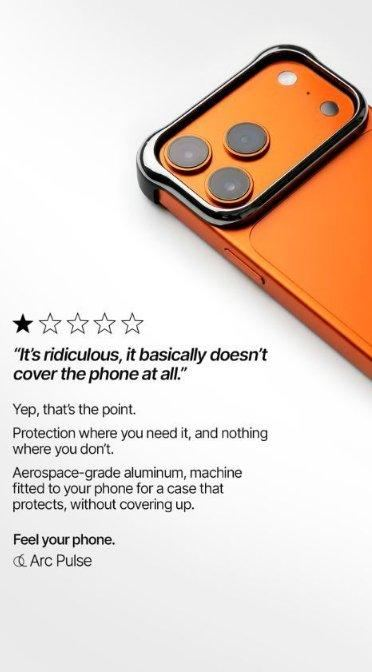

# 69 · Zero Stars rating flip ("5 stars from you / zero stars from them")

<!-- HERO:START -->
[](EXAMPLE.md)

**[See the example and how to make it →](EXAMPLE.md)** · [watch on X](https://x.com/cortex_adbrain/status/2103883993603031429)
<!-- HERO:END -->


> **LC priority P2** · evidence: Medium (live ad, big tester brand) · hype risk: Low · cost $0 · 15 min

## What it is
A two-line rating joke: you give it five stars, while an "enemy" (the shower, the pool, tarnish, the jealous friend) gives it zero. Social proof and a benefit packed into a meme-like card.

## Why it works
- A star rating is instantly readable; the twist makes people read the second line.
- It turns the product's durability into a joke the viewer gets.
- Cheap: one image and two lines.

## Shot-by-shot (LC version)

| Time / slot | Visual | Audio / copy |
|---|---|---|
| Static | Necklace on wet skin; top: "5 stars from you ⭐⭐⭐⭐⭐"; bottom: "Zero stars from the shower" | Primary text: "It's been through 400 showers and refuses to turn green." |

## Hooks (swap-in openers)
- "5 stars from you. Zero stars from your shower."
- "Zero stars from tarnish"
- "Zero stars from my sister (she wanted it first)"

## Real examples from X (studied)
- @FedotOff90 "37 Ad Formats That Print" verified swipe: Perkypeche, 14 (4 at the Aug pull) days live (title "5 Stars from you", body "Zero Stars From Them"; brand runs 1,012 ads). [ad](https://app.gethookd.ai/share/ad/151039245?signature=6f86debc8e15a1ac9878407e28c36e79bebff60317ecc1575c4ff998534c2f3b) · [doc](https://rural-lifeboat-196.notion.site/3c8db9d7074d81548084c2b25d1be1ef) · [post](https://x.com/FedotOff90/status/2104949773539442831)

## Production recipe
1. Write 10 "enemy" lines: shower, pool, chlorine, tarnish, the sister who borrows it.
2. Pair each with a real product photo.
3. Rotate weekly; the format fatigues fast.

## Bot prompt (copy into the creative agent)
```
Write 10 "5 stars from you / zero stars from ___" statics for LC: enemy, photo idea, 60-word primary text. Durability claims must match the PDP.
```

## 3 LC scripts
- A · "Zero stars from the shower".
- B · "Zero stars from chlorine".
- C · "Zero stars from your boyfriend's wallet: 7 for $85".

## Variants to test
- Enemy type
- Joke vs proof tone

## Omni test plan
- **Budget/structure:** 6 statics, $15/day, 5 days
- **Primary KPIs:** CTR, CPA; Omni (F69-*)
- **Kill rule:** CTR <0.9%
- **Scale rule:** Winner → F32 Notes version
- **Naming:** `utm_content=F69-<concept>-<variant>`; weekly Omni roll-up of new-customer revenue by format.

## Compliance
Baseline: [_COMPLIANCE.md](../_COMPLIANCE.md) (no fake testimonials, AI disclosure, no bulk/spoofed accounts, copy structure not assets, PDP-only claims).
- Don't show fake review widgets; the stars are a visual joke, not a rating claim.

## Related
- Strategies: 41-von-restorff-static-copy-prompt, 11-social-proof-credibility-engine
- Formats: [36-backhanded-zero-star-review](../36-backhanded-zero-star-review/README.md), [40-testimonial-mashup](../40-testimonial-mashup/README.md)

<!-- EVIDENCE:START -->
## Evidence from X discovery (auto-generated)

| Date | Author | Post | Engagement | Grade | Gist |
|---|---|---|---|---|---|
| 2026-09-29 | [@FedotOff90](https://x.com/FedotOff90) | [link](https://x.com/FedotOff90/status/2104949773539442831) | 110L/208BM/9kV | VALUE | "37 ad formats printing right now" — verified Notion swipe (live ad, days active, brand ad count per format) + 132-ad FORMATS board. |
<!-- EVIDENCE:END -->
