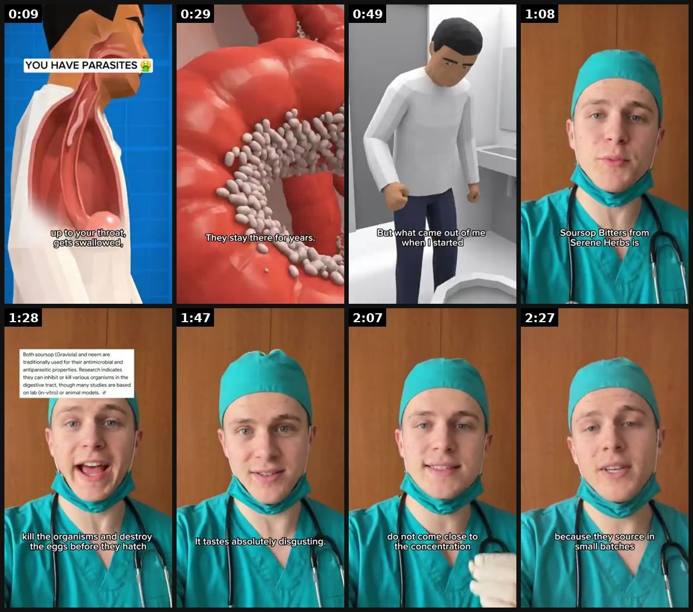

# 70 · Tough Love: blunt, scolding narrator ad ('stop doing this to yourself'): see it, then make it

[](https://x.com/ZedNilm1/status/2098017463195553912)

**The example:** [@ZedNilm1 on X](https://x.com/ZedNilm1/status/2098017463195553912) · 2:36 video · 3 likes, 655 views

**Watch it:** [open the post on X](https://x.com/ZedNilm1/status/2098017463195553912) · [play the video file](https://video.twimg.com/amplify_video/2098017420170711040/vid/avc1/320x572/UTnxVwA_tGAyAThU.mp4?tag=14)

> this parasite ad looks like something made in 10 minutes which is exactly why i’d pay attention to it ugly animation aggressive hook zero concern for looking “premium” but it stops the scroll instantly these are the kinds of creatives most brands would kill before they ever reached meta and sometimes they’re the ones that end up printing added this + a bunch of similar animation ads to the swipe file link in the comm…

## What you are seeing

A blunt, tough-love narrator over gross-out medical visuals ("YOU HAVE PARASITES", a gut close-up, a CGI man in a bathroom), then a man in scrubs and a mask talking frankly to camera. It is meant to look like it took 10 minutes to make.

## Beat by beat

The storyboard above samples the video every 0:19. Lines are the transcript for that stretch; on-screen text comes from OCR, so treat it as rough.

| Frame | Time | On screen | Said / sung |
|---|---|---|---|
| 1 | 0:00–0:19 | Up to! Your throat | If you walk barefoot over dirt, a hookworm can use its sharp mouth to penetrate your skin and enter your body directly through your feet. Once inside it travel through your bloodstream, up to your throat, get swallowed and clamps onto your intestinal walls to feed on your blood for years. Once insid |
| 2 | 0:19–0:39 | me! years. They | get swallowed and end up clamping onto your intestinal walls with sharp curved mouth parts to feed on your blood. They lay eggs, they expand the colony, they stay there for years and the whole time you are just tired, bloated, grinding your teeth at night, craving sugar you cannot |
| 3 | 0:39–0:58 | · | explain, wondering why your energy is gone no matter how much you sleep. Over 60 million Americans have organisms living inside them right now and have no idea but what came out of me when I started taking this was frightening, dark stringy things, clumps, material that had no business being inside  |
| 4 | 0:58–1:18 | Serene Herbs is a | I stood in the bathroom staring at it, not fully believing what I was looking at. You are not going to find what I am about to show you at the corner store and there is a reason for that. Sarsop bitters from Zerene Herbs is anti-pericidate, anti-dactyl, anti-microbial and anti-fungal. It combines 15 |
| 5 | 1:18–1:38 | are traditionally used for their … properties. Research indicates they can inhibit or kill various organisms in the digestive tract, though many studies are bas | designed to clear what is living inside your guts at every life stage. Sarsop, the anemone, kill the organisms and destroy the eggs before they hatch so the cycle cannot restart the way it does with every other clowns you have tried. Seta and Tamarin flush the dead waste and toxic material out throu |
| 6 | 1:38–1:57 | · | Lapseed and turmeric calm the systemic inflammation they leave behind so the bloating, cuffiness and exhaustion start clearing with them. It tastes absolutely disgusting. That is the point, sweet supplements feed what is living inside you, bitter herbs are the thing they cannot survive. Not all bitt |
| 7 | 1:57–2:17 | · | because that is what actually penetrates the biofilm these organisms hide behind. Most products on the market do not come close to the concentration you need to make a real difference. This is the one I personally use and the reason I use it is because it actually works. |
| 8 | 2:17–2:36 | · | Over 500,000 people have cleared theirs with this formula, 60 day money back guarantee if you do not feel the difference you get every penny back. I am going to leave the link somewhere below. Be careful though because they source in small batches directly from West Africa and they sell out every si |

<details><summary>Full transcript (timestamped)</summary>

- `0:00` If you walk barefoot over dirt, a hookworm can use its sharp mouth to penetrate your
- `0:04` skin and enter your body directly through your feet.
- `0:07` Once inside it travel through your bloodstream, up to your throat, get swallowed and clamps
- `0:11` onto your intestinal walls to feed on your blood for years.
- `0:15` Once inside these organisms migrate through your bloodstream, travel to your throat,
- `0:19` get swallowed and end up clamping onto your intestinal walls with sharp curved
- `0:24` mouth parts to feed on your blood.
- `0:27` They lay eggs, they expand the colony, they stay there for years and the whole
- `0:31` time you are just tired, bloated, grinding your teeth at night, craving sugar you cannot
- `0:38` explain, wondering why your energy is gone no matter how much you sleep.
- `0:43` Over 60 million Americans have organisms living inside them right now and have no idea
- `0:48` but what came out of me when I started taking this was frightening, dark stringy
- `0:52` things, clumps, material that had no business being inside a human body.
- `0:57` I stood in the bathroom staring at it, not fully believing what I was looking at.
- `1:03` You are not going to find what I am about to show you at the corner store and there
- `1:06` is a reason for that.
- `1:07` Sarsop bitters from Zerene Herbs is anti-pericidate, anti-dactyl, anti-microbial and anti-fungal.
- `1:14` It combines 15 wild harvested African and Caribbean herbs into one formula specifically
- `1:20` designed to clear what is living inside your guts at every life stage.
- `1:24` Sarsop, the anemone, kill the organisms and destroy the eggs before they hatch so the
- `1:29` cycle cannot restart the way it does with every other clowns you have tried.
- `1:33` Seta and Tamarin flush the dead waste and toxic material out through your colon completely.
- `1:38` Lapseed and turmeric calm the systemic inflammation they leave behind so the bloating, cuffiness
- `1:43` and exhaustion start clearing with them.
- `1:46` It tastes absolutely disgusting.
- `1:48` That is the point, sweet supplements feed what is living inside you, bitter herbs are the
- `1:53` thing they cannot survive.
- `1:54` Not all bitter herb formulas are the same, you need a high potency concentrated extract
- `1:59` because that is what actually penetrates the biofilm these organisms hide behind.
- `2:04` Most products on the market do not come close to the concentration you need to
- `2:08` make a real difference.
- `2:10` This is the one I personally use and the reason I use it is because it actually
- `2:14` works.
- `2:15` Over 500,000 people have cleared theirs with this formula, 60 day money back guarantee if
- `2:21` you do not feel the difference you get every penny back.
- `2:24` I am going to leave the link somewhere below.
- `2:26` Be careful though because they source in small batches directly from West Africa and they
- `2:30` sell out every single restock.
- `2:32` If you can still see the link it is still in stock do not wait on this one.

</details>

## More real examples (1)

Other posts that show this format, or a close cousin of it. Click a thumbnail to open it on X.

| | | |
|---|---|---|
| [](https://x.com/LinoLeighton/status/2108195005126869080)<br>**@LinoLeighton** · 0:26 video · 848 views<br>Drama Ads ripping rn… 100% AI drama ad made with Seedance 2.5 Here’s how to make your drama ads actually hit: Go to agent on arcads Start with an aggr |   |   |

## How to make one like it

**The format in one line:** A narrator who talks to the viewer like a blunt friend or older sister: "Stop buying jewelry you have to take off." The tone is affectionate scolding, followed by a practical fix. Works as a static with long copy or as a talking-head video.

**Why it works:** - Directness stands out in a feed full of polite ads. - Scolding makes it a rescue story, with the viewer in it. - It pairs naturally with an older, experienced narrator.

**Contents:** [1. Structure](#1-copy-the-structure) · [2. Shot by shot](#2-shot-by-shot-remake) · [3. Script and hooks](#3-write-the-script) · [4. Prompts](#4-prompts) · [5. Tools and settings](#5-tools-and-settings) · [6. Louise Carter remake](#6-louise-carter-remake) · [7. Variants and test](#7-variants-and-test-plan) · [8. Pitfalls](#8-pitfalls)

### 1. Copy the structure

Use the example's timing as your beat sheet. Keep the beat, change the words and the product.

| Beat | Time | In the example | Your version |
|---|---|---|---|
| 1 | 0:09 | If you walk barefoot over dirt, a hookworm can use its sharp mouth to penetrate your skin and enter your body directly through your feet. On | … |
| 2 | 0:29 | get swallowed and end up clamping onto your intestinal walls with sharp curved mouth parts to feed on your blood. They lay eggs, they expand | … |
| 3 | 0:49 | explain, wondering why your energy is gone no matter how much you sleep. Over 60 million Americans have organisms living inside them right n | … |
| 4 | 1:08 | I stood in the bathroom staring at it, not fully believing what I was looking at. You are not going to find what I am about to show you at t | … |
| 5 | 1:28 | designed to clear what is living inside your guts at every life stage. Sarsop, the anemone, kill the organisms and destroy the eggs before t | … |
| 6 | 1:47 | Lapseed and turmeric calm the systemic inflammation they leave behind so the bloating, cuffiness and exhaustion start clearing with them. It | … |
| 7 | 2:07 | because that is what actually penetrates the biofilm these organisms hide behind. Most products on the market do not come close to the conce | … |
| 8 | 2:27 | Over 500,000 people have cleared theirs with this formula, 60 day money back guarantee if you do not feel the difference you get every penny | … |

### 2. Shot-by-shot remake

**Target length / size:** 20-40s, 1080x1920

| # | Time / slot | What we see (visual + camera) | Dialogue / on-screen text |
|---|---|---|---|
| 1 | 0-3s | Narrator to camera, arms crossed, blunt | "Stop buying $15 necklaces that last three weeks." |
| 2 | 3-12s | Quick cuts of the habit being scolded | "You've done this six times. That's $90." |
| 3 | 12-22s | The fix | "Buy once. 14K PVD. Shower in it." |
| 4 | 22-30s | Softer close | "You deserve jewellery that lasts." |
| 5 | End | Offer | - |

<details><summary>Playbook shot list (Louise Carter version from the README)</summary>

| Time / slot | Visual | Audio / copy |
|---|---|---|
| 0-3s | Narrator to camera, arms crossed | "Stop buying necklaces you have to take off." |
| 3-25s | Tray of green-stained jewelry | "You've spent $200 on stuff that died in a month." |
| 25-45s | LC stack, in the shower | "Buy once. 14K PVD. Any 7 for $85." |

</details>

### 3. Write the script

Open with one of these hooks (first 1–3 seconds, or the headline on a static):

- "Stop buying jewelry you have to babysit"
- "Honey, that chain is not real gold"
- "I'm going to be blunt about your jewelry drawer"

Then fill the beats from the table above. Pull the wording from real customer reviews, not from ad copy: a review line beats a copywriter line almost every time. Read every line out loud and cut anything you would not say to a friend. Ready-made Louise Carter scripts are in section 6; hand [BOT.md](BOT.md) to any AI agent to write versions for another brand.

### 4. Prompts

**Claude**

```text
Write 10 tough-love scripts for [audience]: scold the habit, never the person; end kind.
```

**Casting**

```text
A confident narrator (stylist, older sister energy); one take, direct to camera.
```

**Full creative-agent prompt (from the playbook):**

```
Write 4 tough-love scripts (30s) and 2 long-copy statics for LC in a blunt older-sister voice, warm not insulting. Proof only from {{PDP_FACTS}}.
```

### 5. Tools and settings

1. Cast a real customer or staff member as the "blunt friend"; no invented personas.
2. Keep it affectionate, never shaming bodies or money.
3. Test as static with long copy and as a 30s video.

| Setting | Value |
|---|---|
| Canvas | 1080×1920 (9:16) master; crop a 1080×1350 (4:5) cut for feed placements |
| Frame rate | 30 fps (shoot 60 fps for slow-motion water or sparkle shots) |
| Camera | Phone main lens at 1x, exposure locked on skin, HDR off, grid on; tripod or a phone clamp for product shots |
| Light | One soft key at 45° (window or ring light), white card as fill; side light for metal sparkle |
| Audio | Lavalier or phone 15–20 cm from the mouth; mix voice at -14 LUFS, music at -28 to -30 dB under voice |
| Captions | Burned in, 2–5 words per line, 64–80 px bold sans, white with a black stroke or pill; keep text inside the safe zone (top 220 px and bottom 420 px clear, 64 px side margins) |
| Pacing | A visual change every 1.5–3 s; the hook lands in the first 1.5 s with no logo intro |
| Edit / export | CapCut or Premiere; H.264, 12–20 Mbps, AAC 320 kbps; upload natively to each platform, not via links |

### 6. Louise Carter remake

- A · "Stop babysitting your jewelry".
- B · "Your jewelry drawer is a graveyard".
- C · "Gift advice from your blunt aunt".

Brand rules, claims you can and cannot make, and more scripts: [brands/louise-carter.md](brands/louise-carter.md). Step-by-step from idea to scale: [STAGES.md](STAGES.md).

### 7. Variants and test plan

- Narrator age
- Static vs video

**Test plan:** - **Budget/structure:** 4 ads, $25/day, 7 days - **Primary KPIs:** Hold rate, CPA; Omni (F70-*) - **Kill rule:** CPA >2× - **Scale rule:** Pair with F14 yapper - **Naming:** `utm_content=F70-<concept>-<variant>`; weekly Omni roll-up of new-customer revenue by format.

**Naming:** `F70-<variant>-<hook##>-<date>` so results map back to this folder. Change one thing per test (hook, narrator, length or offer), never two.

### 8. Pitfalls

- Scold the habit, not the viewer's body or worth.
- Numbers must be realistic.
- End with warmth or it reads as mean.
- Slow open: if the first 1.5 s does not show the hook visually, most people swipe.
- Logo or brand intro at the start reads as an ad; put the brand at the end.
- Captions covered by the platform UI: check the safe zone on a real phone before posting.
- Music over the voice: keep music at least 14 dB under speech.

**Compliance:** Baseline: [_COMPLIANCE.md](../_COMPLIANCE.md) (no fake testimonials, AI disclosure, no bulk/spoofed accounts, copy structure not assets, PDP-only claims). - Real narrator identity; no fake "persona pages" presented as independent people. - No shaming.

## Field notes

Newer observations live in the playbook: [Wave 4 update: Fedotoff October 2026 swipe boards](README.md)

## More examples

Every post we found for this format, with transcripts: [examples/](examples/README.md). Playbook: [README.md](README.md). Agent brief: [BOT.md](BOT.md).
