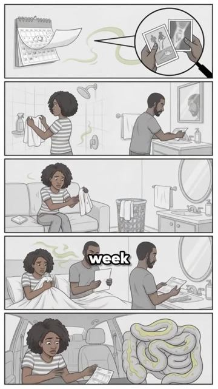

# Meta ad-library examples for F70

<!-- WAVE6 -->
## Wave 6: Resilia & Smooche live Meta ads (Oct 2026)

Pulled from the public Meta Ad Library on 2026-10-09 (Resilia: aged garlic, Ceylon cinnamon, oil of oregano; Smooche: color-changing foundation, Reverse Time peptide serum). Days live are counted to 2026-10-09; most video ads were new tests that week, while the long runners are statics and catalog templates. Transcripts are automatic. Brand claims are the advertisers', not verified, and many are health claims we would never make. The **Do not copy** line flags deceptive tactics (persona "publication" pages, undisclosed AI actors and "experts", fake stock counts).

### Resilia · Natural Defense Report: “If you smell yourself the week before your period, you're already at…” (1 day live)

- **Ad:** [Meta Ad Library #1634124788354262](https://www.facebook.com/ads/library/?id=1634124788354262) · video 1:53 · page “Natural Defense Report” · started 2026-10-07 · 1 copies · lands on `resilia.shop/products/resilia-oil-of-oregano-softgels`
- **What happens:** Opens: “If you smell yourself the week before your period, you're already at stage one. There are five.”
- **Why it works:** The blunt narrator ("If you smell yourself the week before your period, you're already at stage one. There are five.") scolds the viewer into self-diagnosis.
- **How to make one:** Use the stage-count structure with a blunt voice, and soften the claims.
- **Do not copy:** Medical stage claims here are unsupported.
- **LC remake:** "If your jewelry box has a green ring in it, you're at stage one."

Transcript (auto, first ~70 s)

> If you smell yourself the week before your period, you're already at stage one. There are five. Number one, week before your period. You smell yourself and tell yourself it's hormones. It's not your hormones. It's bad bacteria. You're sticky shield on your vaginal walls and it gets thicker every cycle. Number two. The second shower. One before work. One at lunch. Body spray in your purse just in case. Soak, it's behind the shield. Number. Three. The checking. The checking. You smell your underwear before they go in the hamper. Pads every day. Not even for your period. You sit on the edge of the couch in case... anybody gets close. He goes down there, stops and comes back up with that look. So now you pull him up before he gets there and you tell him you're tired. Number five. It's just you. Your tests come back clean. Your gyno says some women just smell like that. So you believe her. You think you're dirty. Five warnings. All from one shield of bad bacteria on your vaginal walls. While the film washes, the boric acid and the probiotics never...

### Resilia · Ancient Remedy Co: “And just one night and you do not meet a diet or a doctor for this…” (0 days live)

- **Ad:** [Meta Ad Library #1087459937511189](https://www.facebook.com/ads/library/?id=1087459937511189) · video 2:49 · page “Ancient Remedy Co” · started 2026-10-08 · 1 copies · lands on `resilia.shop/products/resilia-oil-of-oregano-softgels`
- **What happens:** Opens: “And just one night and you do not meet a diet or a doctor for this. This is what doctors won't tell you.”
- **Why it works:** The blunt narrator ("If you smell yourself the week before your period, you're already at stage one. There are five.") scolds the viewer into self-diagnosis.
- **How to make one:** Use the stage-count structure with a blunt voice, and soften the claims.
- **Do not copy:** Medical stage claims here are unsupported.
- **LC remake:** "If your jewelry box has a green ring in it, you're at stage one."

Transcript (auto, first ~70 s)

> And just one night and you do not meet a diet or a doctor for this. This is what doctors won't tell you. If your vagina smells like a rotten fish market, there's something alive inside you and it feeds off what you eat. If your gut always feels blo, bloated, it's not just gas, it's an infestation. If you wake up tired even after eight hours of sleep, it's. It's not laziness, it's a parasite draining your energy. If your skin is for no reason or you can't shake off yeast infections, you're slowly being taken over and no one's telling you this. It's called dysbiosis. Your bodies become a breeding ground for fungi, harmful bacteria and silent worms. They steal your nutrients, weaken your immune or immune system and trigger internal inflammation. In the worst part, they make you crave sugar to stay alive. But here's what most people don't know. Every cleanse you've ever tried says failed. Because parasites build a a thick protective shield around themselves called biofilm. Wormwood bounces right off it. Charcoal can't break through. Detox teas don't reach it for you. The parasites just one sip behind that wall feeding and reproducing while you waste your money on cleanses that never in the cycle. The only natural compound strong enough to dissolve that that biofilm is Carva Crawl. So it doesn't sit in your gut rotting and making you feel worse. The oregano kills them, the black seed flushes them. Within a few weeks, the smell goes away, the bloating fades, the cravings stop. The energy comes back, the brain fog lifts, and that feeling of lightness you forgot even existed finall

<!-- /WAVE6 -->

<!-- WAVE4 -->
## Wave 4: Alex Fedotoff's October 2026 swipe boards (GetHookd public previews)

Each ad below is from the free 10-ad preview of a public GetHookd board that [@FedotOff90](https://x.com/FedotOff90) shared on X. Days live are as of 2026-10-09; brand claims are the advertisers', not verified.

### Pure Rhythm: Tough-love podcast rant ("women over 40 who still don't know this") (324 days live)

- **Board:** [Podcast-Style Ads — Ecom (mic/interview format)](https://x.com/FedotOff90/status/2101063012471951797) · video 84 s
- **What happens:** "I can't believe… woman over 40 who still doesn't know this… waking up wrecked, bloated, drained… I'm not angry. I'm just tired of watching people suffer because no one tells them the truth. Magnesium is the foundation…" 84 s.
- **Why it lasts:** 324 days. Tough-love anger reads as honest (as in Fedotoff's reflux case), and a symptom list gives the viewer self-recognition.
- **How to make one:** An older male expert on a podcast set, a frustrated tone, a 6-symptom list, one ingredient as the foundation.
- **LC remake:** "I'm tired of watching women ruin their skin with cheap plated jewelry."

