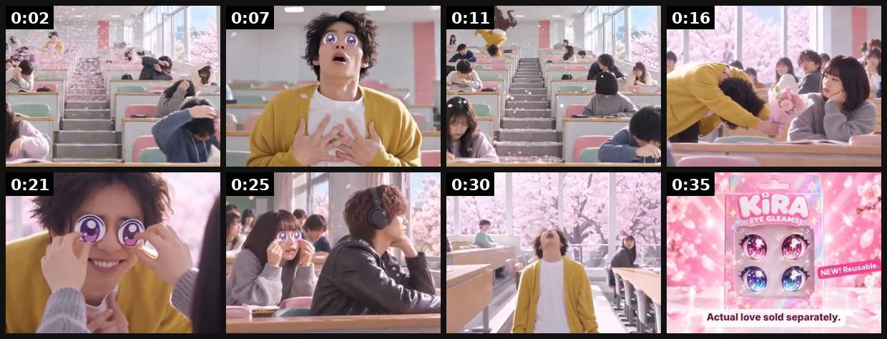

# 71 · 'Side effect' ad (a positive side effect framed as a warning): see it, then make it

[](https://x.com/pmaymin/status/2105059737343492311)

**The example:** [@pmaymin on X](https://x.com/pmaymin/status/2105059737343492311) · 0:37 video · 2 likes, 240 views

**Watch it:** [open the post on X](https://x.com/pmaymin/status/2105059737343492311) · [play the video file](https://video.twimg.com/amplify_video/2105059691516575744/vid/avc1/480x360/eOIc2-9AjloeSsie.mp4?tag=29)

> My entry for Best Product Ad for a fake product that doesn't exist (yet). Side effects may include heartbreak. Made with Seedance 2.5 on @openart_ai @BytePlusGlobal #Seedance #OpenArtAdAwards

## What you are seeing

A spec ad for a fictional product that parodies drug-ad disclaimers ("Side effects may include heartbreak"): a classroom of students, dramatic reactions and a stylised product end card, made with AI video.

## Beat by beat

The storyboard above samples the video every 0:04. Lines are the transcript for that stretch; on-screen text comes from OCR, so treat it as rough.

| Frame | Time | On screen | Said / sung |
|---|---|---|---|
| 1 | 0:00–0:04 | · | · |
| 2 | 0:04–0:09 | · | · |
| 3 | 0:09–0:14 | · | · |
| 4 | 0:14–0:18 | · | · |
| 5 | 0:18–0:23 | · | Is this love usable? |
| 6 | 0:23–0:28 | · | · |
| 7 | 0:28–0:32 | fy al SR yr at 23 | · |
| 8 | 0:32–0:37 | ny Actual love sold separately. | · |

<details><summary>Full transcript (timestamped)</summary>

- `0:03` Is this love usable?

</details>

## How to make one like it

**The format in one line:** A warning-label or "side effects may include…" framing for good outcomes: compliments, people asking where it's from, never taking it off, a friend stealing it. The form mimics a warning label; the content is a benefit.

**Why it works:** - A warning label is a pattern interrupt and promises social payoff. - It sells the emotional result (compliments) rather than features. - Works as a static, a label graphic, or a 10s text video.

**Contents:** [1. Structure](#1-copy-the-structure) · [2. Shot by shot](#2-shot-by-shot-remake) · [3. Script and hooks](#3-write-the-script) · [4. Prompts](#4-prompts) · [5. Tools and settings](#5-tools-and-settings) · [6. Louise Carter remake](#6-louise-carter-remake) · [7. Variants and test](#7-variants-and-test-plan) · [8. Pitfalls](#8-pitfalls)

### 1. Copy the structure

Use the example's timing as your beat sheet. Keep the beat, change the words and the product.

| Beat | Time | In the example | Your version |
|---|---|---|---|
| 1 | 0:02 | (visual beat, see frame 1) | … |
| 2 | 0:07 | (visual beat, see frame 2) | … |
| 3 | 0:11 | (visual beat, see frame 3) | … |
| 4 | 0:16 | (visual beat, see frame 4) | … |
| 5 | 0:21 | Is this love usable? | … |
| 6 | 0:25 | (visual beat, see frame 6) | … |
| 7 | 0:30 | on screen: fy al SR yr at 23 | … |
| 8 | 0:35 | on screen: ny Actual love sold separately. | … |

### 2. Shot-by-shot remake

**Target length / size:** 1 static 1080x1350, or a 15-30s video

| # | Time / slot | What we see (visual + camera) | Dialogue / on-screen text |
|---|---|---|---|
| 1 | 0-3s / headline | Pharmacy-leaflet or drug-ad parody layout: white background, small-print serif, a "WARNING" bar in brand gold | "Side effects of [product] may include:" |
| 2 | 3-15s / list | One quick visual per side effect: a stranger pointing at the necklace, a hand in the sea, a sister wearing it | "strangers asking where it's from · forgetting you're wearing it · your sister borrowing it and never giving it back" |
| 3 | 15-22s | Fast-talking disclaimer voice over product close-up (the parody beat) | "Do not take off before showering. Ask your friends if [brand] is right for you." |
| 4 | End card | Product on skin + logo | "14K PVD. Waterproof. Any 7 for $85." |

<details><summary>Playbook shot list (Louise Carter version from the README)</summary>

| Time / slot | Visual | Audio / copy |
|---|---|---|
| Static | Pharmacy-style label: "Side effects may include: compliments, 'where is that from?', never taking it off" | Primary text: "Warning: people will ask" |
| Video 10s | Text bubbles popping up around a wearer | "side effects of wearing LC for a week" |

</details>

### 3. Write the script

Open with one of these hooks (first 1–3 seconds, or the headline on a static):

- "Warning: people will ask where it's from"
- "Side effects may include: 14 compliments a week"
- "Side effect: your sister stealing it"

Then fill the beats from the table above. Pull the wording from real customer reviews, not from ad copy: a review line beats a copywriter line almost every time. Read every line out loud and cut anything you would not say to a friend. Ready-made Louise Carter scripts are in section 6; hand [BOT.md](BOT.md) to any AI agent to write versions for another brand.

### 4. Prompts

**Claude (copy bank)**

```text
Write 15 "side effects may include" lists for [product]. Each list has 4 effects that are social or emotional outcomes (compliments, never taking it off, someone stealing it). Never mention health, skin or medical outcomes.
```

**ElevenLabs (disclaimer voice)**

```text
Fast, flat, pharmaceutical-ad disclaimer delivery, male or female, speed 1.25x, stability 60. Text: "[parody disclaimer]".
```

**Full creative-agent prompt (from the playbook):**

```
Write 8 "side effects may include…" statics for LC with 3-5 side effects each, taken only from {{REVIEWS}}, plus a 100-word primary text.
```

### 5. Tools and settings

1. Use real compliments from reviews and DMs (with permission) as the side-effect list.
2. Label design: white label, black type, red warning icon.
3. No medical framing in jewelry copy.

| Setting | Value |
|---|---|
| Canvas | 1080×1920 (9:16) master; crop a 1080×1350 (4:5) cut for feed placements |
| Frame rate | 30 fps (shoot 60 fps for slow-motion water or sparkle shots) |
| Camera | Phone main lens at 1x, exposure locked on skin, HDR off, grid on; tripod or a phone clamp for product shots |
| Light | One soft key at 45° (window or ring light), white card as fill; side light for metal sparkle |
| Audio | Lavalier or phone 15–20 cm from the mouth; mix voice at -14 LUFS, music at -28 to -30 dB under voice |
| Captions | Burned in, 2–5 words per line, 64–80 px bold sans, white with a black stroke or pill; keep text inside the safe zone (top 220 px and bottom 420 px clear, 64 px side margins) |
| Pacing | A visual change every 1.5–3 s; the hook lands in the first 1.5 s with no logo intro |
| Edit / export | CapCut or Premiere; H.264, 12–20 Mbps, AAC 320 kbps; upload natively to each platform, not via links |

### 6. Louise Carter remake

- A · "Side effects: compliments, questions, zero green neck".
- B · "Warning: your friends will ask".
- C · Gift: "Side effect: she wears it every day".

Brand rules, claims you can and cannot make, and more scripts: [brands/louise-carter.md](brands/louise-carter.md). Step-by-step from idea to scale: [STAGES.md](STAGES.md).

### 7. Variants and test plan

- Label vs text video
- Compliment vs durability side effects

**Test plan:** - **Budget/structure:** 4 statics + 2 videos, $20/day, 7 days - **Primary KPIs:** CTR, CPA; Omni (F71-*) - **Kill rule:** CPA >1.8× - **Scale rule:** Evergreen; refresh the list monthly - **Naming:** `utm_content=F71-<concept>-<variant>`; weekly Omni roll-up of new-customer revenue by format.

**Naming:** `F71-<variant>-<hook##>-<date>` so results map back to this folder. Change one thing per test (hook, narrator, length or offer), never two.

### 8. Pitfalls

- Never parody a real drug or imply any health effect; keep every "side effect" social.
- The parody must be obvious in the first second, or people will read it as a real warning.
- Featured example is a spec ad for a fictional product; check the format with a real product before scaling.
- Slow open: if the first 1.5 s does not show the hook visually, most people swipe.
- Logo or brand intro at the start reads as an ad; put the brand at the end.
- Captions covered by the platform UI: check the safe zone on a real phone before posting.
- Music over the voice: keep music at least 14 dB under speech.

**Compliance:** Baseline: [_COMPLIANCE.md](../_COMPLIANCE.md) (no fake testimonials, AI disclosure, no bulk/spoofed accounts, copy structure not assets, PDP-only claims). - Keep it clearly playful; do not imitate a real drug label or regulatory mark.

## More examples

Every post we found for this format, with transcripts: [examples/](examples/README.md). Playbook: [README.md](README.md). Agent brief: [BOT.md](BOT.md).
