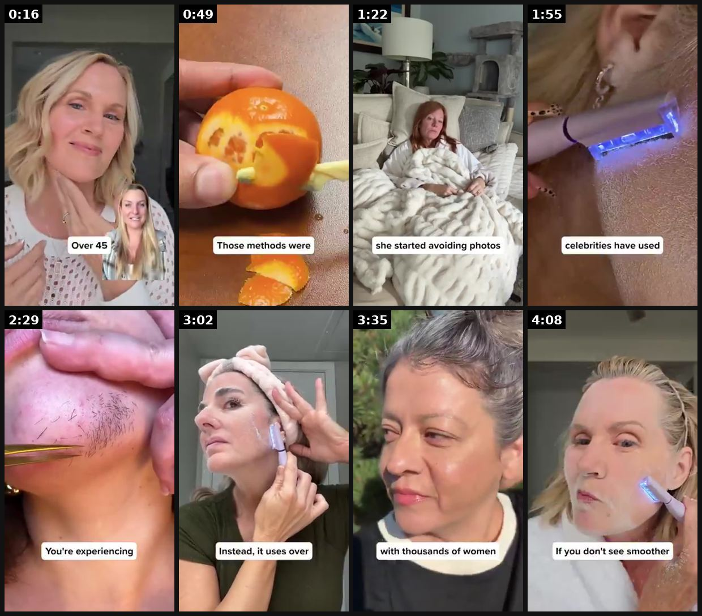

# 72 · VSL: long-form video sales letter (2-25 min) and its text twin (TSL): see it, then make it

[](https://x.com/FedotOff90/status/2095237367925731363)

**The example:** [@FedotOff90 on X](https://x.com/FedotOff90/status/2095237367925731363) · 4:25 video · 49 likes, 8K views

**Watch it:** [open the post on X](https://x.com/FedotOff90/status/2095237367925731363) · [play the video file](https://video.twimg.com/amplify_video/2095236904023126019/vid/avc1/320x568/0nSFoYFO49uLp1za.mp4?tag=29)

> 100%. VSL's print and IF you crack them, it's most scalable ad format BY FAR. Got 300 banger VSLs with a run time of 30+ days. Just follow, retweet, comment ECOM UNC, and I'll send it over. Joking, enjoy and print mfers: https://app.gethookd.ai/share/board/218041?signature=5246c746517977df98ae4ec7fc1087e30cf00e664f48ec5f75fb029553653a49

## What you are seeing

A long-form VSL of about 4 to 5 minutes: a woman telling her story to camera ("Over 40"), with cutaways to an orange being peeled, a woman in bed, a red-light device on skin and close-ups of skin. It is slow, story-led and sells late.

## Beat by beat

The storyboard above samples the video every 0:33. Lines are the transcript for that stretch; on-screen text comes from OCR, so treat it as rough.

| Frame | Time | On screen | Said / sung |
|---|---|---|---|
| 1 | 0:00–0:33 | a Over 45 Ay ata al a be 8: | Are your chin hairs multiplying? Here's why that's happening. I've tried every hair removal product out there, but I've never seen results like this. Upper lip hair, gone in minutes, chin stubble, vanished, jawline peach fuzz, smooth as glass. These are real women over 45, getting real results fast. |
| 2 | 0:33–1:06 | Ta Those methods were aN | During menopause, estrogen drops and androgen levels spike. This shift activates facial hair follicles, making them stronger and turning barely visible peach fuzz into dark coarse stubborn hairs. So what do we do? We wax, we bleach, we tweeze, we shave. The problem? Those methods were never designed |
| 3 | 1:06–1:39 | site pre a mm a she started avoiding photos | And it feels like it's getting worse by the week. Linda, a 54 year old woman, noticed her first little mustache at a family dinner. Her granddaughter asked her, grandma, why do you have whiskers like grandpa? She laughed it off, but cried later in the car. She started avoiding photos. She started hi |
| 4 | 1:39–2:12 | · | It seemed like the only solution was to get a $3,000 laser hair removal treatment that she couldn't afford. She felt hopeless, like this was just her new reality. Until she found a woman named Dr. Elena Morales, a menopause skin specialist from Miami, Florida, who has been quietly disrupting the bea |
| 5 | 2:12–2:45 | in le a Va ae SN You're experiencing | They think they're under attack, so they respond by growing the hair back. Thicker, darker, faster. And that's why every woman says, I pluck one, five grow back. It's like the more I remove it, the worse it gets. I don't recognize my face anymore. You're not imagining it. You're experiencing rebound |
| 6 | 2:45–3:18 | NI if vi it over | while also exfoliating away the dead skin that traps new hair. Unlike razors, Sonic Smooth doesn't cut the hair bluntly. Unlike waxing, it doesn't traumatize the skin. Unlike bleaching or creams, it doesn't burn or inflame. Instead, it uses over 15,000 micro vibrations per minute to precisely remove |
| 7 | 3:18–3:51 | et al sD a ee ae ee ae a with thousands of women | Dr. Morales gave one to Linda, and the transformation shocked her. Her mustache shadow was gone. Her chin stubble, like it wasn't even there. And her confidence? Back to the way it always was. She went from hiding her face in photos to having her friends ask her what was her skincare secret. And aft |
| 8 | 3:51–4:25 | iV wh If you don't see smoother | and has already helped thousands of menopausal women stop feeling ashamed about their hormonal facial hair. Elena Morales wants every woman to know about this breakthrough device, so she's offering a limited time discount. Right now, you can get 30% off, plus a 30-day money back guarantee. If you do |

<details><summary>Full transcript (timestamped)</summary>

- `0:00` Are your chin hairs multiplying? Here's why that's happening.
- `0:03` I've tried every hair removal product out there, but I've never seen results like this.
- `0:07` Upper lip hair, gone in minutes, chin stubble, vanished, jawline peach fuzz, smooth as glass.
- `0:14` These are real women over 45, getting real results fast.
- `0:18` Keep watching to see how this woman has helped over 20,000 menopausal women
- `0:23` get rid of hormonal facial hair safely.
- `0:25` Here's the truth people never talk about.
- `0:27` Menopause facial hair isn't a cosmetic issue.
- `0:29` It's a hormonal distress signal from your skin crying out for help.
- `0:33` During menopause, estrogen drops and androgen levels spike.
- `0:36` This shift activates facial hair follicles, making them stronger and turning barely
- `0:41` visible peach fuzz into dark coarse stubborn hairs.
- `0:44` So what do we do? We wax, we bleach, we tweeze, we shave.
- `0:48` The problem? Those methods were never designed for delicate thinning mature skin.
- `0:53` Waxing tears the skin. Bleaching irritates the skin barrier.
- `0:56` Tweezing causes bumps and ingrowns.
- `0:58` Razors leave stubble by lunchtime.
- `1:00` So the results? More irritation. More stubble.
- `1:04` More humiliation. It's exhausting. It's embarrassing.
- `1:07` And it feels like it's getting worse by the week.
- `1:09` Linda, a 54 year old woman, noticed her first little mustache at a family dinner.
- `1:14` Her granddaughter asked her, grandma, why do you have whiskers like grandpa?
- `1:18` She laughed it off, but cried later in the car.
- `1:21` She started avoiding photos.
- `1:22` She started hiding her upper lip hairs with heavy concealer every time she left the house.
- `1:27` But she still felt embarrassed, and every method she tried made things worse.
- `1:31` Razors left her feeling prickly the next morning.
- `1:34` Waxing tore her skin. Tweezing left scars and dark spots.
- `1:38` It seemed like the only solution was to get a $3,000 laser hair removal treatment that she
- `1:42` couldn't afford. She felt hopeless, like this was just her new reality.
- `1:47` Until she found a woman named Dr. Elena Morales, a menopause skin specialist from Miami,
- `1:51` Florida, who has been quietly disrupting the beauty industry with a method Hollywood
- `1:55` celebrities have used for decades. Dr. Morales studied every hair removal method
- `2:00` and discovered the hidden reason they fail women over 45.
- `2:03` Most methods create micro-tears in the skin barrier,
- `2:06` and they create something called rebound regrowth.
- `2:09` The moment you wax, tweeze, or shave, your hair follicles go into panic mode.
- `2:13` They think they're under attack, so they respond by growing the hair back.
- `2:17` Thicker, darker, faster. And that's why every woman says,
- `2:21` I pluck one, five grow back. It's like the more I remove it, the worse it gets.
- `2:25` I don't recognize my face anymore. You're not imagining it.
- `2:29` You're experiencing rebound regrowth.
- `2:31` So Dr. Morales got to work, and with a team of dermatologists,
- `2:34` they developed a device that worked specifically for mature, sensitive, hormonal skin.
- `2:39` They called it Sonic Smooth Pro Plus. Instead of ripping hair from the root,
- `2:43` Sonic Smooth trims at the surface without triggering a defense regrowth response,
- `2:47` while also exfoliating away the dead skin that traps new hair.
- `2:51` Unlike razors, Sonic Smooth doesn't cut the hair bluntly.
- `2:54` Unlike waxing, it doesn't traumatize the skin.
- `2:57` Unlike bleaching or creams, it doesn't burn or inflame.
- `3:00` Instead, it uses over 15,000 micro vibrations per minute
- `3:04` to precisely remove even the tiniest of hairs.
- `3:07` Designed with a built-in safety guard, it remains safe and gentle on mature skin.
- `3:12` And because it exfoliates at the same time,
- `3:14` it makes the skin look softer, smoother, and brighter than before.
- `3:17` Dr. Morales gave one to Linda, and the transformation shocked her.
- `3:21` Her mustache shadow was gone. Her chin stubble, like it wasn't even there.
- `3:25` And her confidence? Back to the way it always was.
- `3:28` She went from hiding her face in photos to having her friends ask her what was her
- `3:32` skincare secret. And after testing the device with thousands of women,
- `3:35` the results were undeniable. 100% said their skin felt instantly smoother.
- `3:40` 97% saw more radiant skin. 96% reported a more flawless makeup application.
- `3:47` Sonic Smooth Pro Plus is now going viral and has sold out 12 times in the past year,
- `3:51` and has already helped thousands of menopausal women stop feeling ashamed about their hormonal
- `3:56` facial hair. Elena Morales wants every woman to know about this breakthrough device,
- `4:01` so she's offering a limited time discount. Right now, you can get 30% off,
- `4:06` plus a 30-day money back guarantee. If you don't see smoother, hair-free skin,
- `4:10` you get your money back. But don't wait, this is a limited time opportunity,
- `4:14` and it sells out fast. Click the link below to try Sonic Smooth Pro Plus while it's still in stock.

</details>

## How to make one like it

**The format in one line:** A single video that takes cold viewers through problem → villain → mechanism → authority → proof → offer → guarantee. Lengths run from 2 minutes to 25 minutes, and "extra long" (double normal length) is a test in itself. The text sales letter (TSL) is the same skeleton as a long page with an order form at the bottom.

**Why it works:** - Educates and closes in one sitting, with no retargeting needed. - Long watch time trains the algorithm on high-intent viewers. - One winning VSL can absorb very large budgets (Fedotoff: "spent millions profitably").

**Contents:** [1. Structure](#1-copy-the-structure) · [2. Shot by shot](#2-shot-by-shot-remake) · [3. Script and hooks](#3-write-the-script) · [4. Prompts](#4-prompts) · [5. Tools and settings](#5-tools-and-settings) · [6. Louise Carter remake](#6-louise-carter-remake) · [7. Variants and test](#7-variants-and-test-plan) · [8. Pitfalls](#8-pitfalls)

### 1. Copy the structure

Use the example's timing as your beat sheet. Keep the beat, change the words and the product.

| Beat | Time | In the example | Your version |
|---|---|---|---|
| 1 | 0:16 | Are your chin hairs multiplying? Here's why that's happening. I've tried every hair removal product out there, but I've never seen results l | … |
| 2 | 0:49 | During menopause, estrogen drops and androgen levels spike. This shift activates facial hair follicles, making them stronger and turning bar | … |
| 3 | 1:22 | And it feels like it's getting worse by the week. Linda, a 54 year old woman, noticed her first little mustache at a family dinner. Her gran | … |
| 4 | 1:55 | It seemed like the only solution was to get a $3,000 laser hair removal treatment that she couldn't afford. She felt hopeless, like this was | … |
| 5 | 2:29 | They think they're under attack, so they respond by growing the hair back. Thicker, darker, faster. And that's why every woman says, I pluck | … |
| 6 | 3:02 | while also exfoliating away the dead skin that traps new hair. Unlike razors, Sonic Smooth doesn't cut the hair bluntly. Unlike waxing, it d | … |
| 7 | 3:35 | Dr. Morales gave one to Linda, and the transformation shocked her. Her mustache shadow was gone. Her chin stubble, like it wasn't even there | … |
| 8 | 4:08 | and has already helped thousands of menopausal women stop feeling ashamed about their hormonal facial hair. Elena Morales wants every woman | … |

### 2. Shot-by-shot remake

**Target length / size:** 2-6 min first cut (up to 25 min), plus a matching text sales letter page

| # | Time / slot | What we see (visual + camera) | Dialogue / on-screen text |
|---|---|---|---|
| 1 | 0:00-0:30 Hook | Narrator to camera or story B-roll | Personal problem in one sentence: "My mother's gold chain turned her neck green the day of my wedding." |
| 2 | 0:30-2:00 Story + villain | B-roll of the problem, archive-style photos | Why the usual fixes fail ("plating is a coat of paint, it wears off") |
| 3 | 2:00-3:30 Mechanism | Diagram / macro of the material | How PVD bonding works in plain words |
| 4 | 3:30-4:30 Proof | Real customer clips, review screenshots, water test | Specific, verifiable proof only |
| 5 | 4:30-5:30 Offer + guarantee | Product grid, offer card | Bundle, price, guarantee terms, shipping |
| 6 | 5:30-6:00 CTA | Narrator | One clear action, repeated once |

<details><summary>Playbook shot list (Louise Carter version from the README)</summary>

| Time / slot | Visual | Audio / copy |
|---|---|---|
| 0-15s | Hook: the green neck mark / the necklace in the shower | "If you've ever taken your necklace off before a shower, watch this." |
| 15-60s | Villain: plating that wears off | "The coating on most gold jewelry is thinner than a hair." |
| 1-2 min | Mechanism: PVD bonding, 14K | founder explains |
| 2-3 min | Proof stack: reviews, wear tests | real numbers |
| 3-4 min | Offer + guarantee | "Any 7 for $85, [real guarantee]" |

</details>

### 3. Write the script

Open with one of these hooks (first 1–3 seconds, or the headline on a static):

- "The coating on your jewelry is thinner than a hair"
- "Why your gold turns green (and what jewelers don't say)"
- "I tested 12 waterproof necklaces for 30 days"

Then fill the beats from the table above. Pull the wording from real customer reviews, not from ad copy: a review line beats a copywriter line almost every time. Read every line out loud and cut anything you would not say to a friend. Ready-made Louise Carter scripts are in section 6; hand [BOT.md](BOT.md) to any AI agent to write versions for another brand.

### 4. Prompts

**Claude (outline)**

```text
Outline a 6-minute VSL for [product] with sections hook, story, villain, mechanism, proof, offer, guarantee, CTA. Give each a timing, the exact spoken lines and the B-roll list. Every claim must come from this product page: [paste].
```

**Text twin (TSL)**

```text
Turn the VSL script into a long-form landing page with the same headlines as H2s, pull quotes from real reviews and the offer box repeated 3 times.
```

**Full creative-agent prompt (from the playbook):**

```
Write a 3-minute LC VSL on the 7-beat skeleton (hook, villain, mechanism, authority, proof, offer, guarantee) using only {{PDP_FACTS}} and {{REAL_PROOF}}. Then condense it into a 900-word text sales letter with the same beats.
```

### 5. Tools and settings

1. Write a 7-beat script (≈450 words for 3 min).
2. Shoot the founder plus B-roll, or use an AI narrator with real product footage (disclosed).
3. Send it to a dedicated lander, not the PDP: the page continues the video.
4. Test 3 hooks on the same body.

| Setting | Value |
|---|---|
| Canvas | 1080×1920 (9:16) master; crop a 1080×1350 (4:5) cut for feed placements |
| Frame rate | 30 fps (shoot 60 fps for slow-motion water or sparkle shots) |
| Camera | Phone main lens at 1x, exposure locked on skin, HDR off, grid on; tripod or a phone clamp for product shots |
| Light | One soft key at 45° (window or ring light), white card as fill; side light for metal sparkle |
| Audio | Lavalier or phone 15–20 cm from the mouth; mix voice at -14 LUFS, music at -28 to -30 dB under voice |
| Captions | Burned in, 2–5 words per line, 64–80 px bold sans, white with a black stroke or pill; keep text inside the safe zone (top 220 px and bottom 420 px clear, 64 px side margins) |
| Pacing | A visual change every 1.5–3 s; the hook lands in the first 1.5 s with no logo intro |
| Edit / export | CapCut or Premiere; H.264, 12–20 Mbps, AAC 320 kbps; upload natively to each platform, not via links |

### 6. Louise Carter remake

- A · "The coating thinner than a hair" (mechanism VSL).
- B · Founder story VSL ("why I started LC").
- C · TSL lander: "The 30-day shower test".

Brand rules, claims you can and cannot make, and more scripts: [brands/louise-carter.md](brands/louise-carter.md). Step-by-step from idea to scale: [STAGES.md](STAGES.md).

### 7. Variants and test plan

- Length 2 vs 4 vs 8 min
- Founder vs narrator
- VSL vs TSL

**Test plan:** - **Budget/structure:** 1 VSL × 3 hooks, $50/day, 10 days - **Primary KPIs:** Watch time 25/50%, CPA, AOV; Omni (F72-*) - **Kill rule:** CPA >2× after $300 - **Scale rule:** Scale budget on the winner; cut 60s and 15s trailers - **Naming:** `utm_content=F72-<concept>-<variant>`; weekly Omni roll-up of new-customer revenue by format.

**Naming:** `F72-<variant>-<hook##>-<date>` so results map back to this folder. Change one thing per test (hook, narrator, length or offer), never two.

### 8. Pitfalls

- Long form makes weak claims more visible, not less; substantiate everything.
- Test a 2-minute cut against the long version before shooting a 20-minute one.
- Most viewers drop before the offer; put a mini-offer at 60-90s too.
- Slow open: if the first 1.5 s does not show the hook visually, most people swipe.
- Logo or brand intro at the start reads as an ad; put the brand at the end.
- Captions covered by the platform UI: check the safe zone on a real phone before posting.
- Music over the voice: keep music at least 14 dB under speech.

**Compliance:** Baseline: [_COMPLIANCE.md](../_COMPLIANCE.md) (no fake testimonials, AI disclosure, no bulk/spoofed accounts, copy structure not assets, PDP-only claims). - Claims and guarantee must match the PDP and policies exactly; no fake doctors or authority.

## More examples

Every post we found for this format, with transcripts: [examples/](examples/README.md). Playbook: [README.md](README.md). Agent brief: [BOT.md](BOT.md).
