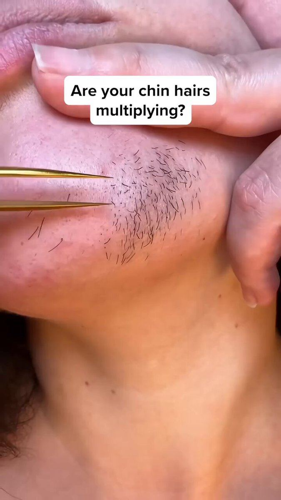

# 72 · VSL: long-form video sales letter (2-25 min) and its text twin (TSL)

<!-- HERO:START -->
[](EXAMPLE.md)

**[See the example and how to make it →](EXAMPLE.md)** · [watch on X](https://x.com/FedotOff90/status/2095237367925731363)
<!-- HERO:END -->


> **LC priority P2** · evidence: High (multi-year live ads, large boards) · hype risk: Medium · cost $200-2,000 · 1-2 weeks

## What it is
A single video that takes cold viewers through problem → villain → mechanism → authority → proof → offer → guarantee. Lengths run from 2 minutes to 25 minutes, and "extra long" (double normal length) is a test in itself. The text sales letter (TSL) is the same skeleton as a long page with an order form at the bottom.

## Why it works
- Educates and closes in one sitting, with no retargeting needed.
- Long watch time trains the algorithm on high-intent viewers.
- One winning VSL can absorb very large budgets (Fedotoff: "spent millions profitably").

## Shot-by-shot (LC version)

| Time / slot | Visual | Audio / copy |
|---|---|---|
| 0-15s | Hook: the green neck mark / the necklace in the shower | "If you've ever taken your necklace off before a shower, watch this." |
| 15-60s | Villain: plating that wears off | "The coating on most gold jewelry is thinner than a hair." |
| 1-2 min | Mechanism: PVD bonding, 14K | founder explains |
| 2-3 min | Proof stack: reviews, wear tests | real numbers |
| 3-4 min | Offer + guarantee | "Any 7 for $85, [real guarantee]" |

## Hooks (swap-in openers)
- "The coating on your jewelry is thinner than a hair"
- "Why your gold turns green (and what jewelers don't say)"
- "I tested 12 waterproof necklaces for 30 days"

## Real examples from X (studied)
- @FedotOff90 "20 Ad Types": VSL = 10-25 min cold closer; Treatmedy 18-min bunion VSL from a 596-ad brand; skeleton symptom → villain → mechanism → authority → proof → guarantee ([doc](https://rural-lifeboat-196.notion.site/3b8db9d7074d81238c95e0061b6377c7) · [ad](https://app.gethookd.ai/share/ad/19195973?signature=d5c0e7174a499d2d2c8838c8dd0be499f75d35843b584311cf7724d32dfb3851)).
- @FedotOff90 "37 Ad Formats That Print" verified swipe: Your Health Journal, 35 (relaunches daily) days live (format renamed "Extra Long VSL", an 11:19 story VSL at double normal length). [ad](https://app.gethookd.ai/share/ad/151459794?signature=ac5bb6cec15a3e1da4fa211ac3aa88e4bee7c9ca310e2261d96f8b8ecc213f0c) · [doc](https://rural-lifeboat-196.notion.site/3c8db9d7074d81548084c2b25d1be1ef) · [post](https://x.com/FedotOff90/status/2104949773539442831)
- The VSL Machine (2026): 7-beat skeleton, story VSL 141s at 1,010 days, founder-expert VSL 9½ min from a 770-ad brand ([doc](https://rural-lifeboat-196.notion.site/3b8db9d7074d8191ace8c8a7e9b4bfc6)).
- Lander DB #33-35: long-form VSL, hidden-culprit mechanism VSL, text sales letter (Vitality Now, 1,759 days) ([db](https://rural-lifeboat-196.notion.site/3c6db9d7074d81fcb0b6cd81a4527126)).
- @FedotOff90 "VSLs print… most scalable ad format by far", 300 VSLs 30+ days ([post](https://x.com/FedotOff90/status/2095237367925731363)).

## Production recipe
1. Write a 7-beat script (≈450 words for 3 min).
2. Shoot the founder plus B-roll, or use an AI narrator with real product footage (disclosed).
3. Send it to a dedicated lander, not the PDP: the page continues the video.
4. Test 3 hooks on the same body.

## Bot prompt (copy into the creative agent)
```
Write a 3-minute LC VSL on the 7-beat skeleton (hook, villain, mechanism, authority, proof, offer, guarantee) using only {{PDP_FACTS}} and {{REAL_PROOF}}. Then condense it into a 900-word text sales letter with the same beats.
```

## 3 LC scripts
- A · "The coating thinner than a hair" (mechanism VSL).
- B · Founder story VSL ("why I started LC").
- C · TSL lander: "The 30-day shower test".

## Variants to test
- Length 2 vs 4 vs 8 min
- Founder vs narrator
- VSL vs TSL

## Omni test plan
- **Budget/structure:** 1 VSL × 3 hooks, $50/day, 10 days
- **Primary KPIs:** Watch time 25/50%, CPA, AOV; Omni (F72-*)
- **Kill rule:** CPA >2× after $300
- **Scale rule:** Scale budget on the winner; cut 60s and 15s trailers
- **Naming:** `utm_content=F72-<concept>-<variant>`; weekly Omni roll-up of new-customer revenue by format.

## Compliance
Baseline: [_COMPLIANCE.md](../_COMPLIANCE.md) (no fake testimonials, AI disclosure, no bulk/spoofed accounts, copy structure not assets, PDP-only claims).
- Claims and guarantee must match the PDP and policies exactly; no fake doctors or authority.

## Related
- Strategies: 35-mass-awareness-placement-to-advertorial, 31-founder-daily-posting-product-as-ad
- Formats: [50-mini-documentary-how-its-made](../50-mini-documentary-how-its-made/README.md), [27-founder-walk-and-talk-story-ad](../27-founder-walk-and-talk-story-ad/README.md), [09-native-story-static-to-advertorial](../09-native-story-static-to-advertorial/README.md)

<!-- EVIDENCE:START -->
## Evidence from X discovery (auto-generated)

| Date | Author | Post | Engagement | Grade | Gist |
|---|---|---|---|---|---|
| 2026-09-29 | [@FedotOff90](https://x.com/FedotOff90) | [link](https://x.com/FedotOff90/status/2104949773539442831) | 110L/208BM/9kV | VALUE | "37 ad formats printing right now" — verified Notion swipe (live ad, days active, brand ad count per format) + 132-ad FORMATS board. |
| 2026-08-11 | [@FedotOff90](https://x.com/FedotOff90) | [link](https://x.com/FedotOff90/status/2087245595249721445) | 83L/152BM/17kV | VALUE | 97-day VSL; VSLs spent millions profitably; full VSL Machine SOP. |
| 2026-09-02 | [@FedotOff90](https://x.com/FedotOff90) | [link](https://x.com/FedotOff90/status/2095237367925731363) | 49L/103BM/8kV | SOME | "VSLs… most scalable ad format by far" — 300 VSLs with 30+ day runtime. |
<!-- EVIDENCE:END -->
