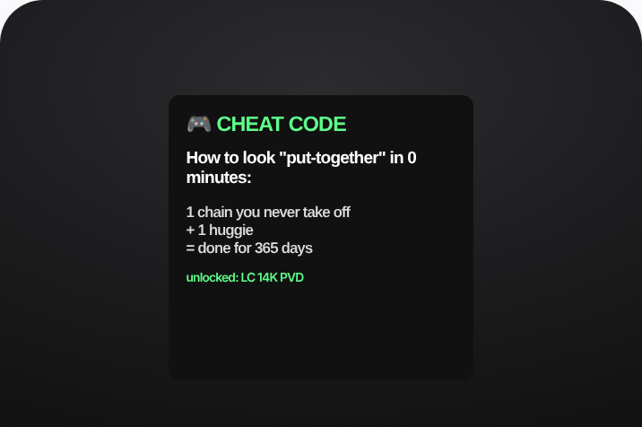

# 73 · 'The Cheat Code' / life-hack static (the product as the shortcut): see it, then make it



> **No clean public example yet.** This is an illustrative mock of the format, not a real ad. The closest real posts are in [examples/](examples/README.md); swap a real one in here when you find it.

## How to make one like it

**The format in one line:** A static that frames the product as a hack or cheat code for a known annoyance: gifting, packing, getting ready fast. The language is "cheat code", "hack" or "the one thing that actually gets used", backed by short review quotes.

**Why it works:** - "Cheat code" promises effort saved; people love shortcuts. - Gift framing ("actually gets used") answers the gift-giver's fear. - Review snippets supply the proof inside the copy.

**Contents:** [1. Structure](#1-copy-the-structure) · [2. Shot by shot](#2-shot-by-shot-remake) · [3. Script and hooks](#3-write-the-script) · [4. Prompts](#4-prompts) · [5. Tools and settings](#5-tools-and-settings) · [6. Louise Carter remake](#6-louise-carter-remake) · [7. Variants and test](#7-variants-and-test-plan) · [8. Pitfalls](#8-pitfalls)

### 1. Copy the structure

The skeleton every version follows: **hook → problem or tension → turn (the product shows up) → proof → one clear ask.** The shot-by-shot below fills it in.

### 2. Shot-by-shot remake

**Target length / size:** 1 static 1080x1350 (plus 1080x1920)

| # | Time / slot | What we see (visual + camera) | Dialogue / on-screen text |
|---|---|---|---|
| 1 | Headline | Big bold sans, game-style or "life hack" framing | "The cheat code for birthday gifts:" |
| 2 | Visual | The product as the shortcut: a gift box already wrapped, or the necklace in the shower | - |
| 3 | Body | 1-2 short lines | "Any 7 for $85. Pre-wrapped. She'll never take it off." |
| 4 | Corner | Small logo + "unlocked" icon | - |

<details><summary>Playbook shot list (Louise Carter version from the README)</summary>

| Time / slot | Visual | Audio / copy |
|---|---|---|
| Static | Gift box open, 7 pieces fanned; headline "The gift cheat code" | Body: 3 short real review quotes + "any 7 for $85" |

</details>

### 3. Write the script

Open with one of these hooks (first 1–3 seconds, or the headline on a static):

- "The gift that actually gets worn"
- "Cheat code for getting ready in 30 seconds"
- "Travel hack: one stack, zero jewelry pouch"

Then fill the beats from the table above. Pull the wording from real customer reviews, not from ad copy: a review line beats a copywriter line almost every time. Read every line out loud and cut anything you would not say to a friend. Ready-made Louise Carter scripts are in section 6; hand [BOT.md](BOT.md) to any AI agent to write versions for another brand.

### 4. Prompts

**Claude**

```text
Give me 20 headlines that frame [product] as a cheat code, hack or shortcut for a known annoyance (gifting, packing, getting ready, travelling). Max 8 words each, no exaggerated claims.
```

**Figma**

```text
1080x1350, headline 96px heavy sans, a "🔓 unlocked" chip in gold, product photo 60% of the canvas.
```

**Full creative-agent prompt (from the playbook):**

```
Write 6 "cheat code" statics for LC (headline ≤7 words, 3 real review snippets from {{REVIEWS}}, offer line).
```

### 5. Tools and settings

1. Pick 3 jobs: gifting, getting ready, travel.
2. Pull 3 short real review quotes for each.
3. Design as a plain static or a Notes screenshot.

| Setting | Value |
|---|---|
| Canvas | 1080×1350 (4:5) for feed; 1080×1920 (9:16) story/reel version with the same elements stacked |
| Type | Headline 80–110 px, max 8 words; body 36–44 px; at most 2 typefaces |
| Layout | Headline readable at thumbnail size; product at least 40% of the canvas; logo small, bottom corner |
| Safe zone | Keep text out of the bottom 20% on 9:16 (UI overlays) |
| Tools | Figma or Canva for layout; Photoshop or Photoroom to cut out product; Midjourney or Flux only for backgrounds, never for the product itself |
| Export | PNG or JPG at quality 90, sRGB, under 1 MB |

### 6. Louise Carter remake

- A · "The gift that actually gets worn".
- B · "30-second getting-ready cheat code".
- C · "Pack 1 stack for 10 outfits".

Brand rules, claims you can and cannot make, and more scripts: [brands/louise-carter.md](brands/louise-carter.md). Step-by-step from idea to scale: [STAGES.md](STAGES.md).

### 7. Variants and test plan

- Gift vs routine vs travel
- With vs without quotes

**Test plan:** - **Budget/structure:** 3 statics, $20/day, 7 days - **Primary KPIs:** CPA; Omni (F73-*) - **Kill rule:** CPA >1.8× - **Scale rule:** Q4: gifting version up-weighted - **Naming:** `utm_content=F73-<concept>-<variant>`; weekly Omni roll-up of new-customer revenue by format.

**Naming:** `F73-<variant>-<hook##>-<date>` so results map back to this folder. Change one thing per test (hook, narrator, length or offer), never two.

### 8. Pitfalls

- The "hack" must really save time or effort; otherwise it reads as clickbait.
- No clean public example was found; the visual is an illustrative mock.
- Too much text: if it cannot be read in 1 second at thumbnail size, cut it.
- AI-generated product images: show the real product; AI is fine for backgrounds only.

**Compliance:** Baseline: [_COMPLIANCE.md](../_COMPLIANCE.md) (no fake testimonials, AI disclosure, no bulk/spoofed accounts, copy structure not assets, PDP-only claims). - Quotes must be real and verbatim.

## More examples

Every post we found for this format, with transcripts: [examples/](examples/README.md). Playbook: [README.md](README.md). Agent brief: [BOT.md](BOT.md).
