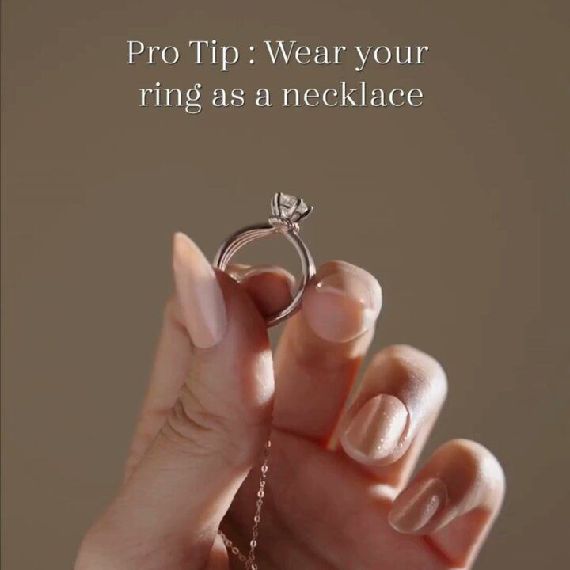

# 73 · "The Cheat Code" / life-hack static (the product as the shortcut)

<!-- HERO:START -->
[](EXAMPLE.md)

**[See the example and how to make it →](EXAMPLE.md)** · [watch on X](https://x.com/bluestone_com/status/1748311425330622859)
<!-- HERO:END -->


> **LC priority P1** · evidence: Medium (live ad, very large tester) · hype risk: Low · cost $0 · 15 min

## What it is
A static that frames the product as a hack or cheat code for a known annoyance: gifting, packing, getting ready fast. The language is "cheat code", "hack" or "the one thing that actually gets used", backed by short review quotes.

## Why it works
- "Cheat code" promises effort saved; people love shortcuts.
- Gift framing ("actually gets used") answers the gift-giver's fear.
- Review snippets supply the proof inside the copy.

## Shot-by-shot (LC version)

| Time / slot | Visual | Audio / copy |
|---|---|---|
| Static | Gift box open, 7 pieces fanned; headline "The gift cheat code" | Body: 3 short real review quotes + "any 7 for $85" |

## Hooks (swap-in openers)
- "The gift that actually gets worn"
- "Cheat code for getting ready in 30 seconds"
- "Travel hack: one stack, zero jewelry pouch"

## Real examples from X (studied)
- @FedotOff90 "37 Ad Formats That Print" verified swipe: Best E-Store, 131 (84 at the Aug pull) days live ("The Gift That Actually Gets Used" + 3 review quotes; brand runs 1,809 ads). [ad](https://app.gethookd.ai/share/ad/112644834?signature=52109a5b83cc30b96a87aeb31f9924d508d695c67c2251ea718ed01ad137ff63) · [doc](https://rural-lifeboat-196.notion.site/3c8db9d7074d81548084c2b25d1be1ef) · [post](https://x.com/FedotOff90/status/2104949773539442831)

## Production recipe
1. Pick 3 jobs: gifting, getting ready, travel.
2. Pull 3 short real review quotes for each.
3. Design as a plain static or a Notes screenshot.

## Bot prompt (copy into the creative agent)
```
Write 6 "cheat code" statics for LC (headline ≤7 words, 3 real review snippets from {{REVIEWS}}, offer line).
```

## 3 LC scripts
- A · "The gift that actually gets worn".
- B · "30-second getting-ready cheat code".
- C · "Pack 1 stack for 10 outfits".

## Variants to test
- Gift vs routine vs travel
- With vs without quotes

## Omni test plan
- **Budget/structure:** 3 statics, $20/day, 7 days
- **Primary KPIs:** CPA; Omni (F73-*)
- **Kill rule:** CPA >1.8×
- **Scale rule:** Q4: gifting version up-weighted
- **Naming:** `utm_content=F73-<concept>-<variant>`; weekly Omni roll-up of new-customer revenue by format.

## Compliance
Baseline: [_COMPLIANCE.md](../_COMPLIANCE.md) (no fake testimonials, AI disclosure, no bulk/spoofed accounts, copy structure not assets, PDP-only claims).
- Quotes must be real and verbatim.

## Related
- Strategies: 41-von-restorff-static-copy-prompt, 12-built-in-sharing-gift-referral
- Formats: [39-x-reasons-why](../39-x-reasons-why/README.md), [65-seasonal-gifting-early-launch](../65-seasonal-gifting-early-launch/README.md)

<!-- EVIDENCE:START -->
## Evidence from X discovery (auto-generated)

| Date | Author | Post | Engagement | Grade | Gist |
|---|---|---|---|---|---|
| 2026-09-29 | [@FedotOff90](https://x.com/FedotOff90) | [link](https://x.com/FedotOff90/status/2104949773539442831) | 110L/208BM/9kV | VALUE | "37 ad formats printing right now" — verified Notion swipe (live ad, days active, brand ad count per format) + 132-ad FORMATS board. |
<!-- EVIDENCE:END -->
