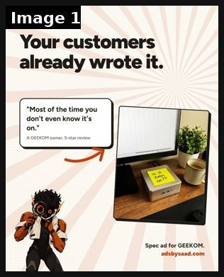
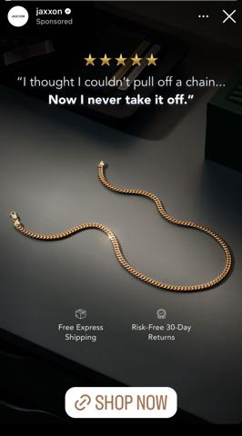
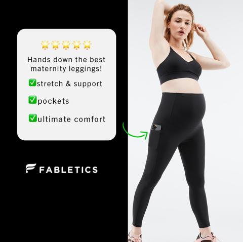
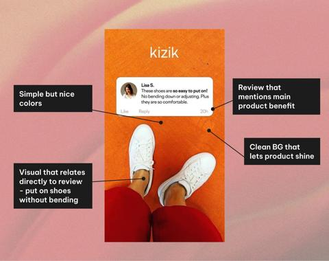

# 74 · 'The Verbatim': one raw customer review as the whole creative: see it, then make it

[](https://x.com/CreatorSaad/status/2107818233302528335)

**The example:** [@CreatorSaad on X](https://x.com/CreatorSaad/status/2107818233302528335) · 1 image · 0 likes, 14 views

**Watch it:** [open the post on X](https://x.com/CreatorSaad/status/2107818233302528335)

> A GEEKOM owner wrote this in a 5-star review: "Most of the time you don't even know it's on." That's a whole ad. So I made it 👇 Your customers write your next ad every day. My job is to find the line. (Spec ad, not affiliated with GEEKOM)

## What you are seeing

A spec static built from a single verbatim review: "Your customers already wrote it." over the quoted line "Most of the time you don't even know it's on." (a GEEKOM owner, 5-star review) with the mini PC on a desk.

## Image by image

| Image | Text on it (OCR, rough) |
|---|---|
| 1 | How find ad ideas Your customers already wrote it. Most of the time you don't even know it's on. owner, 5-star review Ba Spec ad for |

## More real examples (3)

Other posts that show this format, or a close cousin of it. Click a thumbnail to open it on X.

| | | |
|---|---|---|
| [](https://x.com/PhilKiel/status/1842707896443732362)<br>**@PhilKiel** · image · 22K views<br>Customer review static. Who thinks a customer actually wrote this? Stellar copywriting if they did 😂 | [](https://x.com/ariesnotebook/status/1857792129004675247)<br>**@ariesnotebook** · image · 5K views<br>Simple but effective testimonial static. Stats: 4.8M likes | [](https://x.com/helloitsdrew_/status/2000557038682706000)<br>**@helloitsdrew_** · image · 893 views<br>Keys to an effective review/testimonial static: - Review that highlights a specific product benefit - Review shown in an authentic way (social media U |

## How to make one like it

**The format in one line:** One unedited customer review, typos and all, set in large type (or as a screenshot of the review), with only a small logo and product photo. The brand steps back: "this review says it better than we could."

**Why it works:** - Raw voice is more believable than polished copy. - One specific story beats a star average. - Fastest possible production: choose a review, set the type.

**Contents:** [1. Structure](#1-copy-the-structure) · [2. Shot by shot](#2-shot-by-shot-remake) · [3. Script and hooks](#3-write-the-script) · [4. Prompts](#4-prompts) · [5. Tools and settings](#5-tools-and-settings) · [6. Louise Carter remake](#6-louise-carter-remake) · [7. Variants and test](#7-variants-and-test-plan) · [8. Pitfalls](#8-pitfalls)

### 1. Copy the structure

The skeleton every version follows: **hook → problem or tension → turn (the product shows up) → proof → one clear ask.** The shot-by-shot below fills it in.

### 2. Shot-by-shot remake

**Target length / size:** 1 static 1080x1350

| # | Time / slot | What we see (visual + camera) | Dialogue / on-screen text |
|---|---|---|---|
| 1 | Main | One real customer review, verbatim (typos kept), set very large | e.g. "Most of the time you don't even know it's on." |
| 2 | Attribution | First name + "verified buyer" + stars | "Jess R., verified buyer ★★★★★" |
| 3 | Corner | Small product photo + logo | - |
| 4 | Primary text | - | "We didn't write this. Jess did." |

<details><summary>Playbook shot list (Louise Carter version from the README)</summary>

| Time / slot | Visual | Audio / copy |
|---|---|---|
| Static | Big serif quote from a real verified review about months of ocean wear | Primary: "This review says it better than we can." |

</details>

### 3. Write the script

Open with one of these hooks (first 1–3 seconds, or the headline on a static):

- "This review says it better than we could"
- "Read what Jess wrote after 4 months"
- "We didn't write this. Jess did."

Then fill the beats from the table above. Pull the wording from real customer reviews, not from ad copy: a review line beats a copywriter line almost every time. Read every line out loud and cut anything you would not say to a friend. Ready-made Louise Carter scripts are in section 6; hand [BOT.md](BOT.md) to any AI agent to write versions for another brand.

### 4. Prompts

**Review mining (Claude)**

```text
From these 200 reviews [paste], pick the 10 that read most like something a friend would text. Keep them verbatim, do not fix typos. Explain why each one sells.
```

**Figma**

```text
Review 72-88px serif, oversized quote marks in brand gold, attribution 28px grey, product 220px bottom-right.
```

**Full creative-agent prompt (from the playbook):**

```
From {{REVIEWS}}, pick the 10 most specific reviews (time worn, situation, emotion). For each: verbatim quote (unaltered), visual idea, 1-line primary text.
```

### 5. Tools and settings

1. Export the top 50 reviews; tag them by theme (ocean, shower, gift, compliments).
2. Get consent if a name or photo is used; keep spelling as written.
3. Make 10 statics; rotate themes.

| Setting | Value |
|---|---|
| Canvas | 1080×1350 (4:5) for feed; 1080×1920 (9:16) story/reel version with the same elements stacked |
| Type | Headline 80–110 px, max 8 words; body 36–44 px; at most 2 typefaces |
| Layout | Headline readable at thumbnail size; product at least 40% of the canvas; logo small, bottom corner |
| Safe zone | Keep text out of the bottom 20% on 9:16 (UI overlays) |
| Tools | Figma or Canva for layout; Photoshop or Photoroom to cut out product; Midjourney or Flux only for backgrounds, never for the product itself |
| Export | PNG or JPG at quality 90, sRGB, under 1 MB |

### 6. Louise Carter remake

- A · Ocean review.
- B · Bridesmaid review.
- C · "Didn't believe it" review.

Brand rules, claims you can and cannot make, and more scripts: [brands/louise-carter.md](brands/louise-carter.md). Step-by-step from idea to scale: [STAGES.md](STAGES.md).

### 7. Variants and test plan

- Typeset vs screenshot
- Short vs long review

**Test plan:** - **Budget/structure:** 10 statics, $15/day, 7 days - **Primary KPIs:** CPA, CTR; Omni (F74-*) - **Kill rule:** CPA >1.8× - **Scale rule:** Winners → F40 video mashups - **Naming:** `utm_content=F74-<concept>-<variant>`; weekly Omni roll-up of new-customer revenue by format.

**Naming:** `F74-<variant>-<hook##>-<date>` so results map back to this folder. Change one thing per test (hook, narrator, length or offer), never two.

### 8. Pitfalls

- Real reviews only, verbatim, with permission; never edit a review to make it stronger.
- The featured example is a spec ad built from a real review; the format works best when the review is specific.
- Too much text: if it cannot be read in 1 second at thumbnail size, cut it.
- AI-generated product images: show the real product; AI is fine for backgrounds only.

**Compliance:** Baseline: [_COMPLIANCE.md](../_COMPLIANCE.md) (no fake testimonials, AI disclosure, no bulk/spoofed accounts, copy structure not assets, PDP-only claims). - Verbatim and real; never edited to change meaning; disclose incentives.

## More examples

Every post we found for this format, with transcripts: [examples/](examples/README.md). Playbook: [README.md](README.md). Agent brief: [BOT.md](BOT.md).
