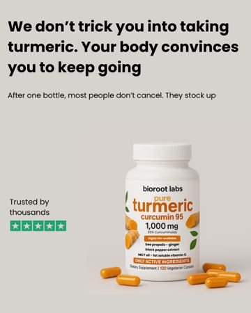
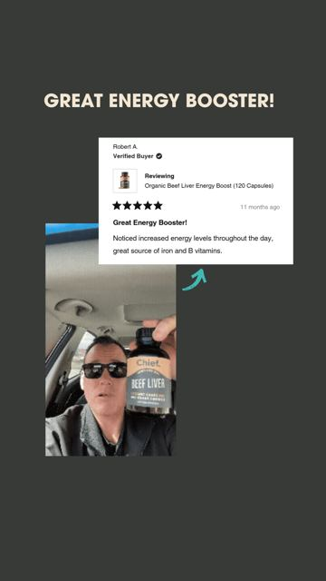

# Meta ad-library examples for F74

<!-- WAVE4 -->
## Wave 4: Alex Fedotoff's October 2026 swipe boards (GetHookd public previews)

Each ad below is from the free 10-ad preview of a public GetHookd board that [@FedotOff90](https://x.com/FedotOff90) shared on X. Days live are as of 2026-10-09; brand claims are the advertisers', not verified.

### BioRoot Labs: "We don't trick you into taking turmeric" retention-claim static (481 days live)

- **Board:** [AI Storytelling Ads: 13 Brands x 50 Longest-Running (Oct 2026)](https://x.com/FedotOff90/status/2107177846070202853) · image
- **What happens:** A beige static: "We don't trick you into taking turmeric. Your body convinces you to keep going. After one bottle, most people don't cancel. They stock up." Bottle and capsules, "Trusted by thousands" with Trustpilot stars.
- **Why it lasts:** 481 days, the longest in a 515-ad board. It sells the subscription with a retention claim instead of a discount.
- **How to make one:** One sentence that flips a fear (subscription trap) into proof (people stay), plus product, plus review stars.
- **LC remake:** "We don't lock you into a subscription. You'll just want all 7."

### Amy: Verified-buyer review card over car selfie (Amy, beef liver) (382 days live)

- **Board:** [iPhone Notes / Text Messages / Reddit / Google Search / Breaking News / DMs / Amazon Review / TikTok Comments](https://x.com/FedotOff90/status/2106046297434374289) · image
- **What happens:** "GREAT ENERGY BOOSTER!" headline; a 5-star "Verified Buyer" review card floats over a man's car selfie holding the bottle; an arrow links the two.
- **Why it lasts:** 382 days. It is a native review screenshot, and the selfie makes the customer real.
- **How to make one:** A real customer photo, a pasted review card (real review), a 3-word headline, an arrow.
- **LC remake:** A customer's pool selfie plus her real review card.

