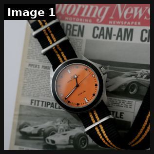

# 75 · 'We're sorry, we keep selling out' apology notice: see it, then make it

[](https://x.com/OmologatoUK/status/2099497006158725545)

**The example:** [@OmologatoUK on X](https://x.com/OmologatoUK/status/2099497006158725545) · 1 image · 7 likes, 327 views

**Watch it:** [open the post on X](https://x.com/OmologatoUK/status/2099497006158725545)

> The TIFOSI x CAN-AM arrived back in stock last week and has already nearly sold out again - We have ONE LEFT! https://www.omologatowatches.com/tifeds

## What you are seeing

A back-in-stock / nearly-sold-out post: a watch on an orange strap laid on an old racing newspaper (TIFOSI x CAN-AM), with copy saying it came back and "has already nearly sold out again — ONE LEFT".

## Image by image

| Image | Text on it (OCR, rough) |
|---|---|
| 1 | (mostly visual) |

## How to make one like it

**The format in one line:** A notice-style static written as an apology: "We're sorry. We didn't expect to keep selling out of ___." The body explains why demand spiked (the mechanism) and that it is back in stock now. Scarcity and social proof wrapped in humility.

**Why it works:** - An apology reads as an announcement, not an ad. - "Keeps selling out" is evergreen demand-based urgency (7 Trends #6). - The story explains why others buy it.

**Contents:** [1. Structure](#1-copy-the-structure) · [2. Shot by shot](#2-shot-by-shot-remake) · [3. Script and hooks](#3-write-the-script) · [4. Prompts](#4-prompts) · [5. Tools and settings](#5-tools-and-settings) · [6. Louise Carter remake](#6-louise-carter-remake) · [7. Variants and test](#7-variants-and-test-plan) · [8. Pitfalls](#8-pitfalls)

### 1. Copy the structure

The skeleton every version follows: **hook → problem or tension → turn (the product shows up) → proof → one clear ask.** The shot-by-shot below fills it in.

### 2. Shot-by-shot remake

**Target length / size:** 1 static notice 1080x1350 (or a 10s founder video)

| # | Time / slot | What we see (visual + camera) | Dialogue / on-screen text |
|---|---|---|---|
| 1 | Header | Plain notice layout, small logo, date | "We're sorry." |
| 2 | Body | 3-4 short lines from the founder | "We didn't expect 3,000 of you to want the same paperclip chain. It sold out in 9 days. Again." |
| 3 | Close | Restock date or waitlist | "Back on [date]. Join the waitlist so you don't miss it." |
| 4 | Sign-off | Founder name | - |

<details><summary>Playbook shot list (Louise Carter version from the README)</summary>

| Time / slot | Visual | Audio / copy |
|---|---|---|
| Static | Plain cream notice card, signature at the bottom: "We're sorry. Chelsea Herringbone sold out [N] times this summer." | Body: why (waterproof), it's back, any 7 for $85 |

</details>

### 3. Write the script

Open with one of these hooks (first 1–3 seconds, or the headline on a static):

- "We're sorry, it sold out again"
- "An apology from Louise Carter"
- "To everyone on the waitlist: we're sorry"

Then fill the beats from the table above. Pull the wording from real customer reviews, not from ad copy: a review line beats a copywriter line almost every time. Read every line out loud and cut anything you would not say to a friend. Ready-made Louise Carter scripts are in section 6; hand [BOT.md](BOT.md) to any AI agent to write versions for another brand.

### 4. Prompts

**Copy (Claude)**

```text
Write a genuine apology from the founder about [product] selling out, under 60 words, with the real reason it sold out and the real restock date.
```

**Full creative-agent prompt (from the playbook):**

```
Write 3 "we're sorry, we keep selling out" notices for LC SKUs with real sell-out history {{SELLOUTS}}: ≤70-word card text + 120-word primary text.
```

### 5. Tools and settings

1. Run it only for SKUs that really sold out (log the dates).
2. Signed by the founder or team.
3. Retarget waitlist and visitors first, then go cold.

| Setting | Value |
|---|---|
| Canvas | 1080×1920 (9:16) master; crop a 1080×1350 (4:5) cut for feed placements |
| Frame rate | 30 fps (shoot 60 fps for slow-motion water or sparkle shots) |
| Camera | Phone main lens at 1x, exposure locked on skin, HDR off, grid on; tripod or a phone clamp for product shots |
| Light | One soft key at 45° (window or ring light), white card as fill; side light for metal sparkle |
| Audio | Lavalier or phone 15–20 cm from the mouth; mix voice at -14 LUFS, music at -28 to -30 dB under voice |
| Captions | Burned in, 2–5 words per line, 64–80 px bold sans, white with a black stroke or pill; keep text inside the safe zone (top 220 px and bottom 420 px clear, 64 px side margins) |
| Pacing | A visual change every 1.5–3 s; the hook lands in the first 1.5 s with no logo intro |
| Edit / export | CapCut or Premiere; H.264, 12–20 Mbps, AAC 320 kbps; upload natively to each platform, not via links |

### 6. Louise Carter remake

- A · Chelsea Herringbone restock.
- B · Holiday gift set.
- C · "Sorry to everyone on the waitlist".

Brand rules, claims you can and cannot make, and more scripts: [brands/louise-carter.md](brands/louise-carter.md). Step-by-step from idea to scale: [STAGES.md](STAGES.md).

### 7. Variants and test plan

- Founder signature vs team
- Cold vs retargeting

**Test plan:** - **Budget/structure:** 2 statics, $25/day, 7 days around a restock - **Primary KPIs:** CPA, CVR; Omni (F75-*) - **Kill rule:** CPA >1.5× - **Scale rule:** Use at every restock - **Naming:** `utm_content=F75-<concept>-<variant>`; weekly Omni roll-up of new-customer revenue by format.

**Naming:** `F75-<variant>-<hook##>-<date>` so results map back to this folder. Change one thing per test (hook, narrator, length or offer), never two.

### 8. Pitfalls

- Only run it when the item really sold out; fake scarcity breaks consumer-protection rules.
- Give a real date; vague "soon" kills the urgency.
- Slow open: if the first 1.5 s does not show the hook visually, most people swipe.
- Logo or brand intro at the start reads as an ad; put the brand at the end.
- Captions covered by the platform UI: check the safe zone on a real phone before posting.
- Music over the voice: keep music at least 14 dB under speech.

**Compliance:** Baseline: [_COMPLIANCE.md](../_COMPLIANCE.md) (no fake testimonials, AI disclosure, no bulk/spoofed accounts, copy structure not assets, PDP-only claims). - Only true sell-outs and real waitlist numbers; no fake scarcity (FTC).

## Field notes

Newer observations live in the playbook: [Wave 2d update: "I need to publicly apologize… because I lied" (Nuora)](README.md)

## More examples

Every post we found for this format, with transcripts: [examples/](examples/README.md). Playbook: [README.md](README.md). Agent brief: [BOT.md](BOT.md).
