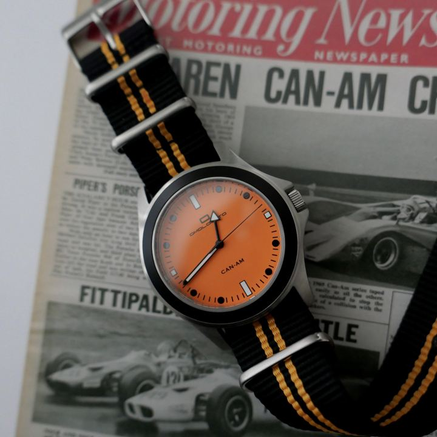

# 75 · "We're sorry, we keep selling out" apology notice

<!-- HERO:START -->
[](EXAMPLE.md)

**[See the example and how to make it →](EXAMPLE.md)** · [watch on X](https://x.com/OmologatoUK/status/2099497006158725545)
<!-- HERO:END -->


> **LC priority P1** · evidence: Medium (live ad) · hype risk: Low · cost $0 · 15 min

## What it is
A notice-style static written as an apology: "We're sorry. We didn't expect to keep selling out of ___." The body explains why demand spiked (the mechanism) and that it is back in stock now. Scarcity and social proof wrapped in humility.

## Why it works
- An apology reads as an announcement, not an ad.
- "Keeps selling out" is evergreen demand-based urgency (7 Trends #6).
- The story explains why others buy it.

## Shot-by-shot (LC version)

| Time / slot | Visual | Audio / copy |
|---|---|---|
| Static | Plain cream notice card, signature at the bottom: "We're sorry. Chelsea Herringbone sold out [N] times this summer." | Body: why (waterproof), it's back, any 7 for $85 |

## Hooks (swap-in openers)
- "We're sorry, it sold out again"
- "An apology from Louise Carter"
- "To everyone on the waitlist: we're sorry"

## Real examples from X (studied)
- @FedotOff90 "37 Ad Formats That Print" verified swipe: Nontoxic Mommy (PRIMALS), 103 (71 at the Aug pull) days live ("We're sorry. We didn't expect to keep selling out of a kids toothbrush…"). [ad](https://app.gethookd.ai/share/ad/107711526?signature=752be131b9ad4cafef6c743f9d730cb00f00a0a74da9fd5841785f0a03a40ab5) · [doc](https://rural-lifeboat-196.notion.site/3c8db9d7074d81548084c2b25d1be1ef) · [post](https://x.com/FedotOff90/status/2104949773539442831)
- 7 Trends of Top-Performing Video Ads #6: urgency built on demand language ("selling out again") never expires ([doc](https://rural-lifeboat-196.notion.site/3b8db9d7074d810dbadae17027c9aca2)).

## Production recipe
1. Run it only for SKUs that really sold out (log the dates).
2. Signed by the founder or team.
3. Retarget waitlist and visitors first, then go cold.

## Bot prompt (copy into the creative agent)
```
Write 3 "we're sorry, we keep selling out" notices for LC SKUs with real sell-out history {{SELLOUTS}}: ≤70-word card text + 120-word primary text.
```

## 3 LC scripts
- A · Chelsea Herringbone restock.
- B · Holiday gift set.
- C · "Sorry to everyone on the waitlist".

## Variants to test
- Founder signature vs team
- Cold vs retargeting

## Omni test plan
- **Budget/structure:** 2 statics, $25/day, 7 days around a restock
- **Primary KPIs:** CPA, CVR; Omni (F75-*)
- **Kill rule:** CPA >1.5×
- **Scale rule:** Use at every restock
- **Naming:** `utm_content=F75-<concept>-<variant>`; weekly Omni roll-up of new-customer revenue by format.

## Compliance
Baseline: [_COMPLIANCE.md](../_COMPLIANCE.md) (no fake testimonials, AI disclosure, no bulk/spoofed accounts, copy structure not assets, PDP-only claims).
- Only true sell-outs and real waitlist numbers; no fake scarcity (FTC).

## Related
- Strategies: 05-offer-page-engineering, 16-rewards-streaks-earned-discounts
- Formats: [37-urgency-offer-statics](../37-urgency-offer-statics/README.md), [64-reminder-retargeting-sequence](../64-reminder-retargeting-sequence/README.md)

## Wave 2d update: "I need to publicly apologize… because I lied" (Nuora)
- Nuora apology mash-up, live since Mar 5 (218 days), rank #5 of 221 brand ads on Atria: "I need to publicly apologize to anyone who's ever bought Nuora's Gut Ritual before because I lied. Yes, it's true that…" ([Atria](https://app.tryatria.com/ad/m2085613122215970), via @briannjho).
- Resilia hands-only variant: text "My apologies for those who couldn't afford it" over a softgel-in-water demo (GetHookd public board preview, [board](https://app.gethookd.ai/share/board/331297?signature=67e55d45fd1139ee96a9b3b8ec4d776be0d3b45520e1ff38ce31cd44463a926c)).
- LC: "I owe everyone who bought the Chelsea chain an apology: I told you to take it off in the pool. You don't have to."

<!-- EVIDENCE:START -->
## Evidence from X discovery (auto-generated)

| Date | Author | Post | Engagement | Grade | Gist |
|---|---|---|---|---|---|
| 2026-09-29 | [@FedotOff90](https://x.com/FedotOff90) | [link](https://x.com/FedotOff90/status/2104949773539442831) | 110L/208BM/9kV | VALUE | "37 ad formats printing right now" — verified Notion swipe (live ad, days active, brand ad count per format) + 132-ad FORMATS board. |
| 2026-09-18 | [@FedotOff90](https://x.com/FedotOff90) | [link](https://x.com/FedotOff90/status/2100948331136782532) | 17L/18BM/3kV | VALUE | Rebuilt the formats list with proof: 30-day survival column = "this works" bar; copy the structure, not the words. |
| 2026-09-01 | [@briannjho](https://x.com/briannjho) | [link](https://x.com/briannjho/status/2094662259746480410) | 138L/338BM/10kV | SOME | Ad picks: Smooche AI song ad, Ryze AI skit, UndrDog big-enemy, Everyday Dose skit, Serene Herbs AI identity, Nuora apology mash-up, Mama Bear "this is what happens". |
<!-- EVIDENCE:END -->
