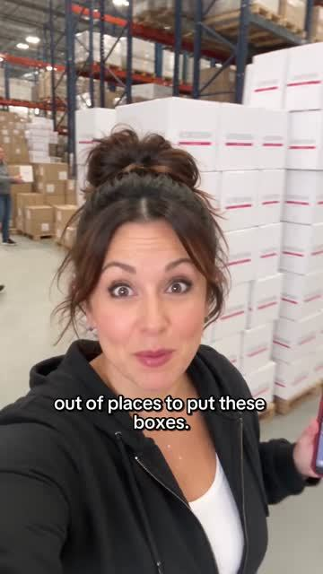
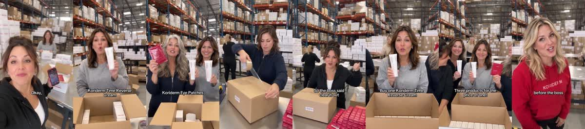
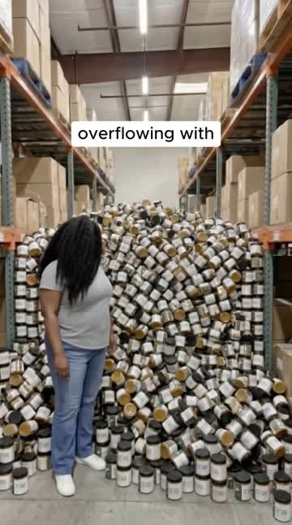
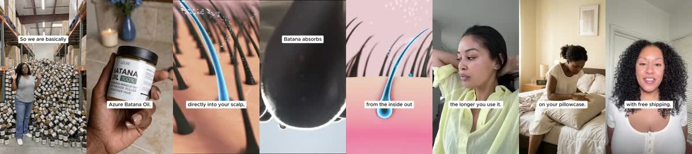
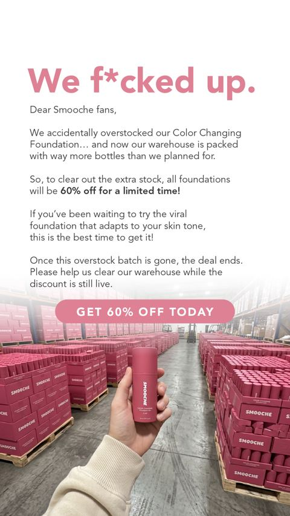
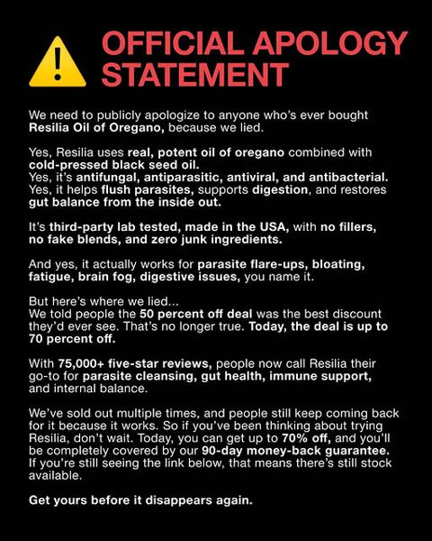
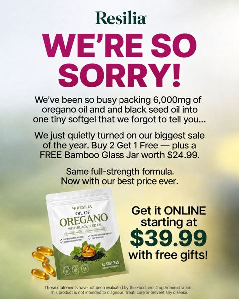

# Meta ad-library examples for F75

<!-- WAVE7 -->
## Wave 7: Lachezar Voynov's "Ad Bible" libraries (Oct 2026)

On Oct 6, 2026 [@LachezarVoynov](https://x.com/LachezarVoynov/status/2107498173384061027) named five Meta pages as "Ad Bibles" for AI ads: Seora Skincare (realistic AI UGC), Koriderm (AI drama), Azure Boutique (AI skits), IM8 Health (AI timeline) and a Resilia page (Suno songs, no active ads when we checked on Oct 9). We pulled each page sorted by impressions and picked the longest-running unique ads. Days live are counted to 2026-10-09, and the brands' claims are not verified.

### Koriderm: Prime Day Sale: Buy 1 Get 2 Free (9 days live)

- **Ad:** [Meta Ad Library #1108901422098291](https://www.facebook.com/ads/library/?id=1108901422098291) · video 0:59 · page “Koriderm” · started 2026-09-30 · from the “AI drama ads” library [@LachezarVoynov](https://x.com/LachezarVoynov/status/2107498173384061027) calls an ‘Ad Bible’ ([page](https://www.facebook.com/ads/library/?active_status=active&ad_type=all&country=ALL&search_type=page&view_all_page_id=964998840030543))
- **What happens:** A warehouse full of boxes: "We are literally running out of places to put these boxes… For Prime Day, buy one and get two products free." Staff unbox the bundle on camera.
- **Why it works:** The overstock excuse makes the discount believable, and the warehouse proves the brand is real. Voynov lists "AI warehouse ads" as a top-of-funnel format.
- **How to make one:** Shoot in a real stockroom with a team member: "We over-ordered", then what you get (an itemised unbox), and the deadline.
- **LC remake:** LC packing room: "We made 4,000 too many Lucky Charm sets", unbox the bundle, ends Sunday.

Transcript (auto, first 90 s)

> We are literally running out of places to put these boxes. Tell them what the box approved. OK, this is crazy. For prime day, buy one cordarm cream and get two products free. OK, here's exactly what you're getting. You buy one cordarm time reverse cream. We give you another full cream for free. And we're throwing in cordarm eye patches for free, too. So that's three products you only pay for one. Why are we doing this? Look around. We ordered too much. So the boss said, clear it out. Honestly, if you've been waiting to try cordarm, this is probably the time. Prime day only. Buy one cordarm time reverse cream. Get another cream free. Plus free eye patches. Three products for the price of one. Click below and help us empty this warehouse before the boss changes his mind.

### Azure Boutique: Buy 1 Get 1 FREE! (116 days live)

- **Ad:** [Meta Ad Library #2420403401791240](https://www.facebook.com/ads/library/?id=2420403401791240) · video 1:04 · page “Azure Boutique” · started 2026-06-15 · from the “AI skits” library [@LachezarVoynov](https://x.com/LachezarVoynov/status/2107498173384061027) calls an ‘Ad Bible’ ([page](https://www.facebook.com/ads/library/?active_status=active&ad_type=all&country=ALL&search_type=page&view_all_page_id=286320267904509))
- **What happens:** "Our warehouse is overflowing with Batana oil, so we are basically giving them away. We made way too many for our spring promotion." Pallets of jars, then a mechanism animation (oil into the scalp), then results.
- **Why it works:** An overstock story plus an ingredient-origin claim (cold-pressed, Honduras) plus a mechanism animation. It has run 116 days from the brand Voynov cites as the "AI skits" bible.
- **How to make one:** Show the warehouse hook, the origin and purity line, a 3-shot mechanism, results, and BOGO.
- **LC remake:** Same as above. Use only a real overstock.

Transcript (auto, first 90 s)

> Our warehouse is overflowing with Patana oil, so we are basically giving them away. We made way too many for our spring promotion, and now we have to move them at a massive discount. I am talking about Azure Patana oil, but one with 100% pure cold. Press Patana straight from Honduras that absorbs directly into your scalp, actually penetrating deep where hair loss starts. No more wasting money on products that sit on top of your hair. Patana absorbs and rebuilds. It makes your textured hair thicker, fuller, and healthier, because the vitamins E, A, and C feature follicles from the inside out, and the DH blue blocker stops the hormone that has been shrinking your edges for years. So your hair gets thicker and stronger. The longer you use it, the only bad thing is the first time you use it. You'll wonder why you waited so long, but that's your proof. It's getting into your scalp instead of sitting on your pillowcase. Seriously, if you ever wanted to try Azure Patana oil, now is the time. Buy one, get one free with free shipping, tap below, and grab yours before we run out of stock.

<!-- /WAVE7 -->

<!-- WAVE6 -->
## Wave 6: Resilia & Smooche live Meta ads (Oct 2026)

Pulled from the public Meta Ad Library on 2026-10-09 (Resilia: aged garlic, Ceylon cinnamon, oil of oregano; Smooche: color-changing foundation, Reverse Time peptide serum). Days live are counted to 2026-10-09; most video ads were new tests that week, while the long runners are statics and catalog templates. Transcripts are automatic. Brand claims are the advertisers', not verified, and many are health claims we would never make. The **Do not copy** line flags deceptive tactics (persona "publication" pages, undisclosed AI actors and "experts", fake stock counts).

### Smooche · Smooche: “We f*cked up” (100 days live)

- **Ad:** [Meta Ad Library #1974572333261252](https://www.facebook.com/ads/library/?id=1974572333261252) · static image · page “Smooche” · started 2026-06-30 · 1 copies · lands on `smooche.com/products/color-changing-foundation`
- **What happens:** "We f*cked up." A letter-style apology for over-ordering, with a warehouse photo of pink boxes and a "60% off" button. Served through a catalog-template slot.
- **Why it works:** "We f*cked up." (a 100-day run on a catalog-template slot), "Official apology statement" and "We're so sorry". An apology for overselling or overstock, written as a letter, reads as a personal note rather than an ad.
- **How to make one:** Write a letter-style static: an admission, the reason (we over-ordered, or we sold out), the fix (the discount), and a sign-off. A warehouse photo makes it believable.
- **LC remake:** "We f*cked up. We made 4,000 too many Lucky Charm necklaces. They're 40% off until they're gone."

### Resilia · Midlife Wellness Journal: “OFFICIAL APOLOGY STATEMENT” (0 days live)

- **Ad:** [Meta Ad Library #2293681194721692](https://www.facebook.com/ads/library/?id=2293681194721692) · static image · page “Midlife Wellness Journal” · started 2026-10-08 · 1 copies · lands on `resilia.shop/products/resilia-oil-of-oregano-softgels`
- **What happens:** "OFFICIAL APOLOGY STATEMENT": a black text-heavy notice about selling out.
- **Why it works:** "We f*cked up." (a 100-day run on a catalog-template slot), "Official apology statement" and "We're so sorry". An apology for overselling or overstock, written as a letter, reads as a personal note rather than an ad.
- **How to make one:** Write a letter-style static: an admission, the reason (we over-ordered, or we sold out), the fix (the discount), and a sign-off. A warehouse photo makes it believable.
- **LC remake:** "We f*cked up. We made 4,000 too many Lucky Charm necklaces. They're 40% off until they're gone."

Primary text

> Resilia is powered by oil of oregano and cold-pressed black seed oil — two of nature's most time-tested botanicals. Our easy-to-swallow softgels feature premium oil of oregano with naturally occurring carvacrol and black seed oil with thymoquinone. Clean, no-BS ingredients, third-party tested, and shipped right from the USA to deliver daily support for a healthy gut, a healthy inflammatory response, and your body's natural defenses. Just two softgels a day, no powders or routines to remember.

### Resilia · Resilia: “We're so sorry!” (1 day live)

- **Ad:** [Meta Ad Library #2169968330609160](https://www.facebook.com/ads/library/?id=2169968330609160) · static image · page “Resilia” · started 2026-10-07 · lands on `resilia.shop/products/resilia-oil-of-oregano-softgels`
- **What happens:** "We're so sorry!": a "we've been so busy packing 6,000kg of oregano oil…" apology with a "$39.99 with free gifts" button.
- **Why it works:** "We f*cked up." (a 100-day run on a catalog-template slot), "Official apology statement" and "We're so sorry". An apology for overselling or overstock, written as a letter, reads as a personal note rather than an ad.
- **How to make one:** Write a letter-style static: an admission, the reason (we over-ordered, or we sold out), the fix (the discount), and a sign-off. A warehouse photo makes it believable.
- **LC remake:** "We f*cked up. We made 4,000 too many Lucky Charm necklaces. They're 40% off until they're gone."

Primary text

> Resilia is powered by oil of oregano and cold-pressed black seed oil — two of nature's most time-tested botanicals. Our easy-to-swallow softgels feature premium oil of oregano with naturally occurring carvacrol and black seed oil with thymoquinone. Clean, no-BS ingredients, third-party tested, and shipped right from the USA to deliver daily support for a healthy gut, a healthy inflammatory response, and your body's natural defenses. Just two softgels a day, no powders or routines to remember.

<!-- /WAVE6 -->

