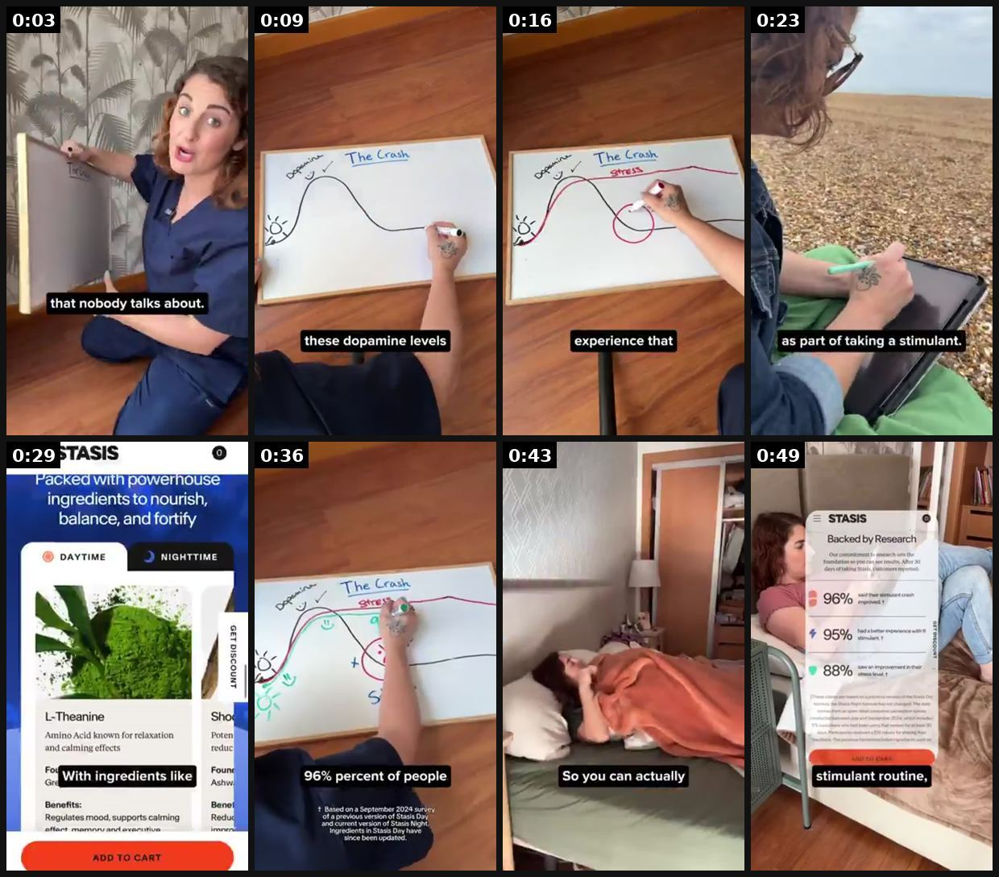
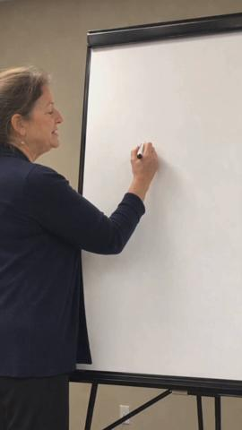
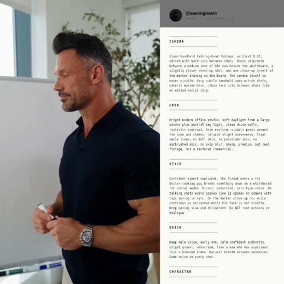

# 76 · Whiteboard explainer (marker diagram of the mechanism, static or video): see it, then make it

[](https://x.com/artfully_amberr/status/2100249277029126306)

**The example:** [@artfully_amberr on X](https://x.com/artfully_amberr/status/2100249277029126306) · 0:52 video · 9 likes, 252 views

**Watch it:** [open the post on X](https://x.com/artfully_amberr/status/2100249277029126306) · [play the video file](https://video.twimg.com/amplify_video/2100249175392727040/vid/avc1/320x568/m8MsZJmGswMDDLcZ.mp4?tag=29)

> Here's a #UGCexample I made for Stasis. This whiteboard explainer concept has generated revenue for the client. For this creative, I leaned into my background as a nurse and filmed in scrubs to establish authority while using a whiteboard to visually simplify a more complex https://t.co/mbRhYHeBnj

## What you are seeing

A creator drawing on a whiteboard while explaining ("that nobody talks about", "these dopamine levels"), with a graph curve, then the product page and a woman relaxing. It is a teacher-style explainer with a marker.

## Beat by beat

The storyboard above samples the video every 0:06. Lines are the transcript for that stretch; on-screen text comes from OCR, so treat it as rough.

| Frame | Time | On screen | Said / sung |
|---|---|---|---|
| 1 | 0:00–0:06 | Tl ee vi hi la if a. bs that nobody talks about. | If you take Adderall or any stimulant, let's map out the crash that nobody talks about. You take Adderall in the morning, dopamine goes up, and that's what causes you to feel focused and productive. |
| 2 | 0:06–0:13 | The these dopamine levels Le | But as the day goes on, these dopamine levels naturally start coming back down, |
| 3 | 0:13–0:19 | Fa Ky experience that | while cortisol, your body's main stress hormone, can stay elevated. That's why some people experience that afternoon crash and feel like they're going to snap at anyone who asks them a question. |
| 4 | 0:19–0:26 | lee a Fe oh ae: ae ra wh eh a Ne a a tee a- Sees ee ee: fo oa ne Ns at mw ae as part of taking a stimulant. oF | The good news is, those downsides don't have to be something you just accept as part of taking a stimulant. That's exactly why Stasis was created. |
| 5 | 0:26–0:33 | · | Their daytime formula is designed to be taken with your stimulant, with ingredients like l-theanine, ashwagandha, and saffron, |
| 6 | 0:33–0:39 | he SF DA po’ Ly Lie 96% percent of people Based on a September 2024 of a previous version of and current version of Night. Ingredients in Day have since | to support healthy dopamine balance and your body's natural stress response. 96% of people said their crash improved. |
| 7 | 0:39–0:46 | So you can actually | Then their nighttime formula is designed to support relaxation and restorative sleep, so you can actually fall asleep at the end of the day and wake up feeling refreshed. |
| 8 | 0:46–0:52 | · | If you're looking for a better way to support your stimulant routine, not replace it, check out the link below to learn more about Stasis. |

<details><summary>Full transcript (timestamped)</summary>

- `0:00` If you take Adderall or any stimulant, let's map out the crash that nobody talks about.
- `0:03` You take Adderall in the morning, dopamine goes up, and that's what causes you to feel focused and productive.
- `0:08` But as the day goes on, these dopamine levels naturally start coming back down,
- `0:12` while cortisol, your body's main stress hormone, can stay elevated.
- `0:15` That's why some people experience that afternoon crash and feel like they're going to snap at anyone who asks them a question.
- `0:20` The good news is, those downsides don't have to be something you just accept as part of taking a stimulant.
- `0:24` That's exactly why Stasis was created.
- `0:26` Their daytime formula is designed to be taken with your stimulant,
- `0:29` with ingredients like l-theanine, ashwagandha, and saffron,
- `0:32` to support healthy dopamine balance and your body's natural stress response.
- `0:36` 96% of people said their crash improved.
- `0:39` Then their nighttime formula is designed to support relaxation and restorative sleep,
- `0:42` so you can actually fall asleep at the end of the day and wake up feeling refreshed.
- `0:46` If you're looking for a better way to support your stimulant routine,
- `0:49` not replace it, check out the link below to learn more about Stasis.

</details>

## More real examples (2)

Other posts that show this format, or a close cousin of it. Click a thumbnail to open it on X.

| | | |
|---|---|---|
| [](https://x.com/0xROAS/status/2094086530973229173)<br>**@0xROAS** · 0:46 video · 24K views<br>here's another BANGER ai ad style you can use in your ads it's called BRB Whiteboard Explainer style (my fav) there's infinite ways you can scale your | [](https://x.com/atlas_cloud_ai/status/2087724906285060447)<br>**@atlas_cloud_ai** · 0:30 video · 998 views<br>30-second expert whiteboard ad. Perfect lip sync, natural handwriting, real skin texture — one single Seedance 2.5 generation. Generated on https://t. |   |

## How to make one like it

**The format in one line:** A hand-drawn whiteboard diagram explaining why the usual fix fails and how the product works (layers, timelines, cost math). Shown as a photo of the whiteboard or a 30s marker-drawing video with a person addressing the viewer by name ("Hey Priya, you need this").

**Why it works:** - Teacher framing creates authority without claiming credentials. - A marker drawing feels homemade and honest. - Simplifies LC's real edge (bonded PVD vs plating) into one picture.

**Contents:** [1. Structure](#1-copy-the-structure) · [2. Shot by shot](#2-shot-by-shot-remake) · [3. Script and hooks](#3-write-the-script) · [4. Prompts](#4-prompts) · [5. Tools and settings](#5-tools-and-settings) · [6. Louise Carter remake](#6-louise-carter-remake) · [7. Variants and test](#7-variants-and-test-plan) · [8. Pitfalls](#8-pitfalls)

### 1. Copy the structure

Use the example's timing as your beat sheet. Keep the beat, change the words and the product.

| Beat | Time | In the example | Your version |
|---|---|---|---|
| 1 | 0:03 | If you take Adderall or any stimulant, let's map out the crash that nobody talks about. You take Adderall in the morning, dopamine goes up, | … |
| 2 | 0:09 | But as the day goes on, these dopamine levels naturally start coming back down, | … |
| 3 | 0:16 | while cortisol, your body's main stress hormone, can stay elevated. That's why some people experience that afternoon crash and feel like the | … |
| 4 | 0:23 | The good news is, those downsides don't have to be something you just accept as part of taking a stimulant. That's exactly why Stasis was cr | … |
| 5 | 0:29 | Their daytime formula is designed to be taken with your stimulant, with ingredients like l-theanine, ashwagandha, and saffron, | … |
| 6 | 0:36 | to support healthy dopamine balance and your body's natural stress response. 96% of people said their crash improved. | … |
| 7 | 0:43 | Then their nighttime formula is designed to support relaxation and restorative sleep, so you can actually fall asleep at the end of the day | … |
| 8 | 0:49 | If you're looking for a better way to support your stimulant routine, not replace it, check out the link below to learn more about Stasis. | … |

### 2. Shot-by-shot remake

**Target length / size:** Photo of a whiteboard (static) or a 30-60s drawing video

| # | Time / slot | What we see (visual + camera) | Dialogue / on-screen text |
|---|---|---|---|
| 1 | 0-3s | Hand starts drawing on a whiteboard, top-down or straight-on | "why your gold jewelry turns green (nobody tells you this)" |
| 2 | 3-25s | Diagram: a thin plating layer wearing off vs a bonded PVD layer | Marker labels, narrator explains |
| 3 | 25-40s | Cost math: "$20 x 6 replacements vs one $85 stack" | Simple numbers |
| 4 | 40-50s | Product placed on the board | CTA |

<details><summary>Playbook shot list (Louise Carter version from the README)</summary>

| Time / slot | Visual | Audio / copy |
|---|---|---|
| Static | Whiteboard photo: two drawn layers "plating (wears off)" vs "PVD (bonded)" + arrows + LC necklace taped on | Headline: "whiteboard alert ✏️" |
| Video 30s | Hand draws the diagram, VO explains | "Before you buy another gold chain…" |

</details>

### 3. Write the script

Open with one of these hooks (first 1–3 seconds, or the headline on a static):

- "Whiteboard alert ✏️ why plating wears off"
- "Before you buy another gold chain, look at this"
- "The 2-layer drawing every jewelry buyer should see"

Then fill the beats from the table above. Pull the wording from real customer reviews, not from ad copy: a review line beats a copywriter line almost every time. Read every line out loud and cut anything you would not say to a friend. Ready-made Louise Carter scripts are in section 6; hand [BOT.md](BOT.md) to any AI agent to write versions for another brand.

### 4. Prompts

**Shoot**

```text
Whiteboard + black and gold markers, ring light from the side to avoid glare, phone on an overhead arm, record at 1x then speed up to 2x.
```

**Script (Claude)**

```text
Write a 45-second whiteboard explainer: problem, why the usual fix fails, how [product] works, cost comparison, CTA. Each line must correspond to something drawn.
```

**Full creative-agent prompt (from the playbook):**

```
Write 4 whiteboard explainers for LC: what to draw (labels, arrows), 60-word VO, headline. Use only {{PDP_FACTS}}.
```

### 5. Tools and settings

1. Use a real whiteboard and the founder's handwriting.
2. One idea per board: layers, cost per wear, care.
3. Shoot the static and a 30s time-lapse.

| Setting | Value |
|---|---|
| Canvas | 1080×1350 (4:5) for feed; 1080×1920 (9:16) story/reel version with the same elements stacked |
| Type | Headline 80–110 px, max 8 words; body 36–44 px; at most 2 typefaces |
| Layout | Headline readable at thumbnail size; product at least 40% of the canvas; logo small, bottom corner |
| Safe zone | Keep text out of the bottom 20% on 9:16 (UI overlays) |
| Tools | Figma or Canva for layout; Photoshop or Photoroom to cut out product; Midjourney or Flux only for backgrounds, never for the product itself |
| Export | PNG or JPG at quality 90, sRGB, under 1 MB |

### 6. Louise Carter remake

- A · Plating vs PVD layers.
- B · Cost per wear: $9 chain ×6 vs LC.
- C · Shower/pool/ocean test grid.

Brand rules, claims you can and cannot make, and more scripts: [brands/louise-carter.md](brands/louise-carter.md). Step-by-step from idea to scale: [STAGES.md](STAGES.md).

### 7. Variants and test plan

- Static vs time-lapse
- Named-address hook vs generic

**Test plan:** - **Budget/structure:** 2 statics + 2 videos, $20/day, 7 days - **Primary KPIs:** CTR, hold rate, CPA; Omni (F76-*) - **Kill rule:** CTR <0.8% - **Scale rule:** Organic Reel + pin - **Naming:** `utm_content=F76-<concept>-<variant>`; weekly Omni roll-up of new-customer revenue by format.

**Naming:** `F76-<variant>-<hook##>-<date>` so results map back to this folder. Change one thing per test (hook, narrator, length or offer), never two.

### 8. Pitfalls

- The diagram must be technically correct.
- Cost math must use real prices.
- Too much text: if it cannot be read in 1 second at thumbnail size, cut it.
- AI-generated product images: show the real product; AI is fine for backgrounds only.

**Compliance:** Baseline: [_COMPLIANCE.md](../_COMPLIANCE.md) (no fake testimonials, AI disclosure, no bulk/spoofed accounts, copy structure not assets, PDP-only claims). - Accurate material science; no medical or skin claims.

## Field notes

Newer observations live in the playbook: [Wave 3 update: Meta ad-library long-runners (Fedotoff gut-health board)](README.md)

## More examples

Every post we found for this format, with transcripts: [examples/](examples/README.md). Playbook: [README.md](README.md). Agent brief: [BOT.md](BOT.md).
