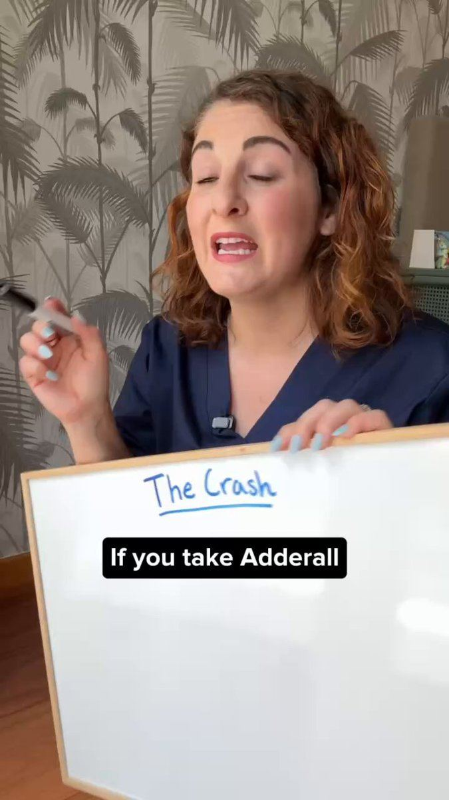

# 76 · Whiteboard explainer (marker diagram of the mechanism, static or video)

<!-- HERO:START -->
[](EXAMPLE.md)

**[See the example and how to make it →](EXAMPLE.md)** · [watch on X](https://x.com/artfully_amberr/status/2100249277029126306)
<!-- HERO:END -->


> **LC priority P1** · evidence: Medium (live ad) · hype risk: Low · cost $0-50 · 30 min

## What it is
A hand-drawn whiteboard diagram explaining why the usual fix fails and how the product works (layers, timelines, cost math). Shown as a photo of the whiteboard or a 30s marker-drawing video with a person addressing the viewer by name ("Hey Priya, you need this").

## Why it works
- Teacher framing creates authority without claiming credentials.
- A marker drawing feels homemade and honest.
- Simplifies LC's real edge (bonded PVD vs plating) into one picture.

## Shot-by-shot (LC version)

| Time / slot | Visual | Audio / copy |
|---|---|---|
| Static | Whiteboard photo: two drawn layers "plating (wears off)" vs "PVD (bonded)" + arrows + LC necklace taped on | Headline: "whiteboard alert ✏️" |
| Video 30s | Hand draws the diagram, VO explains | "Before you buy another gold chain…" |

## Hooks (swap-in openers)
- "Whiteboard alert ✏️ why plating wears off"
- "Before you buy another gold chain, look at this"
- "The 2-layer drawing every jewelry buyer should see"

## Real examples from X (studied)
- @FedotOff90 "37 Ad Formats That Print" verified swipe: Ventamin, 23 days live ("Hey priya, you need this… whiteboard alert!"; laser vs root-cause drawing; brand runs 202 ads). [ad](https://app.gethookd.ai/share/ad/148249183?signature=5e615eaeeed08951f5fd37832f7eecbbe35fbebc7e3b784498089c3c2d2e80af) · [doc](https://rural-lifeboat-196.notion.site/3c8db9d7074d81548084c2b25d1be1ef) · [post](https://x.com/FedotOff90/status/2104949773539442831)

## Production recipe
1. Use a real whiteboard and the founder's handwriting.
2. One idea per board: layers, cost per wear, care.
3. Shoot the static and a 30s time-lapse.

## Bot prompt (copy into the creative agent)
```
Write 4 whiteboard explainers for LC: what to draw (labels, arrows), 60-word VO, headline. Use only {{PDP_FACTS}}.
```

## 3 LC scripts
- A · Plating vs PVD layers.
- B · Cost per wear: $9 chain ×6 vs LC.
- C · Shower/pool/ocean test grid.

## Variants to test
- Static vs time-lapse
- Named-address hook vs generic

## Omni test plan
- **Budget/structure:** 2 statics + 2 videos, $20/day, 7 days
- **Primary KPIs:** CTR, hold rate, CPA; Omni (F76-*)
- **Kill rule:** CTR <0.8%
- **Scale rule:** Organic Reel + pin
- **Naming:** `utm_content=F76-<concept>-<variant>`; weekly Omni roll-up of new-customer revenue by format.

## Compliance
Baseline: [_COMPLIANCE.md](../_COMPLIANCE.md) (no fake testimonials, AI disclosure, no bulk/spoofed accounts, copy structure not assets, PDP-only claims).
- Accurate material science; no medical or skin claims.

## Related
- Strategies: 19-content-hub-blog-to-product, 41-von-restorff-static-copy-prompt
- Formats: [58-educational-care-material-explainer](../58-educational-care-material-explainer/README.md), [35-diagram-statics-venn-report-card](../35-diagram-statics-venn-report-card/README.md)

<!-- EVIDENCE:START -->
## Wave 3 update: Meta ad-library long-runners (Fedotoff gut-health board)
- Rachel's Tea: Animated numbered-benefit product spec video, 424 days live. Silent, readable in 3 s, cheap to version; for a returning-customer base the spec IS the message.
- Pinch Magic Fiber: Presenter explainer with 'this is what 30 g of fiber looks like', 288 days live. The 'what X looks like' visual turns an abstract number into a pile of food the viewer can't eat daily, so the product becomes the shortcut; comparison table handles 'all fiber is the same'.
- Stills, transcripts and LC remakes: [adlibrary/](adlibrary/README.md).

## Evidence from X discovery (auto-generated)

| Date | Author | Post | Engagement | Grade | Gist |
|---|---|---|---|---|---|
| 2026-09-29 | [@FedotOff90](https://x.com/FedotOff90) | [link](https://x.com/FedotOff90/status/2104949773539442831) | 110L/208BM/9kV | VALUE | "37 ad formats printing right now" — verified Notion swipe (live ad, days active, brand ad count per format) + 132-ad FORMATS board. |
<!-- EVIDENCE:END -->
