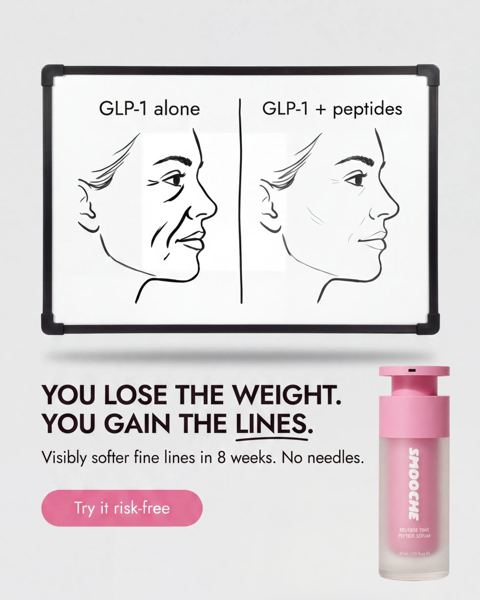

# Meta ad-library examples for F76 (GetHookd board 155932, gut health)

<!-- WAVE6 -->
## Wave 6: Resilia & Smooche live Meta ads (Oct 2026)

Pulled from the public Meta Ad Library on 2026-10-09 (Resilia: aged garlic, Ceylon cinnamon, oil of oregano; Smooche: color-changing foundation, Reverse Time peptide serum). Days live are counted to 2026-10-09; most video ads were new tests that week, while the long runners are statics and catalog templates. Transcripts are automatic. Brand claims are the advertisers', not verified, and many are health claims we would never make. The **Do not copy** line flags deceptive tactics (persona "publication" pages, undisclosed AI actors and "experts", fake stock counts).

### Smooche · Smooche: A whiteboard sketch (20 days live)

- **Ad:** [Meta Ad Library #3252508194947125](https://www.facebook.com/ads/library/?id=3252508194947125) · static image · page “Smooche” · started 2026-09-18 · 1 copies · lands on `quiz.smooche.com/`
- **What happens:** A whiteboard sketch: "GLP-1 alone | GLP-1 + peptides. YOU LOSE THE WEIGHT. YOU GAIN THE LINES."
- **Why it works:** A marker drawing ("GLP-1 alone vs GLP-1 + peptides: You lose the weight. You gain the lines.") explains the problem in one image.
- **How to make one:** A two-panel whiteboard sketch, a one-line punchline, and the product photo.
- **LC remake:** "Cheap plating vs PVD": a sketch of the layers wearing off vs bonded.

Primary text

> Most anti-aging creams don't work. And no, it's not because women use them wrong. It's because collagen molecules are too big to absorb. They sit on top of the skin until you wash them off. Collagen powders? Broken down in digestion before your skin ever sees them. And the treatments that do work run hundreds per session. That's why so many women are switching to Smooche. A peptide serum formulated in Korea with hydrolyzed collagen and hyaluronic acid: the same actives, cut small enough to actually sink in. Plus firming peptides and sodium DNA. ✔ Takes seconds, morning and night ✔ No needles, no downtime, no clinic prices ✔ Fresher-looking skin in days, firmer in weeks Try it risk-free for 30 days.

<!-- /WAVE6 -->

From [@FedotOff90](https://x.com/FedotOff90/status/2108212319113412929)'s public board preview. Days live are as of 2026-10-09. Full board breakdown is in the internal sources folder.

## Rachel's Tea: Animated numbered-benefit product spec video (424 days live)

- **What happens:** Motion-graphic: bottle on orange/white, '100 BILLION PROBIOTICS' supers, numbered 01 / 02 benefit callouts sliding in, ORDER NOW end card; music only.
- **Why it lasts:** 424 days live. Silent, readable in 3 s, cheap to version; for a returning-customer base the spec IS the message.
- **How to make one:** After Effects / CapCut keyframes or Canva video; 15-22 s; one benefit per 4 s; brand colour background.
- **LC remake:** Animated '3 reasons it doesn't turn green': 01 14K gold layer, 02 PVD bond, 03 stainless core; product spins; '7 for $85'.

## Pinch Magic Fiber: Presenter explainer with 'this is what 30 g of fiber looks like' (288 days live)

- **What happens:** Bearded presenter talks fiber science over b-roll (poop-shape hook, psyllium close-ups, comparison chart 'Premium Psyllium / 0 g sugar / Bromelain') and the key visual: a table of whole foods = 30 g fiber, 'if you can't eat this every day, here's this'. Ends on a 'The People Have Spoken' review page.
- **Why it lasts:** 288 days live. The 'what X looks like' visual turns an abstract number into a pile of food the viewer can't eat daily, so the product becomes the shortcut; comparison table handles 'all fiber is the same'.
- **How to make one:** 100 s explainer: presenter A-roll + 8-12 b-roll inserts + one big visual-equivalence shot + comparison table + review-page close.
- **LC remake:** 'This is what it costs to replace plated jewelry every year' visual: a pile of 8 cheap green-turned necklaces = $240 vs one LC stack.

Transcript

> The shape and consistency of your poop can tell you a lot about your health. When you don't get enough fiber, your digestive system struggles to move waste efficiently. Over time, this can lead to bloating, hardened stools, and discomfort whether you're in or out of the bathroom. Without fiber, toxins and waste linger in your system, affecting your gut microbiome, energy levels, and even your mood. To get the recommended daily fiber intake, you'd need to eat a lot of whole foods. This is what 30 grams of fiber looks like. If you can't eat this every day, here this. There's an easier way to get the fiber your body needs. Cillium husk. It's a powerful, all-natural fiber that gently works in your system. Think of cillium husk as a sponge. It absorbs water, softens stools, and sweeps waste through your digestive tract, making everything run more smoothly. It also feeds the good bacteria in your gut, supporting a healthy microbiome, which is key to overall digestive health and immunity. But not all fiber is created equal. Pinch intentionally uses a distinct source of the highest purity cillium. In combination with other gut-enhancing ingredients, optimize on over a dozen different dimensions. This ensures the best results in the game, while avoiding any fluff or detrimental ingredients like aspartame or enolent. These ingredients all work together to help your digestion stay on track, while also providing nutrients your body needs. Preparing pinch magic fiber is incredibly easy. Just mix it into water, and you've got a simple way to improve your digestive health each day, no matter how busy or schedule. While many fiber supplements rely on fillers or artificial ingredients, pinch stands out with its clean natural formula. It's gentle, effective, delicious, and designed for everyday use without any unwanted extras. Read the amazing customer feedback, and try pinch magic fiber today with peace of mind from its 100% money back guarantee.

