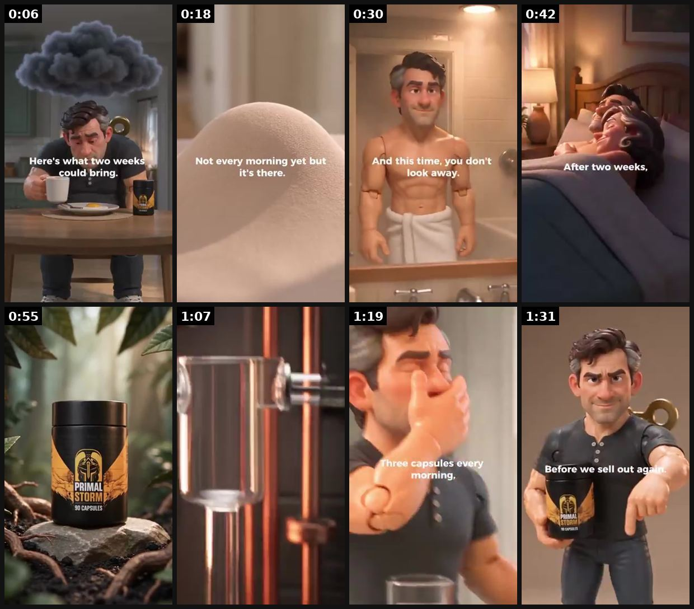
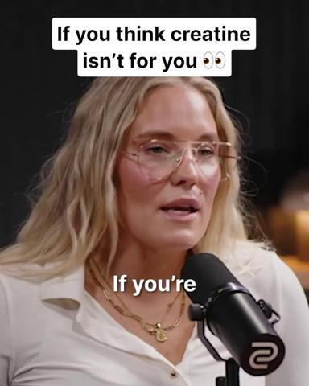
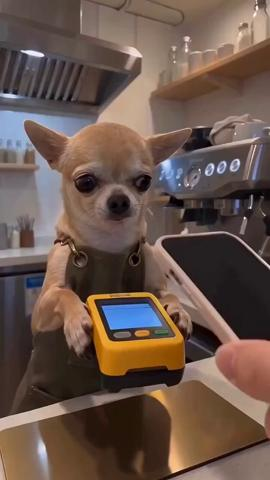
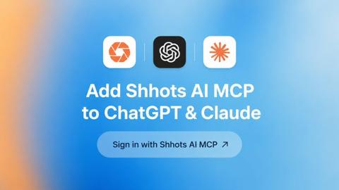

# 77 · UGC voiceover remix (one creator clip, 10 swapped VO hooks): see it, then make it

[](https://x.com/zedmadeit/status/2098121655167926499)

**The example:** [@zedmadeit on X](https://x.com/zedmadeit/status/2098121655167926499) · 1:37 video · 55 likes, 9K views

**Watch it:** [open the post on X](https://x.com/zedmadeit/status/2098121655167926499) · [play the video file](https://video.twimg.com/amplify_video/2098121497508253699/vid/avc1/320x568/b6lC2OMK1YgYWrqh.mp4?tag=29)

> I just one shot this AI song ad same video same workflow new audio took the original script, turned it into lyrics and prompted suno to match the og voiceover duration. A whole new creative without rebuilding from scratch If you have a winning creative thats scaling, try this

## What you are seeing

An AI song version of an existing ad: the same Pixar-style man and the same scenes (morning bathroom, mirror, product jar in a jungle set) with new sung audio. Same video, new soundtrack.

## Beat by beat

The storyboard above samples the video every 0:12. Lines are the transcript for that stretch; on-screen text comes from OCR, so treat it as rough.

| Frame | Time | On screen | Said / sung |
|---|---|---|---|
| 1 | 0:00–0:12 | wh at lo wee bring. oo aa hy fl | Dramastome every morning here's what two weeks could bring within 48 hours the fog lives at |
| 2 | 0:12–0:24 | a Not every morning it's there. a | Wired tired feeling quits down shoulders drop your mind clear something moving underneath After three days morning would not every morning yet, but it's there The fire isn't just back It's not a thing that's been in years |
| 3 | 0:24–0:36 | · | After five days chest firms up you catch yourself in the middle you're gonna look away After one week she'd give you that look again you're initiating your reason for her |
| 4 | 0:36–0:48 | · | · |
| 5 | 0:48–1:01 | · | · |
| 6 | 1:01–1:13 | · | You be capsules every morning that you gotta do what it would and 10,000 other men |
| 7 | 1:13–1:25 | · | · |
| 8 | 1:25–1:37 | Before we 20 ae worm | · |

<details><summary>Full transcript (timestamped)</summary>

- `0:02` Dramastome every morning here's what two weeks could bring within 48 hours the fog lives at
- `0:09` Wired tired feeling quits down shoulders drop your mind clear something moving underneath
- `0:15` After three days morning would not every morning yet, but it's there
- `0:20` The fire isn't just back It's not a thing that's been in years
- `0:24` After five days chest firms up you catch yourself in the middle you're gonna look away
- `0:33` After one week she'd give you that look again you're initiating your reason for her
- `0:38` You be capsules every morning that you gotta do what it would and 10,000 other men

</details>

## More real examples (4)

Other posts that show this format, or a close cousin of it. Click a thumbnail to open it on X.

| | | |
|---|---|---|
| [](https://x.com/HenryCrochemore/status/2089291503919087933)<br>**@HenryCrochemore** · 1:11 video · 4K views<br>ai podcast ads might be one of the easiest ways to make ugc feel native again instead of generating another creator holding a product put them behind | [](https://x.com/sleepclip/status/2102703772354875719)<br>**@sleepclip** · 0:10 video · 2K views<br>no F*CKING way this app scaled from $1k to $500k off ai videos all it took was ai videos of different animals and characters that crossed millions of | [](https://x.com/shhotsAI/status/2082182718704775496)<br>**@shhotsAI** · image · 126 views<br>Today we're launching Shhots AI MCP 🎉 Shhots now runs inside @ChatGPT & @claudeai Connect once and just chat to create your marketing campaigns: - "Cr |
| [](https://x.com/francis_nayan/status/2090055433645928642)<br>**@francis_nayan** · image · 527 views<br>3 things I've learned writing and strategizing ads for 8-figure brands: 1 - There's an infinite amount of WINNING ads to write Most brands pick 5-6 pe |   |   |

## How to make one like it

**The format in one line:** Take one winning UGC or B-roll clip and lay a professional or AI voiceover on top, swapping only the first 3-5 seconds to test many hooks. The VO controls the claims (compliance-friendly), and footage costs nothing extra.

**Why it works:** - The hook is the biggest lever, so testing 10 hooks on proven footage is cheap and fast. - No new usage rights or reshoots needed (when the license covers edits). - VO keeps claims consistent and PDP-exact.

**Contents:** [1. Structure](#1-copy-the-structure) · [2. Shot by shot](#2-shot-by-shot-remake) · [3. Script and hooks](#3-write-the-script) · [4. Prompts](#4-prompts) · [5. Tools and settings](#5-tools-and-settings) · [6. Louise Carter remake](#6-louise-carter-remake) · [7. Variants and test](#7-variants-and-test-plan) · [8. Pitfalls](#8-pitfalls)

### 1. Copy the structure

Use the example's timing as your beat sheet. Keep the beat, change the words and the product.

| Beat | Time | In the example | Your version |
|---|---|---|---|
| 1 | 0:06 | Dramastome every morning here's what two weeks could bring within 48 hours the fog lives at | … |
| 2 | 0:18 | Wired tired feeling quits down shoulders drop your mind clear something moving underneath After three days morning would not every morning y | … |
| 3 | 0:30 | After five days chest firms up you catch yourself in the middle you're gonna look away After one week she'd give you that look again you're | … |
| 4 | 0:42 | (visual beat, see frame 4) | … |
| 5 | 0:55 | (visual beat, see frame 5) | … |
| 6 | 1:07 | You be capsules every morning that you gotta do what it would and 10,000 other men | … |
| 7 | 1:19 | (visual beat, see frame 7) | … |
| 8 | 1:31 | on screen: Before we 20 ae worm | … |

### 2. Shot-by-shot remake

**Target length / size:** One clip, 10 swapped voiceover hooks (first 3-5s)

| # | Time / slot | What we see (visual + camera) | Dialogue / on-screen text |
|---|---|---|---|
| 1 | Base | One winning UGC or B-roll clip you own | Unchanged after the hook |
| 2 | 0-5s | Same footage, new VO hook each version | e.g. "I stopped buying gold-plated for one reason" / "this survived a week in the sea" |
| 3 | 5-end | Original edit | Original VO or a consistent pro VO |
| 4 | Naming | - | F77-hook01 ... hook10 so the hook is the only variable |

<details><summary>Playbook shot list (Louise Carter version from the README)</summary>

| Time / slot | Visual | Audio / copy |
|---|---|---|
| 0-3s | Same winning footage | VO hook variant 1-10 |
| 3-30s | Unchanged body | Shared VO body |
| End | Offer card | "Any 7 for $85" |

</details>

### 3. Write the script

Open with one of these hooks (first 1–3 seconds, or the headline on a static):

- 10 hooks from the F34/F54/F71 banks

Then fill the beats from the table above. Pull the wording from real customer reviews, not from ad copy: a review line beats a copywriter line almost every time. Read every line out loud and cut anything you would not say to a friend. Ready-made Louise Carter scripts are in section 6; hand [BOT.md](BOT.md) to any AI agent to write versions for another brand.

### 4. Prompts

**ElevenLabs**

```text
Same voice for all 10 hooks, stability 45, similarity 80, normalise to -14 LUFS, 3-5 seconds each.
```

**Hook bank (Claude)**

```text
Write 20 opening lines (max 12 words) for this clip [describe]; each must be true for what the footage shows.
```

**Full creative-agent prompt (from the playbook):**

```
For LC clip {{CLIP_DESC}} (transcript {{TRANSCRIPT}}), write 10 alternative 3-second VO hooks across these types: callout, contrarian, regret-discovery, side effect, number. Keep the body VO unchanged.
```

### 5. Tools and settings

1. Confirm the creator license covers edits and VO.
2. Write 10 hooks; record VO (human, or AI with disclosure where needed).
3. Export 10 cuts and name them F77-<clip>-<hook>.

| Setting | Value |
|---|---|
| Canvas | 1080×1920 (9:16) master; crop a 1080×1350 (4:5) cut for feed placements |
| Frame rate | 30 fps (shoot 60 fps for slow-motion water or sparkle shots) |
| Camera | Phone main lens at 1x, exposure locked on skin, HDR off, grid on; tripod or a phone clamp for product shots |
| Light | One soft key at 45° (window or ring light), white card as fill; side light for metal sparkle |
| Audio | Lavalier or phone 15–20 cm from the mouth; mix voice at -14 LUFS, music at -28 to -30 dB under voice |
| Captions | Burned in, 2–5 words per line, 64–80 px bold sans, white with a black stroke or pill; keep text inside the safe zone (top 220 px and bottom 420 px clear, 64 px side margins) |
| Pacing | A visual change every 1.5–3 s; the hook lands in the first 1.5 s with no logo intro |
| Edit / export | CapCut or Premiere; H.264, 12–20 Mbps, AAC 320 kbps; upload natively to each platform, not via links |

### 6. Louise Carter remake

- A · 10 hooks on the best ocean clip.
- B · 10 hooks on the unboxing clip.
- C · Gift-angle hooks on the try-on clip.

Brand rules, claims you can and cannot make, and more scripts: [brands/louise-carter.md](brands/louise-carter.md). Step-by-step from idea to scale: [STAGES.md](STAGES.md).

### 7. Variants and test plan

- Hook type
- Human vs AI VO

**Test plan:** - **Budget/structure:** 10 cuts, $10/day each, 4 days → top 2 get $50/day - **Primary KPIs:** 3s hold, CTR, CPA; Omni (F77-*) - **Kill rule:** Bottom 7 by hold rate - **Scale rule:** Re-run monthly with fresh hooks - **Naming:** `utm_content=F77-<concept>-<variant>`; weekly Omni roll-up of new-customer revenue by format.

**Naming:** `F77-<variant>-<hook##>-<date>` so results map back to this folder. Change one thing per test (hook, narrator, length or offer), never two.

### 8. Pitfalls

- The VO cannot claim anything the footage does not show.
- Change only the hook, or the test is meaningless.
- Slow open: if the first 1.5 s does not show the hook visually, most people swipe.
- Logo or brand intro at the start reads as an ad; put the brand at the end.
- Captions covered by the platform UI: check the safe zone on a real phone before posting.
- Music over the voice: keep music at least 14 dB under speech.

**Compliance:** Baseline: [_COMPLIANCE.md](../_COMPLIANCE.md) (no fake testimonials, AI disclosure, no bulk/spoofed accounts, copy structure not assets, PDP-only claims). - Creator license must allow edits/VO; AI voices disclosed per platform rules; claims PDP-exact.

## More examples

Every post we found for this format, with transcripts: [examples/](examples/README.md). Playbook: [README.md](README.md). Agent brief: [BOT.md](BOT.md).
