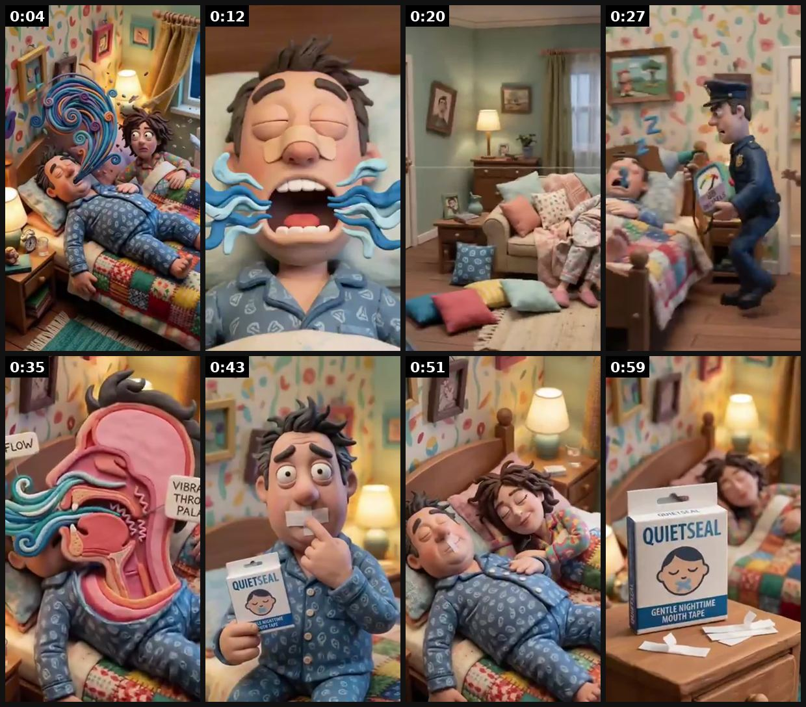
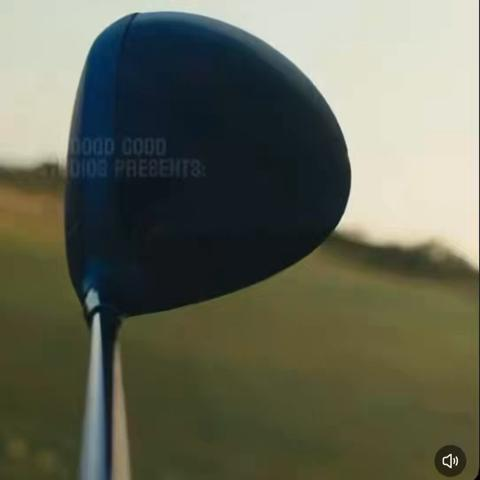

# 78 · Comedy sketch with a full direct-response pitch hidden inside the joke: see it, then make it

[](https://x.com/Daniloecom/status/2107749101823574297)

**The example:** [@Daniloecom on X](https://x.com/Daniloecom/status/2107749101823574297) · 1:03 video · 4 likes, 117 views

**Watch it:** [open the post on X](https://x.com/Daniloecom/status/2107749101823574297) · [play the video file](https://video.twimg.com/amplify_video/2107748983938404352/vid/avc1/320x568/tpY0PtAmYqJmsyYe.mp4?tag=29)

> What if an anti-snoring ad felt more like a ridiculous comedy sketch than an ad? So I made one. Claymation characters, absurd escalation, deadpan VO, and a fake brand called QuietSeal. The goal: make you watch the story before you realize you’re watching a product ad. https://t.co/sBqzwanZAa

## What you are seeing

A claymation-style comedy sketch about snoring: a man snoring with sound waves, his wife suffering, a cop bursting in, a giant cartoon mouth, then the product (QuietSeal) on the nightstand.

## Beat by beat

The storyboard above samples the video every 0:07. Lines are the transcript for that stretch; on-screen text comes from OCR, so treat it as rough.

| Frame | Time | On screen | Said / sung |
|---|---|---|---|
| 1 | 0:00–0:08 | · | I used to think I just snored a little. Apparently, I was wrong. My wife said it sounded like a chainsaw running in our bedroom. |
| 2 | 0:08–0:16 | · | So, we tried everything. Earplugs, nose strips, special pillows. |
| 3 | 0:16–0:23 | · | At one point, we were basically sleeping in separate rooms. Nothing worked. Then one night, my snoring got so loud, my wife actually called the cops. |
| 4 | 0:23–0:31 | · | The officer came in with a decibel meter. I took one breath, and apparently, that was enough to break it. |
| 5 | 0:31–0:39 | PAL led as | Turns out, the problem was pretty simple. I was sleeping with my mouth wide open. So, I started using quiet seal. |
| 6 | 0:39–0:47 | · | It gently keeps my mouth closed while I sleep, helping me breathe quietly through my nose. And for the first time in a very long time, |
| 7 | 0:47–0:55 | · | my wife actually slept next to me. No earplugs, no couch, no police. |
| 8 | 0:55–1:03 | · | It's just quiet. Honestly, I should have tried it sooner. Get quiet seal before your wife calls the cops. |

<details><summary>Full transcript (timestamped)</summary>

- `0:00` I used to think I just snored a little.
- `0:03` Apparently, I was wrong.
- `0:05` My wife said it sounded like a chainsaw running in our bedroom.
- `0:09` So, we tried everything.
- `0:11` Earplugs, nose strips, special pillows.
- `0:15` At one point, we were basically sleeping in separate rooms.
- `0:18` Nothing worked.
- `0:20` Then one night, my snoring got so loud, my wife actually called the cops.
- `0:25` The officer came in with a decibel meter.
- `0:28` I took one breath, and apparently, that was enough to break it.
- `0:32` Turns out, the problem was pretty simple.
- `0:35` I was sleeping with my mouth wide open.
- `0:37` So, I started using quiet seal.
- `0:40` It gently keeps my mouth closed while I sleep,
- `0:43` helping me breathe quietly through my nose.
- `0:46` And for the first time in a very long time,
- `0:49` my wife actually slept next to me.
- `0:52` No earplugs, no couch, no police.
- `0:57` It's just quiet.
- `0:59` Honestly, I should have tried it sooner.
- `1:01` Get quiet seal before your wife calls the cops.

</details>

## More real examples (3)

Other posts that show this format, or a close cousin of it. Click a thumbnail to open it on X.

| | | |
|---|---|---|
| [](https://x.com/Teavetua1971/status/2104205130413273395)<br>**@Teavetua1971** · 0:10 video · 10K views<br>QT With Your Funny Ad (Inspired by an old ad for a famous brand 😁😁) #digitalart #AIart️️️️️️️️️️️️️️️️️️️️️️️️️️️️️️️️️️️️️️️️️️️️️️️️️️️ https://t.co | [](https://x.com/nedfulmer/status/2080780729852526953)<br>**@nedfulmer** · image · 6K views<br>“Is influencer marketing dead?" While hiking through a medieval castle (lol, I know), I recently had a conversation with a founder who had shifted nea | [](https://x.com/imranullah/status/2091907704734257203)<br>**@imranullah** · 0:15 video · 12K views<br>The sad part is that this brand thought this was going to be a funny ad. I have pulled the calaway woods from my bag. #calawaygolf #goodgood https://t |

## How to make one like it

**The format in one line:** A 30-90s scripted comedy sketch (heist, courtroom, interrogation, office) in which every joke delivers a selling point: the mechanism, social proof, the offer, and the CTA ("click the button below"). Funny is the costume; direct response is the body.

**Why it works:** - Entertainment earns watch time and shares, which buys cheaper CPMs. - It doesn't feel like an ad until the punchline. - It still sells, because every beat carries a claim.

**Contents:** [1. Structure](#1-copy-the-structure) · [2. Shot by shot](#2-shot-by-shot-remake) · [3. Script and hooks](#3-write-the-script) · [4. Prompts](#4-prompts) · [5. Tools and settings](#5-tools-and-settings) · [6. Louise Carter remake](#6-louise-carter-remake) · [7. Variants and test](#7-variants-and-test-plan) · [8. Pitfalls](#8-pitfalls)

### 1. Copy the structure

Use the example's timing as your beat sheet. Keep the beat, change the words and the product.

| Beat | Time | In the example | Your version |
|---|---|---|---|
| 1 | 0:04 | I used to think I just snored a little. Apparently, I was wrong. My wife said it sounded like a chainsaw running in our bedroom. | … |
| 2 | 0:12 | So, we tried everything. Earplugs, nose strips, special pillows. | … |
| 3 | 0:20 | At one point, we were basically sleeping in separate rooms. Nothing worked. Then one night, my snoring got so loud, my wife actually called | … |
| 4 | 0:27 | The officer came in with a decibel meter. I took one breath, and apparently, that was enough to break it. | … |
| 5 | 0:35 | Turns out, the problem was pretty simple. I was sleeping with my mouth wide open. So, I started using quiet seal. | … |
| 6 | 0:43 | It gently keeps my mouth closed while I sleep, helping me breathe quietly through my nose. And for the first time in a very long time, | … |
| 7 | 0:51 | my wife actually slept next to me. No earplugs, no couch, no police. | … |
| 8 | 0:59 | It's just quiet. Honestly, I should have tried it sooner. Get quiet seal before your wife calls the cops. | … |

### 2. Shot-by-shot remake

**Target length / size:** 30-90s, 1080x1920

| # | Time / slot | What we see (visual + camera) | Dialogue / on-screen text |
|---|---|---|---|
| 1 | 0-5s | Absurd setup: a courtroom, a heist, an interrogation | "Ma'am, you're charged with showering in your jewelry." |
| 2 | 5-25s | Joke 1 delivers the mechanism | "It's 14K PVD, your honour. It's bonded." |
| 3 | 25-45s | Joke 2 delivers social proof | "We have 40,000 witnesses." (real review count) |
| 4 | 45-60s | Joke 3 delivers the offer | "Any 7 for $85? Case dismissed." |
| 5 | End | Product + CTA | - |

<details><summary>Playbook shot list (Louise Carter version from the README)</summary>

| Time / slot | Visual | Audio / copy |
|---|---|---|
| 0-5s | Night, two sisters in black, flashlights at a jewelry box | "Tonight we take the Herringbone." |
| 5-40s | Heist gags: "it's waterproof, we can escape through the pool" | proof joke with a real count |
| 40-60s | Caught by mom, who is wearing all 7 | "Any 7 for $85. Click below before she takes them all." |

</details>

### 3. Write the script

Open with one of these hooks (first 1–3 seconds, or the headline on a static):

- "Tonight… we steal the necklace"
- "The jewelry heist"
- "Courtroom: the necklace that wouldn't turn green"

Then fill the beats from the table above. Pull the wording from real customer reviews, not from ad copy: a review line beats a copywriter line almost every time. Read every line out loud and cut anything you would not say to a friend. Ready-made Louise Carter scripts are in section 6; hand [BOT.md](BOT.md) to any AI agent to write versions for another brand.

### 4. Prompts

**Claude**

```text
Write a 60-second comedy sketch in [setting]. Each joke must carry one selling point in this order: mechanism, proof, offer, CTA. Max 3 characters.
```

**AI version (Veo 3 / Kling claymation)**

```text
claymation courtroom, a judge and a woman wearing a gold necklace, comedic, lip-sync "[line]", 8s, 9:16
```

**Full creative-agent prompt (from the playbook):**

```
Write 3 comedy sketches (60s) for LC where each joke carries one selling point: mechanism, proof ({{REAL_PROOF}}), offer, CTA. Mark which line does which job.
```

### 5. Tools and settings

1. Write the sales beats first, then the jokes around them.
2. Hire local comedians or creators; one location.
3. Cut a 60s, a 30s and a 15s version.

| Setting | Value |
|---|---|
| Canvas | 1080×1920 (9:16) master; crop a 1080×1350 (4:5) cut for feed placements |
| Frame rate | 30 fps (shoot 60 fps for slow-motion water or sparkle shots) |
| Camera | Phone main lens at 1x, exposure locked on skin, HDR off, grid on; tripod or a phone clamp for product shots |
| Light | One soft key at 45° (window or ring light), white card as fill; side light for metal sparkle |
| Audio | Lavalier or phone 15–20 cm from the mouth; mix voice at -14 LUFS, music at -28 to -30 dB under voice |
| Captions | Burned in, 2–5 words per line, 64–80 px bold sans, white with a black stroke or pill; keep text inside the safe zone (top 220 px and bottom 420 px clear, 64 px side margins) |
| Pacing | A visual change every 1.5–3 s; the hook lands in the first 1.5 s with no logo intro |
| Edit / export | CapCut or Premiere; H.264, 12–20 Mbps, AAC 320 kbps; upload natively to each platform, not via links |

### 6. Louise Carter remake

- A · Sister heist.
- B · Courtroom: "the necklace is accused of being too waterproof".
- C · Interrogation: "where did you get that?"

Brand rules, claims you can and cannot make, and more scripts: [brands/louise-carter.md](brands/louise-carter.md). Step-by-step from idea to scale: [STAGES.md](STAGES.md).

### 7. Variants and test plan

- Sketch type
- Length

**Test plan:** - **Budget/structure:** 2 sketches, $40/day, 10 days - **Primary KPIs:** Hold rate, shares, CPA; Omni (F78-*) - **Kill rule:** CPA >2.5× - **Scale rule:** Organic first; boost the shareable one - **Naming:** `utm_content=F78-<concept>-<variant>`; weekly Omni roll-up of new-customer revenue by format.

**Naming:** `F78-<variant>-<hook##>-<date>` so results map back to this folder. Change one thing per test (hook, narrator, length or offer), never two.

### 8. Pitfalls

- A joke that does not sell is expensive airtime; cut it.
- Numbers in jokes (review counts, prices) must be real.
- Slow open: if the first 1.5 s does not show the hook visually, most people swipe.
- Logo or brand intro at the start reads as an ad; put the brand at the end.
- Captions covered by the platform UI: check the safe zone on a real phone before posting.
- Music over the voice: keep music at least 14 dB under speech.

**Compliance:** Baseline: [_COMPLIANCE.md](../_COMPLIANCE.md) (no fake testimonials, AI disclosure, no bulk/spoofed accounts, copy structure not assets, PDP-only claims). - Proof numbers real; no IP or parody of protected characters.

## Field notes

Newer observations live in the playbook: [Wave 2d update: supplement skit ads](README.md)

## More examples

Every post we found for this format, with transcripts: [examples/](examples/README.md). Playbook: [README.md](README.md). Agent brief: [BOT.md](BOT.md).
