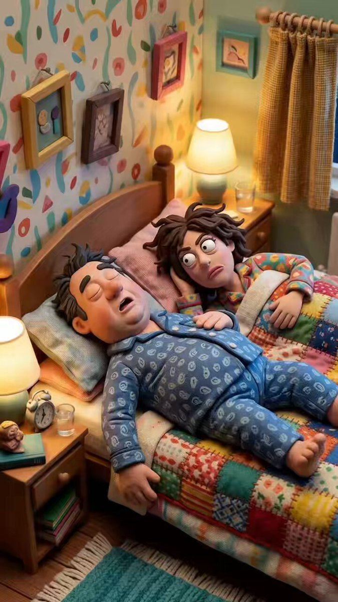

# 78 · Comedy sketch with a full direct-response pitch hidden inside the joke

<!-- HERO:START -->
[](EXAMPLE.md)

**[See the example and how to make it →](EXAMPLE.md)** · [watch on X](https://x.com/Daniloecom/status/2107749101823574297)
<!-- HERO:END -->


> **LC priority P2** · evidence: Medium (live example + playbook) · hype risk: Medium · cost $300-2,000 · 1-2 days

## What it is
A 30-90s scripted comedy sketch (heist, courtroom, interrogation, office) in which every joke delivers a selling point: the mechanism, social proof, the offer, and the CTA ("click the button below"). Funny is the costume; direct response is the body.

## Why it works
- Entertainment earns watch time and shares, which buys cheaper CPMs.
- It doesn't feel like an ad until the punchline.
- It still sells, because every beat carries a claim.

## Shot-by-shot (LC version)

| Time / slot | Visual | Audio / copy |
|---|---|---|
| 0-5s | Night, two sisters in black, flashlights at a jewelry box | "Tonight we take the Herringbone." |
| 5-40s | Heist gags: "it's waterproof, we can escape through the pool" | proof joke with a real count |
| 40-60s | Caught by mom, who is wearing all 7 | "Any 7 for $85. Click below before she takes them all." |

## Hooks (swap-in openers)
- "Tonight… we steal the necklace"
- "The jewelry heist"
- "Courtroom: the necklace that wouldn't turn green"

## Real examples from X (studied)
- "20 Ad Types" #9 Creative/funny ads: True Classic heist; "Funny is the costume. Direct response is the body." ([doc](https://rural-lifeboat-196.notion.site/3b8db9d7074d81238c95e0061b6377c7)).

## Production recipe
1. Write the sales beats first, then the jokes around them.
2. Hire local comedians or creators; one location.
3. Cut a 60s, a 30s and a 15s version.

## Bot prompt (copy into the creative agent)
```
Write 3 comedy sketches (60s) for LC where each joke carries one selling point: mechanism, proof ({{REAL_PROOF}}), offer, CTA. Mark which line does which job.
```

## 3 LC scripts
- A · Sister heist.
- B · Courtroom: "the necklace is accused of being too waterproof".
- C · Interrogation: "where did you get that?"

## Variants to test
- Sketch type
- Length

## Omni test plan
- **Budget/structure:** 2 sketches, $40/day, 10 days
- **Primary KPIs:** Hold rate, shares, CPA; Omni (F78-*)
- **Kill rule:** CPA >2.5×
- **Scale rule:** Organic first; boost the shareable one
- **Naming:** `utm_content=F78-<concept>-<variant>`; weekly Omni roll-up of new-customer revenue by format.

## Compliance
Baseline: [_COMPLIANCE.md](../_COMPLIANCE.md) (no fake testimonials, AI disclosure, no bulk/spoofed accounts, copy structure not assets, PDP-only claims).
- Proof numbers real; no IP or parody of protected characters.

## Related
- Strategies: 10-skit-and-problem-first-ugc-hooks, 32-drama-show-ads-hidden-storyline
- Formats: [24-skit-beginner-intermediate-expert](../24-skit-beginner-intermediate-expert/README.md), [08-drama-show-micro-series](../08-drama-show-micro-series/README.md)

## Wave 2d update: supplement skit ads
- Ryze AI skit (1:55, peaked #46 of 14.7K ads) and Everyday Dose skit (1:32, #23 of 840, live 66 days) on Atria, both picked by @briannjho. Resilia's deal skit: "What do you mean the sale ends today?" (see **F99**).

<!-- EVIDENCE:START -->
## Evidence from X discovery (auto-generated)

| Date | Author | Post | Engagement | Grade | Gist |
|---|---|---|---|---|---|
| 2026-09-01 | [@briannjho](https://x.com/briannjho) | [link](https://x.com/briannjho/status/2094662259746480410) | 138L/338BM/10kV | SOME | Ad picks: Smooche AI song ad, Ryze AI skit, UndrDog big-enemy, Everyday Dose skit, Serene Herbs AI identity, Nuora apology mash-up, Mama Bear "this is what happens". |
<!-- EVIDENCE:END -->
