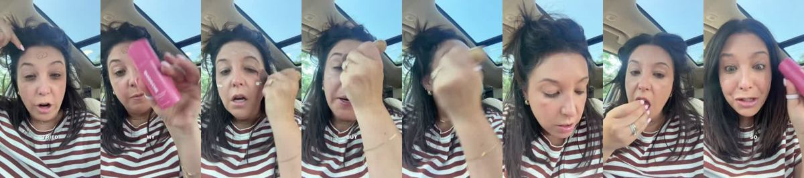
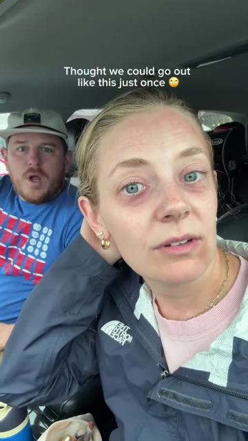
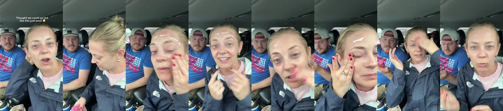
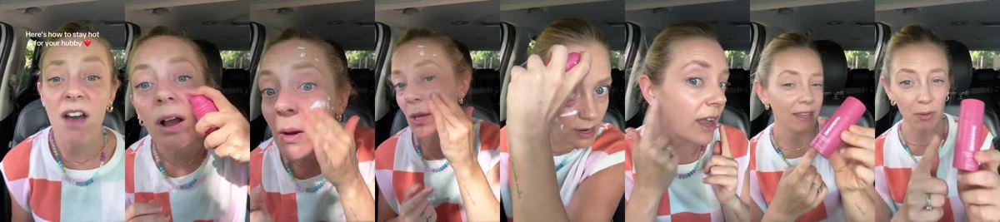
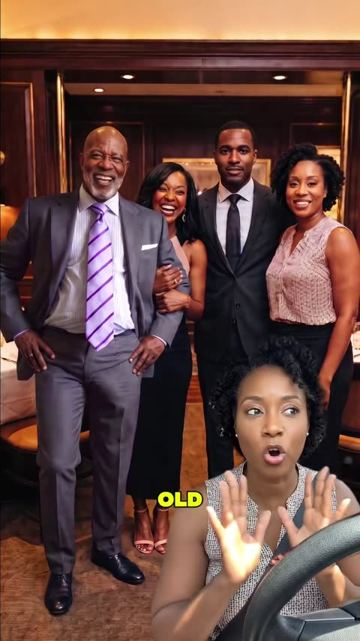
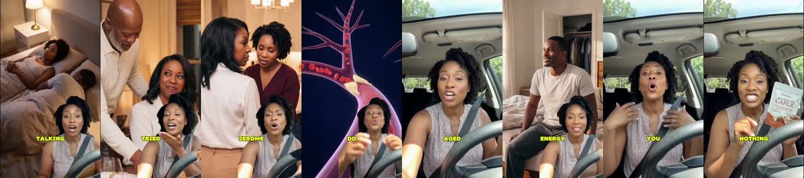

# Meta ad-library examples for F78

<!-- WAVE6 -->
## Wave 6: Resilia & Smooche live Meta ads (Oct 2026)

Pulled from the public Meta Ad Library on 2026-10-09 (Resilia: aged garlic, Ceylon cinnamon, oil of oregano; Smooche: color-changing foundation, Reverse Time peptide serum). Days live are counted to 2026-10-09; most video ads were new tests that week, while the long runners are statics and catalog templates. Transcripts are automatic. Brand claims are the advertisers', not verified, and many are health claims we would never make. The **Do not copy** line flags deceptive tactics (persona "publication" pages, undisclosed AI actors and "experts", fake stock counts).

### Smooche · Smooche: “I'm about to walk into brunch to meet my girlfriend that I was with to…” (41 days live)

- **Ad:** [Meta Ad Library #1038179568995397](https://www.facebook.com/ads/library/?id=1038179568995397) · video 1:33 · page “Smooche” · started 2026-08-28 · 1 copies · lands on `smooche.com/products/ccf2`
- **What happens:** Opens: “I'm about to walk into brunch to meet my girlfriend that I was with to figure out who tried to draw a ying yang on my forehead and guess what? I just saw my ex- boyfriend of 15 years and it's perfect…”
- **Why it works:** Couple and friend skits ("Are you not wearing makeup today?" / "I am, look at the difference") hide a full demo inside a joke.
- **How to make one:** One relationship conflict, a surprise reveal of the product effect, and a fast demo in the middle.
- **LC remake:** The husband accuses: "You bought ANOTHER necklace?" "No, it's the same one I've worn for 8 months, in the ocean."

Transcript (auto, first ~70 s)

> I'm about to walk into brunch to meet my girlfriend that I was with to figure out who tried to draw a ying yang on my forehead and guess what? I just saw my ex- boyfriend of 15 years and it's perfect only I have with me is my smooch color changing foundation and we're going to see if this can take care of me because this will be horrible if I have to see them looking like this so this goes on white it almost looks like moistur but it is actually a serum that benefit your skin it does have a definite but it blends in and color matches with your pH to make it your this is like a freaking filter for my face where's my lip gloss? alright, get some of that trying and fix this hair this is amazing look at this look at that that is so good so good okay get this you will not regret it so good

### Smooche · Smooche: “Let's go. Whoa! Well, what?…” (10 days live)

- **Ad:** [Meta Ad Library #1593551462516058](https://www.facebook.com/ads/library/?id=1593551462516058) · video 1:14 · page “Smooche” · started 2026-09-28 · 1 copies · lands on `smooche.com/products/ccf2`
- **What happens:** Opens: “Let's go. Whoa!”
- **Why it works:** Couple and friend skits ("Are you not wearing makeup today?" / "I am, look at the difference") hide a full demo inside a joke.
- **How to make one:** One relationship conflict, a surprise reveal of the product effect, and a fast demo in the middle.
- **LC remake:** The husband accuses: "You bought ANOTHER necklace?" "No, it's the same one I've worn for 8 months, in the ocean."

Transcript (auto, first ~70 s)

> Let's go. Whoa! Well, what? What are you doing? What's going on? No, I never sleep. Are you not wearing makeup today? I wasn't going to. Why not? Look at the difference between my eyes now. Right? And look, it covers up all that old sunburn that I used to have. Like, look at the color. Yeah. It's so good. It's like this perfect color match. I just know my mom's going to say something. I know, she usually does. I think the best part is it actually creates. So it gives you Korean skin care benefits. Oh, it's got SPF, too, too. Yeah, it's an SPF 15. It also doubles as my sunscreen. It's really good. But yeah, doesn't that look so much better? It's like glowy and dewy. Is this one of those ridiculously expensive things, too? No, actually, it's really good. They actually have a bundle deal so that you could get two of them for the price of $49, which is only $10 more than the more.

### Smooche · Smooche: “Okay, Richard say it's one more time. Well, I'm married to you because…” (6 days live)

- **Ad:** [Meta Ad Library #1481554707131753](https://www.facebook.com/ads/library/?id=1481554707131753) · video 1:13 · page “Smooche” · started 2026-10-02 · 1 copies · lands on `smooche.com/products/ccf2`
- **What happens:** Opens: “Okay, Richard say it's one more time. Well, I'm married to you because I thought you were going to be hot forever.”
- **Why it works:** Couple and friend skits ("Are you not wearing makeup today?" / "I am, look at the difference") hide a full demo inside a joke.
- **How to make one:** One relationship conflict, a surprise reveal of the product effect, and a fast demo in the middle.
- **LC remake:** The husband accuses: "You bought ANOTHER necklace?" "No, it's the same one I've worn for 8 months, in the ocean."

Transcript (auto, first ~70 s)

> Okay, Richard say it's one more time. Well, I'm married to you because I thought you were going to be hot forever. I'm sorry that I had two of your children that you don't wake up for in the middle of the night. So I'm looking a little bit more haggard than I used to. So since maybe he'll take me out for our anniversary tonight, I'm going to show you in real time how freaking amazing this thing is because I am, completely shade blind. I have no idea what shade foundation to buy ever. But this one, it goes on white I'm color-changing to match correctly and beautifully to your natural skin tone. Look at that. This is the best match I've ever gotten and all bottles- and bottles � a foundation in the past. This is the best match I've ever gotten and I'm going to show you in real time. I'm going to show you in real time. I'm going to show you in real time. I'm going to show

### Resilia · Vascular Wellness Report: “So my 473 year old husband was bricked up at the dinner. So I'll change…” (1 day live)

- **Ad:** [Meta Ad Library #2443236876207097](https://www.facebook.com/ads/library/?id=2443236876207097) · video 4:10 · page “Vascular Wellness Report” · started 2026-10-07 · 1 copies · lands on `resilia.shop/products/resilia-aged-odorless-garlic`
- **What happens:** Opens: “So my 473 year old husband was bricked up at the dinner. So I'll change my man's life.”
- **Why it works:** Couple and friend skits ("Are you not wearing makeup today?" / "I am, look at the difference") hide a full demo inside a joke.
- **How to make one:** One relationship conflict, a surprise reveal of the product effect, and a fast demo in the middle.
- **LC remake:** The husband accuses: "You bought ANOTHER necklace?" "No, it's the same one I've worn for 8 months, in the ocean."

Transcript (auto, first ~70 s)

> So my 473 year old husband was bricked up at the dinner. So I'll change my man's life. I'm not a creep. Let me rewind and actually explain it. Me and my husband Jerome have been dealing with this for months. We go to my girl Tasha's house for dinner. Now Tasha is 43. Her husband Richard is 73. I And I'm not a creep. I'm not a creep. right there. Not angry, just confused. How is this man 30 years the older than mine and his body still responds like that to his wife while my

<!-- /WAVE6 -->

