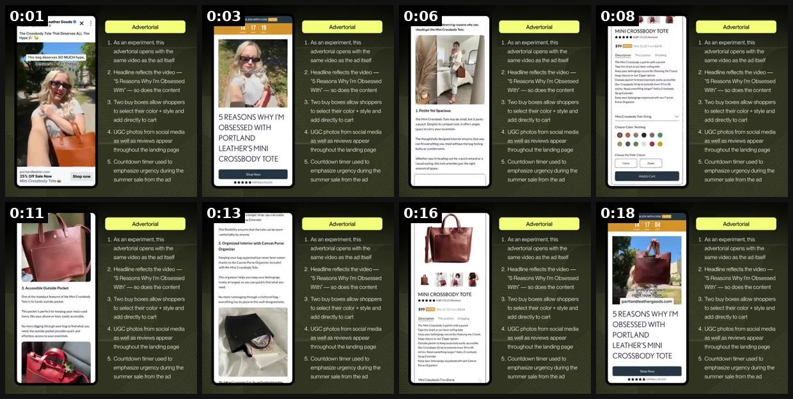
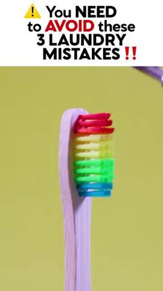
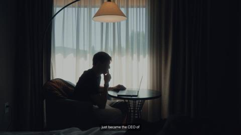
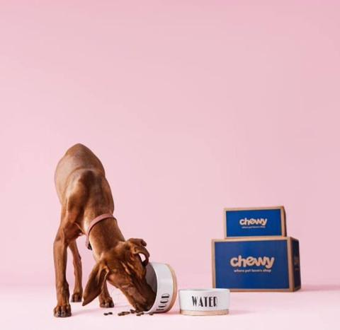

# 79 · Advertorial-style video ('5 reasons ___ are ditching ___'): see it, then make it

[](https://x.com/AaronOrendorff/status/1815524880361914630)

**The example:** [@AaronOrendorff on X](https://x.com/AaronOrendorff/status/1815524880361914630) · 0:19 video · 4 likes, 213 views

**Watch it:** [open the post on X](https://x.com/AaronOrendorff/status/1815524880361914630) · [play the video file](https://video.twimg.com/ext_tw_video/1815524397463248896/pu/vid/avc1/540x540/EZK7UW1Ffxs6lNEQ.mp4?tag=12)

> **How close is this example?** Close: a breakdown of a real advertorial funnel. The gallery below has more examples.

> 3️⃣ Advertorial: “Reasons Why” As an experiment, this advertorial opens with the same video as the ad itself Headline + content reflects the creative — “5 Reasons Why I’m Obsessed With” Two buy boxes allow shoppers to select their color + style and add directly to cart UGC photos from social media as well as reviews appear throughout the landing page Countdown timer used to emphasize urgency during the summer sale fr…

## What you are seeing

A breakdown of a 'Reasons Why' advertorial for a leather tote: the landing page opens with the same video as the ad, the headline mirrors it ("5 Reasons Why I'm Obsessed With..."), then come numbered reasons, UGC photos, reviews, two buy boxes and a countdown timer. The yellow notes beside each screen explain the part.

## Beat by beat

The storyboard above samples the video every 0:02. Lines are the transcript for that stretch; on-screen text comes from OCR, so treat it as rough.

| Frame | Time | On screen | Said / sung |
|---|---|---|---|
| 1 | 0:00–0:02 | Portland Leather Goods Tote That ALL The experiment, this opens with the so CH same video as the ad itself op Headline reflects the video is Reasons Why I'm Obs | · |
| 2 | 0:02–0:04 | SAVE AN EXTRA 25% WITH COOK HE 14:17:19 As an experiment, this opens with the same video as the ad itself WW Headline reflects the video a Reasons Why I'm Obses | · |
| 3 | 0:04–0:07 | Here are five hype-deserving reasons why you get the Mini Tote. As an experiment, this opens with the same video as the ad itself Headline reflects the video Re | · |
| 4 | 0:07–0:09 | MINI TOTE eh As As an experiment, this $99 im 00 opens with the Then same video as the ad itself Tops th the Cl Headline reflects the video sep Ho Reasons Why I | · |
| 5 | 0:09–0:12 | a experiment, this opens with the same video as the ad itself Headline reflects the video Reasons Why I'm Obsessed 3. Accessible Outside Pocket With so does the | · |
| 6 | 0:12–0:14 | 5. Organized Interior with Canvas Purse experiment, this Organizer opens with the same video as the ad itself Headline reflects the video bel Reasons Why I'm Ob | · |
| 7 | 0:14–0:17 | As an experiment, this opens with the same video as the ad itself Headline reflects the video Reasons Why I'm Obsessed With so does the content MINI v1 Two buy  | · |
| 8 | 0:17–0:19 | SAVE 25% WITH COOK HER 14:17: 04 As an experiment, this opens with the same video as the ad itself Headline reflects the video Reasons Why I'm Obsessed With so  | · |

## More real examples (4)

Other posts that show this format, or a close cousin of it. Click a thumbnail to open it on X.

| | | |
|---|---|---|
| [](https://x.com/nachovanzini/status/1792567677103263901)<br>**@nachovanzini** · 2:53 video · 117 views<br>1/ Listicle They love to use listicle format ads It's a great way to send traffic to a advertorial landing page 3 reasons why XYZ | [](https://x.com/FedotOff90/status/2094854572623675832)<br>**@FedotOff90** · image · 47K views<br>6 lander/advertorial types (news mimic, story, listicle, quiz, authority, comparison) — 53-format lander database. | [](https://x.com/k4komaaaal/status/2084289721703010738)<br>**@k4komaaaal** · 15:11 video · 655 views<br>10 reasons why brands are ditching polished ads for founder faces on camera: 1. sushiswap, gymshark all started founder led content before ads 2. face |
| [](https://x.com/phemeinfluence/status/2078934717462888585)<br>**@phemeinfluence** · image · 15K views<br>🐶 PET UGC OPPORTUNITY 35+ (cats or dogs moms) BRAND: Chewy PAY: $2000 + Product Pet brand hiring UGC creators to film a 90s advertorial video featurin |   |   |

## How to make one like it

**The format in one line:** A 45-120s video built like an editorial article: headline title card, numbered reasons, B-roll, a calm narrator. It educates first, then sends viewers to a matching advertorial lander (news-mimic, listicle, comparison).

**Why it works:** - Editorial framing lowers ad defences. - The numbered structure keeps viewers watching to the end of the list. - Pairs with lander formats that continue the article.

**Contents:** [1. Structure](#1-copy-the-structure) · [2. Shot by shot](#2-shot-by-shot-remake) · [3. Script and hooks](#3-write-the-script) · [4. Prompts](#4-prompts) · [5. Tools and settings](#5-tools-and-settings) · [6. Louise Carter remake](#6-louise-carter-remake) · [7. Variants and test](#7-variants-and-test-plan) · [8. Pitfalls](#8-pitfalls)

### 1. Copy the structure

Use the example's timing as your beat sheet. Keep the beat, change the words and the product.

| Beat | Time | In the example | Your version |
|---|---|---|---|
| 1 | 0:01 | on screen: Portland Leather Goods Tote That ALL The experiment, this opens with the so CH same video as the ad itself op Headline r | … |
| 2 | 0:03 | on screen: SAVE AN EXTRA 25% WITH COOK HE 14:17:19 As an experiment, this opens with the same video as the ad itself WW Headline re | … |
| 3 | 0:06 | on screen: Here are five hype-deserving reasons why you get the Mini Tote. As an experiment, this opens with the same video as the | … |
| 4 | 0:08 | on screen: MINI TOTE eh As As an experiment, this $99 im 00 opens with the Then same video as the ad itself Tops th the Cl Headline | … |
| 5 | 0:11 | on screen: a experiment, this opens with the same video as the ad itself Headline reflects the video Reasons Why I'm Obsessed 3. Ac | … |
| 6 | 0:13 | on screen: 5. Organized Interior with Canvas Purse experiment, this Organizer opens with the same video as the ad itself Headline r | … |
| 7 | 0:16 | on screen: As an experiment, this opens with the same video as the ad itself Headline reflects the video Reasons Why I'm Obsessed W | … |
| 8 | 0:18 | on screen: SAVE 25% WITH COOK HER 14:17: 04 As an experiment, this opens with the same video as the ad itself Headline reflects the | … |

### 2. Shot-by-shot remake

**Target length / size:** 45-120s, 1080x1920 and 1080x1350

| # | Time / slot | What we see (visual + camera) | Dialogue / on-screen text |
|---|---|---|---|
| 1 | 0-3s | Editorial title card, serif type, magazine look | "5 reasons women are ditching gold-plated jewelry" |
| 2 | 3-80s | Numbered reasons, each with B-roll and a calm narrator | Reason, one fact, one visual |
| 3 | 80-100s | Soft product mention | "One brand fixing it: [brand]" |
| 4 | End | Link to an advertorial page that matches the video | - |

<details><summary>Playbook shot list (Louise Carter version from the README)</summary>

| Time / slot | Visual | Audio / copy |
|---|---|---|
| 0-5s | Title card: "5 reasons women are ditching gold-plated jewelry" | VO reads it |
| 5-60s | Reasons 1-5 with B-roll (green mark, swim, cost per wear, gift) | calm VO |
| 60-75s | "Reason 5 is why we built LC" | CTA to listicle lander |

</details>

### 3. Write the script

Open with one of these hooks (first 1–3 seconds, or the headline on a static):

- "5 reasons women are ditching gold-plated jewelry"
- "The real reason your necklace turns green"
- "Why jewelers hate waterproof gold"

Then fill the beats from the table above. Pull the wording from real customer reviews, not from ad copy: a review line beats a copywriter line almost every time. Read every line out loud and cut anything you would not say to a friend. Ready-made Louise Carter scripts are in section 6; hand [BOT.md](BOT.md) to any AI agent to write versions for another brand.

### 4. Prompts

**Claude**

```text
Write a 90-second editorial-style script with 5 numbered reasons, a neutral narrator and a matching advertorial outline.
```

**Edit**

```text
Serif title cards (Playfair / Tiempos), slow crossfades, subtle paper texture, captions in sentence case.
```

**Full creative-agent prompt (from the playbook):**

```
Write a 75s advertorial-style video script for LC: title card, 5 numbered reasons (true, from {{PDP_FACTS}}), a close that hands off to a matching listicle lander. Also outline the lander H1/H2s.
```

### 5. Tools and settings

1. Pick the lander first (listicle or comparison), then mirror its reasons in the video.
2. B-roll from own shoots.
3. Neutral narrator voice; no fake news branding.

| Setting | Value |
|---|---|
| Canvas | 1080×1920 (9:16) master; crop a 1080×1350 (4:5) cut for feed placements |
| Frame rate | 30 fps (shoot 60 fps for slow-motion water or sparkle shots) |
| Camera | Phone main lens at 1x, exposure locked on skin, HDR off, grid on; tripod or a phone clamp for product shots |
| Light | One soft key at 45° (window or ring light), white card as fill; side light for metal sparkle |
| Audio | Lavalier or phone 15–20 cm from the mouth; mix voice at -14 LUFS, music at -28 to -30 dB under voice |
| Captions | Burned in, 2–5 words per line, 64–80 px bold sans, white with a black stroke or pill; keep text inside the safe zone (top 220 px and bottom 420 px clear, 64 px side margins) |
| Pacing | A visual change every 1.5–3 s; the hook lands in the first 1.5 s with no logo intro |
| Edit / export | CapCut or Premiere; H.264, 12–20 Mbps, AAC 320 kbps; upload natively to each platform, not via links |

### 6. Louise Carter remake

- A · "5 reasons women are ditching gold-plated".
- B · "The real reason your necklace turns green".
- C · "7 gifts she'll actually wear (#1 is waterproof)".

Brand rules, claims you can and cannot make, and more scripts: [brands/louise-carter.md](brands/louise-carter.md). Step-by-step from idea to scale: [STAGES.md](STAGES.md).

### 7. Variants and test plan

- Listicle vs myth-bust framing
- Narrator vs text-only

**Test plan:** - **Budget/structure:** 2 videos → matching landers, $30/day, 10 days - **Primary KPIs:** Hold, LP CVR, CPA; Omni (F79-*) - **Kill rule:** CPA >2× - **Scale rule:** Winner → static F09 twin - **Naming:** `utm_content=F79-<concept>-<variant>`; weekly Omni roll-up of new-customer revenue by format.

**Naming:** `F79-<variant>-<hook##>-<date>` so results map back to this folder. Change one thing per test (hook, narrator, length or offer), never two.

### 8. Pitfalls

- It is still an ad: keep "Sponsored" labelling and avoid fake-news styling.
- Featured example is a long founder-style talk; the editorial version should be tighter.
- Slow open: if the first 1.5 s does not show the hook visually, most people swipe.
- Logo or brand intro at the start reads as an ad; put the brand at the end.
- Captions covered by the platform UI: check the safe zone on a real phone before posting.
- Music over the voice: keep music at least 14 dB under speech.

**Compliance:** Baseline: [_COMPLIANCE.md](../_COMPLIANCE.md) (no fake testimonials, AI disclosure, no bulk/spoofed accounts, copy structure not assets, PDP-only claims). - No fake publisher names or logos; label "Advertorial"/"Sponsored" on the lander.

## Field notes

Newer observations live in the playbook: [Wave 2d update: the Resilia advertorial engine](README.md)

## More examples

Every post we found for this format, with transcripts: [examples/](examples/README.md). Playbook: [README.md](README.md). Agent brief: [BOT.md](BOT.md).
