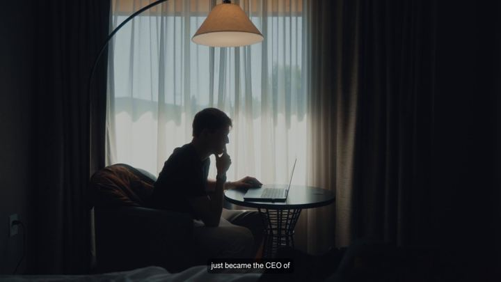

# 79 · Advertorial-style video ("5 reasons ___ are ditching ___")

<!-- HERO:START -->
[](EXAMPLE.md)

**[See the example and how to make it →](EXAMPLE.md)** · [watch on X](https://x.com/k4komaaaal/status/2084289721703010738)
<!-- HERO:END -->


> **LC priority P1** · evidence: Medium (playbook + boards) · hype risk: Low · cost $50-300 · 3-4 h

## What it is
A 45-120s video built like an editorial article: headline title card, numbered reasons, B-roll, a calm narrator. It educates first, then sends viewers to a matching advertorial lander (news-mimic, listicle, comparison).

## Why it works
- Editorial framing lowers ad defences.
- The numbered structure keeps viewers watching to the end of the list.
- Pairs with lander formats that continue the article.

## Shot-by-shot (LC version)

| Time / slot | Visual | Audio / copy |
|---|---|---|
| 0-5s | Title card: "5 reasons women are ditching gold-plated jewelry" | VO reads it |
| 5-60s | Reasons 1-5 with B-roll (green mark, swim, cost per wear, gift) | calm VO |
| 60-75s | "Reason 5 is why we built LC" | CTA to listicle lander |

## Hooks (swap-in openers)
- "5 reasons women are ditching gold-plated jewelry"
- "The real reason your necklace turns green"
- "Why jewelers hate waterproof gold"

## Real examples from X (studied)
- "20 Ad Types" #16 Advertorial-style video ([doc](https://rural-lifeboat-196.notion.site/3b8db9d7074d81238c95e0061b6377c7)).
- @FedotOff90: 6 landing page / advertorial types (news mimic, story, listicle, quiz, authority, comparison) ([post](https://x.com/FedotOff90/status/2094854572623675832) · [db](https://rural-lifeboat-196.notion.site/3c6db9d7074d81fcb0b6cd81a4527126)).

## Production recipe
1. Pick the lander first (listicle or comparison), then mirror its reasons in the video.
2. B-roll from own shoots.
3. Neutral narrator voice; no fake news branding.

## Bot prompt (copy into the creative agent)
```
Write a 75s advertorial-style video script for LC: title card, 5 numbered reasons (true, from {{PDP_FACTS}}), a close that hands off to a matching listicle lander. Also outline the lander H1/H2s.
```

## 3 LC scripts
- A · "5 reasons women are ditching gold-plated".
- B · "The real reason your necklace turns green".
- C · "7 gifts she'll actually wear (#1 is waterproof)".

## Variants to test
- Listicle vs myth-bust framing
- Narrator vs text-only

## Omni test plan
- **Budget/structure:** 2 videos → matching landers, $30/day, 10 days
- **Primary KPIs:** Hold, LP CVR, CPA; Omni (F79-*)
- **Kill rule:** CPA >2×
- **Scale rule:** Winner → static F09 twin
- **Naming:** `utm_content=F79-<concept>-<variant>`; weekly Omni roll-up of new-customer revenue by format.

## Compliance
Baseline: [_COMPLIANCE.md](../_COMPLIANCE.md) (no fake testimonials, AI disclosure, no bulk/spoofed accounts, copy structure not assets, PDP-only claims).
- No fake publisher names or logos; label "Advertorial"/"Sponsored" on the lander.

## Related
- Strategies: 35-mass-awareness-placement-to-advertorial, 05-offer-page-engineering
- Formats: [09-native-story-static-to-advertorial](../09-native-story-static-to-advertorial/README.md), [39-x-reasons-why](../39-x-reasons-why/README.md)

## Wave 2d update: the Resilia advertorial engine
- 30-50% of all Resilia paid traffic goes to one 7-minute advertorial written as health journalism ("The CDC Says Over 60 Million Americans Are Infected With Parasites…"), a "Lisa, 38, teacher from Ohio" story, then the mechanism and the PDP. Twelve persona Pages feed it (Funnel of the Week, Apr 2026). Lander URL pattern: resilia.shop/pages/the-hidden-invaders-living-inside-85-of-americans-right-now (@lorenzo_pravata).
- @lorenzo_pravata: "none of the parasite claims live on the product page"; the aggressive claims sit on subpages and the PDP stays clean. **LC must not split claims that way.** Keep every claim on the advertorial PDP-true.
- OTO flow $29.99 → $83 AOV: complementary upsell ("the softgels are the attack, the drops are the sweep"), BOGO, then a weaker overlap offer. LC parallel: chain → matching huggies → gift box.

<!-- EVIDENCE:START -->
## Evidence from X discovery (auto-generated)

| Date | Author | Post | Engagement | Grade | Gist |
|---|---|---|---|---|---|
| 2026-09-01 | [@FedotOff90](https://x.com/FedotOff90) | [link](https://x.com/FedotOff90/status/2094854572623675832) | 175L/385BM/47kV | VALUE | 6 lander/advertorial types (news mimic, story, listicle, quiz, authority, comparison) — 53-format lander database. |
| 2026-08-25 | [@FedotOff90](https://x.com/FedotOff90) | [link](https://x.com/FedotOff90/status/2092382176738202057) | 145L/318BM/11kV | VALUE | 24 landing page formats with live ad→lander pairs (breaking news, investigation, as-seen-on-TV, doctor warning…). |
| 2026-04-15 | [@funneloftheweek](https://x.com/funneloftheweek) | [link](https://x.com/funneloftheweek/status/2044464896104857850) | 14L/23BM/3kV | VALUE | Resilia: 12 persona Pages → one 7-min advertorial (30-50% of traffic), 3-4 copy templates × hundreds of creatives, 544 new ads/30d, OTO flow $30→$83. |
<!-- EVIDENCE:END -->
