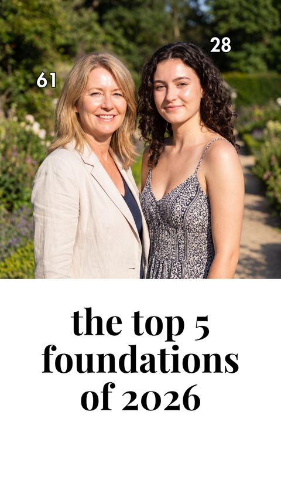

# Meta ad-library examples for F79

<!-- WAVE6 -->
## Wave 6: Resilia & Smooche live Meta ads (Oct 2026)

Pulled from the public Meta Ad Library on 2026-10-09 (Resilia: aged garlic, Ceylon cinnamon, oil of oregano; Smooche: color-changing foundation, Reverse Time peptide serum). Days live are counted to 2026-10-09; most video ads were new tests that week, while the long runners are statics and catalog templates. Transcripts are automatic. Brand claims are the advertisers', not verified, and many are health claims we would never make. The **Do not copy** line flags deceptive tactics (persona "publication" pages, undisclosed AI actors and "experts", fake stock counts).

### Smooche · Cosmetic Times: A two-woman photo (20 days live)

- **Ad:** [Meta Ad Library #1082009374187205](https://www.facebook.com/ads/library/?id=1082009374187205) · static image · page “Cosmetic Times” · started 2026-09-18 · 1 copies · lands on `smooche.com/pages/top5foundations`
- **What happens:** A two-woman photo (ages 61 and 28) with "the top 5 foundations of 2026". The primary text: "Michelle Mason, a beauty expert with 20 years of experience, tested 5…"
- **Why it works:** "Beauty expert tests the top 5 foundations of 2026": an advertorial cover static (two women aged 61 and 28) that clicks through to a listicle landing page (/pages/top5foundations).
- **How to make one:** A magazine-style cover image, a "tests the top 5" headline, and a listicle lander where the brand wins.
- **Do not copy:** The "expert" and the publication ("Cosmetic Times") are brand-run personas.
- **LC remake:** "Jewelry stylist tests the top 5 waterproof necklaces of 2026."

Primary text

> Michelle Mason, a beauty expert with 20 years of experience, tested 5 color-changing foundations. From Estée Lauder to Fenty Beauty. From L'Oréal Paris to Maybelline. She compared how well they cover age spots, redness, and fine lines – without that heavy mask effect women over 50 dread. After 30 days of testing, the results were shocking. 👉 Curious which foundation surprised her the most? Read the full test on Cosmetic Times.

<!-- /WAVE6 -->

